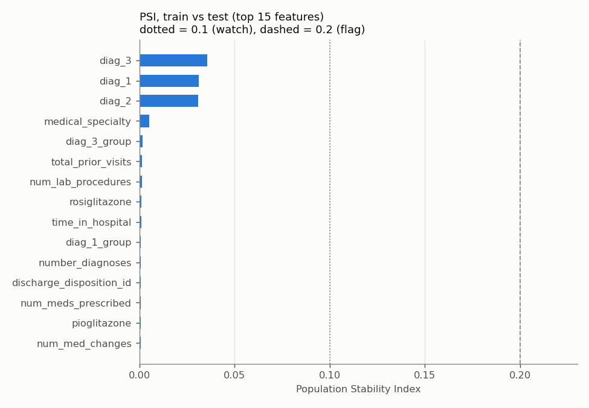
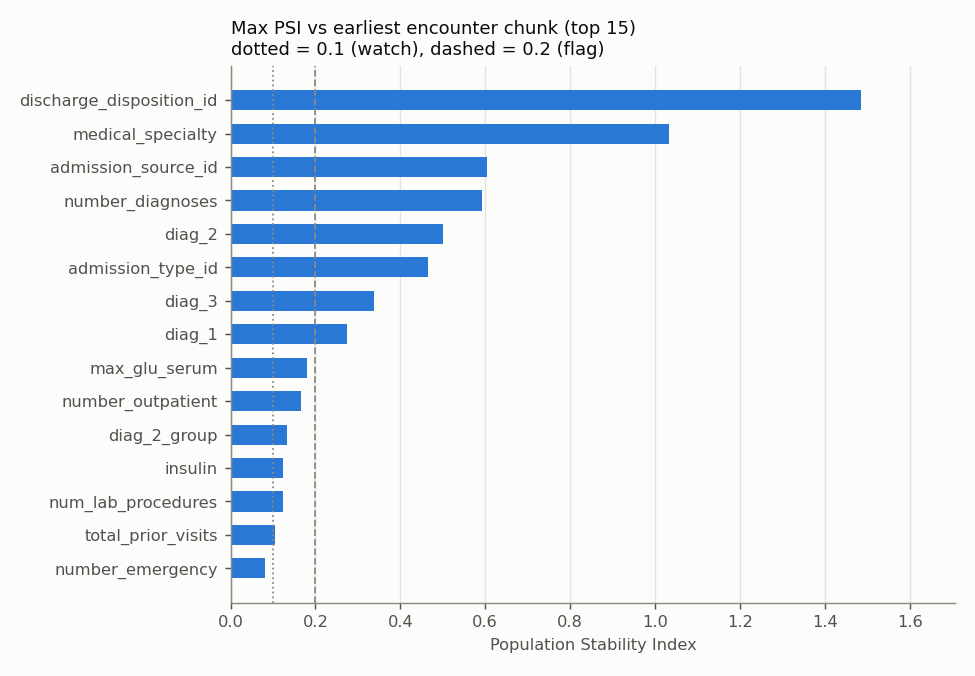
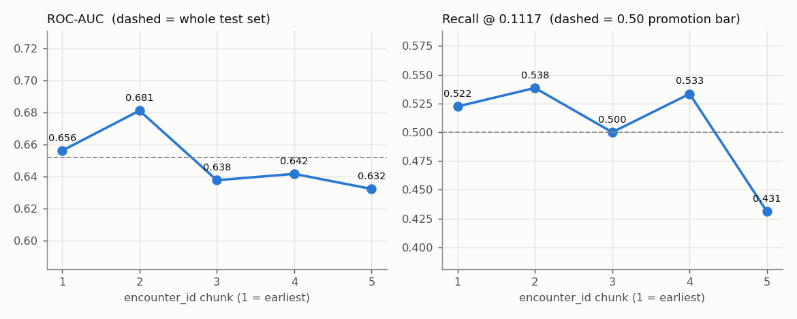

# Drift and leakage report

_Generated by `ml/scripts/drift_and_leakage_report.py` on 2026-10-02 08:29 UTC at commit `aac0c2639b2a`. Do not edit by hand - re-run the script._

## Conclusion (plain language)

- **No patient leakage.** 0 patients appear in both the training and the test set (train/val 0, val/test 0). Each patient contributes exactly one encounter, so the test score is measured on people the model has never seen.
- **No target leakage found.** None of readmitted, readmitted_30d, encounter_id, patient_nbr reaches the model, and the strongest single feature (`discharge_disposition_id`) predicts readmission with an AUC of only 0.574 on its own - far below the 0.8 a leaked outcome would produce.
- **Expired/hospice encounters are removed.** 2,423 such raw rows exist; 0 remain after cleaning.
- **The 0.1117 threshold was tuned on validation, not test.** Re-running the selection rule on validation gives exactly 0.111748, and the selection-time recall stored in metrics.json (0.5072) is the validation recall, not the test recall (0.5099).
- **No significant data drift between train and test** (largest PSI 0.0358, flag level 0.2).
- **Significant drift across encounter_id chunks (time proxy)** in 8 feature(s), PSI > 0.2 vs the earliest chunk: `discharge_disposition_id` (PSI 1.49, 18: 17.0% -> 0.0%); `medical_specialty` (PSI 1.03, Missing: 41.5% -> 67.3%); `admission_source_id` (PSI 0.61, 6: 0.3% -> 11.2%); `number_diagnoses` (PSI 0.59, 9: 25.9% -> 61.1%); `diag_2` (PSI 0.50, 250.01: 3.4% -> 0.3%); `admission_type_id` (PSI 0.47, 1: 45.8% -> 57.6%); `diag_3` (PSI 0.34, Missing: 3.3% -> 0.7%); `diag_1` (PSI 0.28, 414: 10.7% -> 5.5%).
  These are mostly *recording* changes rather than different patients - a disposition code that stops being used, diagnosis counts no longer capped at 9, more blank specialties - which is why train vs test (a random split that mixes all periods) shows no drift at all. 30-day readmission rate by chunk: 9.9%, 9.7%, 10.0%, 8.6%, 6.7%.
- **Concept drift - ranking holds, the operating point does not.** The production model's test ROC-AUC per chunk ranges 0.632–0.681 (whole test set 0.652) and every chunk's 95% bootstrap interval overlaps chunk 1's, so there is no clear evidence that the model ranks later patients worse. But recall at the fixed 0.1117 threshold falls below the 0.50 promotion bar in chunk(s) 5 (lowest 0.431), where the readmission rate is also lowest - a fixed threshold should be re-checked whenever prevalence moves.

**Limits of this evidence:** there are no real dates in this dataset, so `encounter_id` order is only a proxy for time; and every row is from 1999–2008, so none of this says how the model would behave on today's patients. Because train/val/test are a random split across the whole period, the test score is a time-averaged estimate; a temporal hold-out (train on earlier chunks, test on the last) would be the stricter check and is recommended before any real deployment. Live drift monitoring needs the `prediction_events` collection to be populated in production.

## 1. Leakage proof

### 1.1 Patient overlap between splits (must be 0)

| pair | shared patients |
|---|---|
| train / test | 0 |
| train / val | 0 |
| val / test | 0 |
| duplicate patient_nbr in modelling table | 0 |

Why it is zero by construction: `basic_clean` keeps only the first encounter per `patient_nbr` (`cleaning.first_encounter_only: true`) before the split, so a row-level split is also a patient-level split. The number above is measured, not assumed.

### 1.2 No target-derived or post-discharge features

- `assert_no_leaked_columns` (train.py) passes: `readmitted`, `readmitted_30d`, `encounter_id`, `patient_nbr` are absent from the feature matrix.
- Feature names containing "readmit": none.
- The model uses 51 input columns, all recorded during the index encounter (demographics, admission type/source, length of stay, lab/procedure/medication counts, prior-year visit counts, diagnoses, medication changes). `discharge_disposition_id` is set *at* discharge - the moment the model is meant to be used - so it is available at prediction time and is not post-discharge information.
- Univariate leak scan (each feature alone, encoded on train, scored on test). A leaked feature would score near 1.0; the alarm level is 0.8:

| feature | single-feature AUC on test |
|---|---|
| discharge_disposition_id | 0.5736 |
| diag_1 | 0.5721 |
| diag_3 | 0.5590 |
| number_inpatient | 0.5520 |
| total_prior_visits | 0.5519 |
| time_in_hospital | 0.5484 |
| number_diagnoses | 0.5481 |
| num_lab_procedures | 0.5460 |
| diag_2 | 0.5456 |
| age_numeric | 0.5448 |

### 1.3 Expired / hospice encounters

Discharge dispositions [11, 13, 14, 19, 20, 21] (expired or hospice) cannot lead to a readmission and would teach the model that very sick patients "never come back".

|  | rows |
|---|---|
| raw dataset | 2423 |
| of which labelled readmitted <30 | 43 |
| after basic_clean | 0 |

### 1.4 Threshold was tuned on validation, not test

Rule (`select_decision_threshold` in `ml/src/evaluation/metrics.py`): the highest-precision cutoff whose recall is ≥ 0.5 (config `evaluation.thresholds.recall`). `train.py` calls it with `y_val` and the validation probabilities.

| evidence | value |
|---|---|
| shipped threshold (metrics.json `decision_threshold`) | 0.1117478535 |
| rule re-run on validation | 0.1117478535 |
| identical? | True |
| recall at threshold - validation, recomputed now | 0.5072 |
| recall at threshold - validation, stored by train.py | 0.5072 |
| recall at threshold - test | 0.5099 |
| precision at threshold - validation, recomputed now | 0.1425 |
| precision at threshold - validation, stored by train.py | 0.1425 |
| precision at threshold - test | 0.1454 |

The stored selection-time recall/precision equal the validation values exactly and differ from the test values, so selection ran on validation. Honest caveat: re-running the same rule on *test* gives 0.1117478535. The calibrated model emits only 26 distinct probability levels (isotonic regression is a step function), so both splits happen to pick the same step; that comparison alone could not have told them apart.

## 2. Data drift

PSI < 0.1 = stable, 0.1–0.2 = moderate, > 0.2 = significant (flagged). KS statistic = largest gap between the two cumulative distributions (numeric features only); with tens of thousands of rows its p-value is tiny for almost any difference, so read the statistic, not the p-value.

### 2.1 Train vs test



Max PSI **0.0358**; features with PSI > 0.2: **0**. Top 10:

| feature | PSI | KS statistic | KS p-value |
|---|---|---|---|
| diag_3 | 0.0358 | — | — |
| diag_1 | 0.0311 | — | — |
| diag_2 | 0.0310 | — | — |
| medical_specialty | 0.0051 | — | — |
| diag_3_group | 0.0017 | — | — |
| total_prior_visits | 0.0014 | 0.0022 | 1.0000 |
| num_lab_procedures | 0.0013 | 0.0107 | 0.1644 |
| rosiglitazone | 0.0012 | — | — |
| time_in_hospital | 0.0012 | 0.0076 | 0.5472 |
| diag_1_group | 0.0008 | — | — |

### 2.2 Across encounter_id-ordered chunks (time proxy)

The modelling table sorted by `encounter_id` and cut into 5 equal chunks; each later chunk is compared with chunk 1.

| chunk | rows | encounter_id range | 30-day readmission rate |
|---|---|---|---|
| 1 | 13998 | 12522–66827406 | 0.0987 |
| 2 | 13998 | 66838224–116803782 | 0.0974 |
| 3 | 13997 | 116810130–162217692 | 0.0997 |
| 4 | 13997 | 162221100–241265268 | 0.0859 |
| 5 | 13997 | 241289898–443867222 | 0.0673 |



Max PSI **1.4851**; features with PSI > 0.2: **8**. Top 10:

| feature | max PSI vs chunk 1 | worst chunk | biggest mover (chunk 1 -> worst) | KS stat (chunk 5 vs 1) |
|---|---|---|---|---|
| discharge_disposition_id | 1.4851 | 3 | 18: 17.0% -> 0.0% | 0.1874 |
| medical_specialty | 1.0317 | 5 | Missing: 41.5% -> 67.3% | — |
| admission_source_id | 0.6053 | 2 | 6: 0.3% -> 11.2% | 0.1374 |
| number_diagnoses | 0.5929 | 5 | 9: 25.9% -> 61.1% | 0.3565 |
| diag_2 | 0.5007 | 5 | 250.01: 3.4% -> 0.3% | — |
| admission_type_id | 0.4653 | 5 | 1: 45.8% -> 57.6% | 0.1707 |
| diag_3 | 0.3370 | 5 | Missing: 3.3% -> 0.7% | — |
| diag_1 | 0.2753 | 4 | 414: 10.7% -> 5.5% | — |
| max_glu_serum | 0.1806 | 3 | None: 90.5% -> 98.8% | — |
| number_outpatient | 0.1653 | 4 | 0: 94.5% -> 82.0% | 0.1001 |

## 3. Concept drift (performance across chunks)

Production model (XGBoost, threshold 0.1117) scored on the **test rows** of each chunk only (train/val rows were seen during fitting or calibration).



| chunk | test rows | prevalence | ROC-AUC | 95% CI | PR-AUC | recall | precision | Brier | ROC-AUC LR | ROC-AUC RF |
|---|---|---|---|---|---|---|---|---|---|---|
| 1 | 2827 | 0.0948 | 0.6562 | 0.624–0.690 | 0.1656 | 0.5224 | 0.1485 | 0.0834 | 0.6203 | 0.6483 |
| 2 | 2843 | 0.0960 | 0.6811 | 0.651–0.714 | 0.1912 | 0.5385 | 0.1742 | 0.0831 | 0.6476 | 0.6801 |
| 3 | 2815 | 0.1073 | 0.6377 | 0.605–0.668 | 0.1870 | 0.5000 | 0.1634 | 0.0929 | 0.6087 | 0.6333 |
| 4 | 2766 | 0.0868 | 0.6417 | 0.602–0.681 | 0.1763 | 0.5333 | 0.1407 | 0.0764 | 0.6341 | 0.6363 |
| 5 | 2747 | 0.0633 | 0.6323 | 0.592–0.675 | 0.1109 | 0.4310 | 0.0952 | 0.0591 | 0.6146 | 0.6206 |

## 4. Subgroup performance (production model, test split, threshold 0.1117)

Groups under 30 test patients are marked unreliable rather than hidden.

### By age

| group | n | prevalence | ROC-AUC | recall | precision | FPR | flag rate | reliable |
|---|---|---|---|---|---|---|---|---|
| [0-10) | 29 | 0.0000 | — | 0.0000 | 0.0000 | 0.0345 | 0.0345 | False |
| [10-20) | 109 | 0.0459 | 0.7106 | 0.4000 | 0.2000 | 0.0769 | 0.0917 | True |
| [20-30) | 204 | 0.0735 | 0.7924 | 0.5333 | 0.2286 | 0.1429 | 0.1716 | True |
| [30-40) | 535 | 0.0654 | 0.6768 | 0.2857 | 0.1587 | 0.1060 | 0.1178 | True |
| [40-50) | 1352 | 0.0695 | 0.6098 | 0.2979 | 0.1296 | 0.1494 | 0.1598 | True |
| [50-60) | 2464 | 0.0791 | 0.6665 | 0.3744 | 0.1785 | 0.1481 | 0.1660 | True |
| [60-70) | 3126 | 0.0877 | 0.6222 | 0.4307 | 0.1374 | 0.2598 | 0.2748 | True |
| [70-80) | 3610 | 0.1047 | 0.6477 | 0.5979 | 0.1547 | 0.3821 | 0.4047 | True |
| [80-90) | 2237 | 0.1019 | 0.6369 | 0.6974 | 0.1301 | 0.5291 | 0.5463 | True |
| [90-100) | 332 | 0.0994 | 0.6186 | 0.5152 | 0.1278 | 0.3880 | 0.4006 | True |

### By gender

| group | n | prevalence | ROC-AUC | recall | precision | FPR | flag rate | reliable |
|---|---|---|---|---|---|---|---|---|
| Female | 7511 | 0.0884 | 0.6547 | 0.5377 | 0.1411 | 0.3175 | 0.3370 | True |
| Male | 6487 | 0.0914 | 0.6485 | 0.4789 | 0.1512 | 0.2704 | 0.2895 | True |

### By race

| group | n | prevalence | ROC-AUC | recall | precision | FPR | flag rate | reliable |
|---|---|---|---|---|---|---|---|---|
| AfricanAmerican | 2505 | 0.0922 | 0.6724 | 0.4762 | 0.1654 | 0.2441 | 0.2655 | True |
| Asian | 96 | 0.0938 | 0.7535 | 0.5556 | 0.2632 | 0.1609 | 0.1979 | True |
| Caucasian | 10520 | 0.0907 | 0.6421 | 0.5147 | 0.1400 | 0.3154 | 0.3335 | True |
| Hispanic | 286 | 0.1049 | 0.6900 | 0.5333 | 0.2222 | 0.2188 | 0.2517 | True |
| Missing | 361 | 0.0609 | 0.6872 | 0.5455 | 0.1212 | 0.2566 | 0.2742 | True |
| Other | 230 | 0.0478 | 0.7827 | 0.6364 | 0.1522 | 0.1781 | 0.2000 | True |

## Reproduce

```bash
cd ml && python -m scripts.drift_and_leakage_report
```

Dataset sha256 `d00fe453ec6a4c7ff19df7a727d1ff1fd7d80c4c07979be9b58f4d522cc6af79`; machine-readable numbers in `ml/artifacts/drift_and_leakage_summary.json`.
