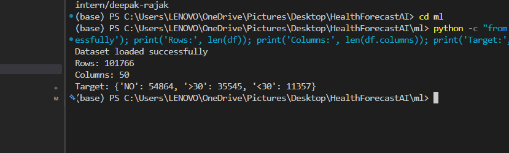

# Milestone 1 report - Week 1 & 2 - Project Initialization, Design Process & Core Setup

- **Intern name:** Deepak Rajak
- **Branch:** `intern/deepak-rajak`
- **Submitted on:** 28 August 2026

---

## Scope for this milestone

- Define healthcare workflows and project objectives.
- Design the system architecture and database schema.
- Create UI wireframes and plan the workflows.
- Set up the frontend and backend environments.
- Implement authentication, role-based access control, user permissions and
  dashboard access for Doctors, Hospital Administrators, Healthcare Researchers
  and System Administrators.
- Load the Diabetes 130-US Hospitals dataset.
- Build patient management and healthcare dashboard workflows.

## Evaluation criteria

- Project initialization and architecture setup completed.
- Authentication, role-based access control and patient management workflows implemented.
- Healthcare dashboard functional.
- Dataset integration and preprocessing completed.

---

## What I built

My contribution to Milestone 1 focused on the **AI/ML dataset integration and preprocessing pipeline**.

### Dataset integration

- Integrated the Diabetes 130-US Hospitals dataset into the ML project.
- Implemented dataset loading in `ml/src/data/load_data.py`.
- Configured the dataset path and target information in `ml/configs/config.yaml`.
- Verified that the raw dataset contains **101,766 records and 50 columns**.
- Verified the `readmitted` target distribution:
  - `NO`: 54,864
  - `>30`: 35,545
  - `<30`: 11,357
- Used `<30` as the positive label for the project's 30-day readmission target.
- Treated `>30` and `NO` as negative outcomes for the 30-day readmission target.

### Data preprocessing

Implemented the shared preprocessing pipeline in:

`ml/src/data/preprocess.py`

The preprocessing workflow includes:

- Handling missing values represented by `?`.
- Removing configured identifier and high-missingness columns.
- Removing encounters where a normal future readmission is not possible.
- Cleaning the diagnosis columns:
  - `diag_1`
  - `diag_2`
  - `diag_3`
- Removing duplicate records.
- Preserving the `readmitted` target column for downstream machine learning.

The preprocessing configuration is maintained in:

`ml/configs/config.yaml`

The preprocessing pipeline was verified to reduce the dataset from:

- **101,766 rows × 50 columns**
- to **99,343 rows × 45 columns**

with:

- **0 duplicate records**
- `readmitted` target preserved.

### Feature engineering structure

Initial feature engineering was prepared in:

`ml/src/features/build_features.py`

A prior-utilisation feature named `prior_visits_total` was added using:

- `number_outpatient`
- `number_emergency`
- `number_inpatient`

This provides the initial feature-engineering structure for future readmission-risk modelling.

### ML project structure

The AI/ML work is organized under the separate `ml/` directory so that ML development can proceed independently without interfering with the frontend and backend workstreams.

The ML structure includes:

```text
ml/
├── artifacts/
├── configs/
│   └── config.yaml
├── data/
│   ├── raw/
│   ├── processed/
│   └── external/
├── notebooks/
├── src/
│   ├── data/
│   │   ├── load_data.py
│   │   └── preprocess.py
│   ├── evaluation/
│   │   └── metrics.py
│   ├── features/
│   │   └── build_features.py
│   ├── models/
│   │   ├── predict.py
│   │   └── train.py
│   └── utils/
└── tests/
```

---


## How to run it

Run the following commands from the `ml/` directory.

### Prerequisite: Dataset

The raw Diabetes 130-US Hospitals dataset is not committed to the repository.
Download the dataset and place `diabetic_data.csv` in:

`ml/data/raw/diabetic_data.csv`

Download instructions are available in `ml/data/README.md`.

After placing the dataset in the required location, run the commands below.


### 1. Dataset loading

This command loads the Diabetes 130-US Hospitals dataset and verifies the
number of records, columns, and target distribution.

```bash
python -c "from src.data.load_data import load_raw; df=load_raw('data/raw/diabetic_data.csv'); print('Dataset loaded successfully'); print('Rows:', len(df)); print('Columns:', len(df.columns)); print('Target:', df['readmitted'].value_counts().to_dict())"
```

Expected output:

```text
Dataset loaded successfully
Rows: 101766
Columns: 50
Target: {'NO': 54864, '>30': 35545, '<30': 11357}
```

### 2. Data preprocessing

This command applies the preprocessing pipeline and verifies the resulting
dataset shape, duplicate records, and target column.

```bash
python -c "from src.data.load_data import load_raw; from src.data.preprocess import basic_clean; from src.utils.config import load_config; df=load_raw('data/raw/diabetic_data.csv'); clean=basic_clean(df, load_config('configs/config.yaml')); print('Original:', df.shape); print('After preprocessing:', clean.shape); print('Duplicates:', clean.duplicated().sum()); print('Target present:', 'readmitted' in clean.columns)"
```

Expected output:

```text
Original: (101766, 50)
After preprocessing: (99343, 45)
Duplicates: 0
Target present: True
```
## Evidence

The following screenshots provide evidence that the dataset loading and preprocessing
pipeline were executed successfully.

### 1. Dataset loading evidence

The dataset loading command was executed successfully from the `ml/` directory.

The terminal output verifies:

- Dataset loaded successfully.
- **101,766 rows** were loaded.
- **50 columns** were detected.
- The `readmitted` target distribution was verified:
  - `NO`: 54,864
  - `>30`: 35,545
  - `<30`: 11,357


### 2. Data preprocessing evidence

The preprocessing command was executed successfully using the implemented
`basic_clean()` pipeline and `config.yaml`.

The terminal output verifies:

- Original dataset: **101,766 rows × 50 columns**
- After preprocessing: **99,343 rows × 45 columns**
- Duplicate records: **0**
- `readmitted` target column is preserved.



### 3. Implementation evidence

The following project files contain the implementation used for the above results:

- `ml/src/data/load_data.py` — dataset loading functionality.
- `ml/src/data/preprocess.py` — data preprocessing pipeline.
- `ml/src/features/build_features.py` — initial feature engineering.
- `ml/configs/config.yaml` — dataset and preprocessing configuration.

The screenshots contain terminal output and dataset statistics only; no
real patient-identifiable information is included.

## Metrics

The following metrics were verified during Milestone 1:

| Metric | Result |
|---|---:|
| Raw dataset records | 101,766 |
| Raw dataset columns | 50 |
| Records after preprocessing | 99,343 |
| Columns after preprocessing | 45 |
| Duplicate records after preprocessing | 0 |
| Target column preserved | Yes |
| Target classes | 3 |
| Positive class (`<30`) | 11,357 |
| Negative class (`>30` + `NO`) | 90,409 |

### Dataset target distribution

- `NO`: 54,864
- `>30`: 35,545
- `<30`: 11,357

For the 30-day readmission objective, `<30` is treated as the positive class,
while `>30` and `NO` are treated as negative outcomes.

### Preprocessing result

The preprocessing pipeline reduced the dataset from **101,766 × 50** to
**99,343 × 45** while preserving the `readmitted` target column and producing
**0 duplicate records**.

### ML implementation

- Dataset loading module implemented: `ml/src/data/load_data.py`
- Preprocessing module implemented: `ml/src/data/preprocess.py`
- Feature engineering module prepared: `ml/src/features/build_features.py`
- Configuration maintained in: `ml/configs/config.yaml`

## Known gaps

The following items are not part of the completed ML contribution in Milestone 1
and will be addressed in later milestones:

- Model training and final model selection are not included in this milestone.
- Model performance optimization and hyperparameter tuning will be performed
  in a later milestone.
- The current feature engineering contains the initial `prior_visits_total`
  feature; additional clinically relevant features will be explored later.
- The preprocessing pipeline is prepared for downstream machine learning, but
  the complete prediction workflow will be developed in the next stages.
- Frontend/backend integration of the ML pipeline is not yet completed.
- The current milestone focuses on reliable dataset loading, preprocessing,
  configuration, and initial feature engineering rather than production
  deployment.