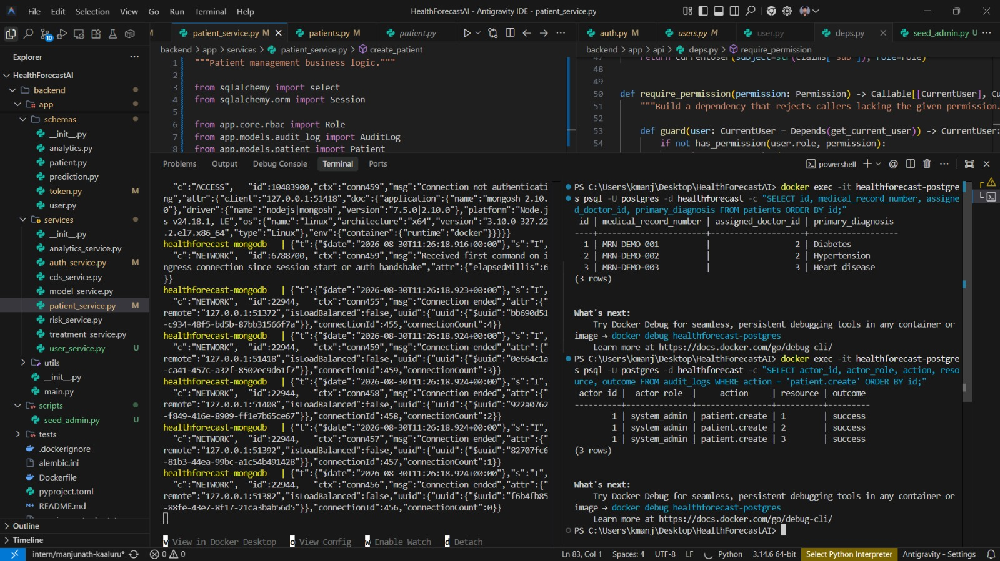
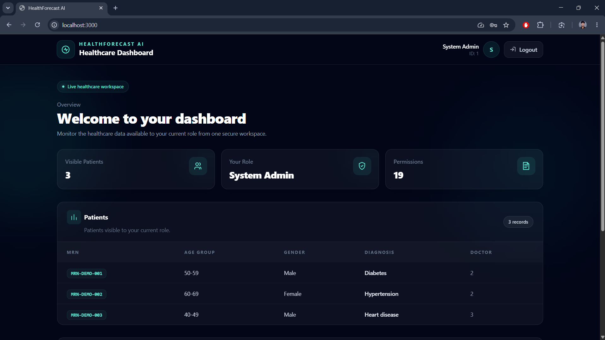
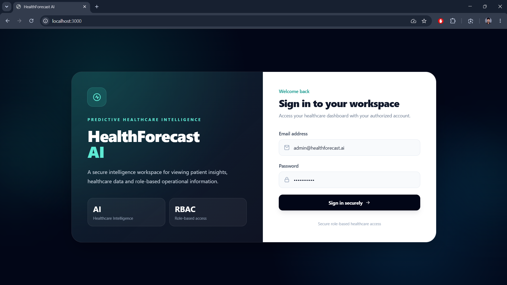
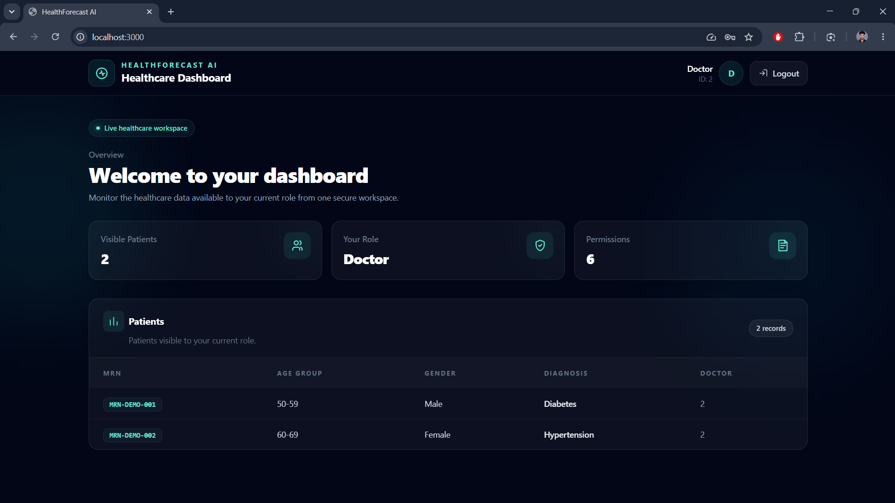

# Milestone 1 Report — Week 1 & 2

## Project Initialization, Design Process & Core Setup

| Field            | Details                    |
| ---------------- | -------------------------- |
| **Intern Name**  | Manjunath Kaaluru          |
| **Branch**       | `intern/manjunath-kaaluru` |
| **Milestone**    | Milestone 1 — Week 1 & 2   |
| **Submitted On** | 2026-08-31                 |
| **Project**      | HealthForecast AI          |

---

## 1. Milestone Overview

Milestone 1 focused on establishing the core foundation of the **HealthForecast AI** platform.

The primary objectives were to:

* Define healthcare workflows and project objectives.
* Design the initial system architecture and database schema.
* Create UI wireframes and plan application workflows.
* Set up the frontend, backend, database, and ML environments.
* Implement authentication and role-based access control.
* Implement user permissions and role-specific dashboard access.
* Implement patient management workflows.
* Integrate and preprocess the Diabetes 130-US Hospitals dataset.
* Establish the foundation for healthcare dashboards and future ML workflows.

---

## 2. Evaluation Criteria

The following milestone objectives were targeted:

* [x] Project initialization and architecture setup completed.
* [x] Authentication implemented.
* [x] Role-based access control implemented.
* [x] Patient management workflows implemented.
* [x] Healthcare dashboard foundation implemented.
* [x] Diabetes 130-US Hospitals dataset integrated.
* [x] Dataset preprocessing pipeline implemented.
* [x] Automated backend and ML validation completed.

---

# 3. System Architecture & Project Initialization

Implemented the core Docker-based development environment for the HealthForecast AI platform.

### Platform Components

The development environment consists of:

* **FastAPI** — Backend API
* **Next.js** — Frontend application
* **PostgreSQL** — Relational application database
* **MongoDB** — Document/data storage
* **ML/Data Processing Environment** — Dataset preparation and machine-learning workflows
* **Docker Compose** — Local service orchestration

The frontend, backend, databases, and ML environment are configured to operate as part of the local development platform.

### Core Architecture

```text
                    HealthForecast AI
                           |
             +-------------+-------------+
             |                           |
        Next.js Frontend            FastAPI Backend
             |                           |
             |                +----------+----------+
             |                |                     |
             |           PostgreSQL              MongoDB
             |                |
             |        Authentication / RBAC
             |        Users / Patients / Audit
             |
             +-------------------------------+
                                             |
                                      ML / Data Pipeline
                                             |
                                  Diabetes 130-US Hospitals
```

---

# 4. Authentication

Implemented database-backed authentication using:

* PostgreSQL
* bcrypt password hashing
* JWT access tokens
* FastAPI authentication dependencies

### Authentication Flow

The authentication process is:

1. Accept user credentials.
2. Look up the user in PostgreSQL.
3. Verify the submitted password against the stored bcrypt hash.
4. Generate a JWT access token.
5. Include the authenticated user's subject and role in the token.
6. Use authenticated API dependencies to protect protected endpoints.

### Relevant Backend Files

```text
backend/app/api/v1/endpoints/auth.py
backend/app/services/auth_service.py
backend/app/core/security.py
backend/app/api/deps.py
backend/app/models/user.py
backend/app/schemas/user.py
backend/app/schemas/token.py
```

---

# 5. Role-Based Access Control

Implemented four platform roles:

| Role             | Description                                              |
| ---------------- | -------------------------------------------------------- |
| `doctor`         | Access to assigned patient and clinical workflows        |
| `hospital_admin` | Administrative and broader healthcare-management access  |
| `researcher`     | Access to permitted research and analytics functionality |
| `system_admin`   | System-level administration and user management          |

Fine-grained permissions are defined in:

```text
backend/app/core/rbac.py
```

### Permission Areas

The permission system controls access to functionality including:

* Patient records
* Risk reports
* Healthcare analytics
* Treatment reports
* Research datasets
* User management
* Model management
* System administration

Role-based permissions are enforced through the authenticated user's role and associated permissions.

---

# 6. User Management

Implemented system-administrator user management backed by PostgreSQL.

### User Creation Supports

* Request validation
* Password hashing
* Role assignment
* Database persistence
* Audit logging

Development users were created for the system administrator and doctor roles.

Example development accounts:

| Email                      | Role           |
| -------------------------- | -------------- |
| `admin@healthforecast.ai`  | `system_admin` |
| `doctor@healthforecast.ai` | `doctor`       |

Passwords are stored as bcrypt hashes rather than plaintext values.

---

# 7. Audit Logging

Implemented audit logging for security-sensitive operations.

The PostgreSQL `audit_logs` table records:

| Field      | Description                    |
| ---------- | ------------------------------ |
| Actor      | User performing the operation  |
| Actor Role | Role of the authenticated user |
| Action     | Operation performed            |
| Resource   | Resource affected              |
| Outcome    | Result of the operation        |
| Timestamp  | Time of the operation          |

Authentication and user/patient creation operations were verified through PostgreSQL audit records.

---

# 8. Patient Management

Implemented patient creation and role-based patient visibility.

Patient records are stored in PostgreSQL and currently support:

* Medical record number
* Age group
* Gender
* Race
* Primary diagnosis
* Assigned doctor
* Creation timestamp

### Access Control

Doctor access can be scoped to assigned patients.

Administrative roles have broader access according to their assigned permissions.

Patient creation also generates a corresponding audit-log entry.

### Development Patient Records

Three development patient records were created:

```text
MRN-DEMO-001
MRN-DEMO-002
MRN-DEMO-003
```

Corresponding `patient.create` audit events were verified in PostgreSQL.

> **Privacy:** Development/demo records are used for validation. Screenshots must not contain real patient information or other sensitive data.

---

# 9. Healthcare Dashboard

Implemented the initial Next.js healthcare dashboard and connected it to the FastAPI backend.

The dashboard provides the foundation for the healthcare platform modules and integrates the user and patient workflows.

### Relevant Frontend Files

```text
frontend/src/app/page.tsx
frontend/src/lib/api.ts
frontend/src/lib/modules.ts
frontend/src/types/index.ts
```

The dashboard is currently focused on core workflow integration. Visual styling and advanced healthcare analytics will be expanded in later milestones.

---

# 10. Diabetes 130-US Hospitals Dataset Integration

Integrated the **Diabetes 130-US Hospitals** dataset into the ML/data-processing pipeline.

### Raw Dataset

| Metric  |   Value |
| ------- | ------: |
| Records | 101,766 |
| Columns |      50 |

The raw dataset is intentionally excluded from Git and stored locally under:

```text
ml/data/raw/
```

### Target Transformation

The original three-class `readmitted` target was converted into a binary 30-day readmission target:

| Original Value | Binary Target |
| -------------- | ------------: |
| `<30`          |           `1` |
| `>30`          |           `0` |
| `NO`           |           `0` |

The preprocessing pipeline also converts `?` values into missing values.

---

# 11. Dataset Preprocessing

Implemented a reproducible preprocessing pipeline containing:

1. Duplicate removal
2. Removal of discharge outcomes where readmission is not a meaningful possible outcome
3. Removal of configured identifier/high-missingness columns
4. Age-bucket normalization
5. Diagnosis-code grouping
6. Rare diagnosis grouping into `OTHER`
7. Utilisation feature generation
8. Target binarisation
9. Parquet output generation

### Processed Dataset

The resulting processed dataset contains:

| Metric              |  Result |
| ------------------- | ------: |
| Raw rows            | 101,766 |
| Raw columns         |      50 |
| Processed rows      |  99,343 |
| Processed columns   |      46 |
| 30-day readmissions |  11,314 |
| Other outcomes      |  88,029 |
| Positive class      |  11.39% |
| Negative class      |  88.61% |

The processed dataset is generated at:

```text
ml/data/processed/admissions_features.parquet
```

---

# 12. ML Environment

Added a Dockerized ML environment so dataset preparation and ML validation can be executed consistently without requiring all ML dependencies to be installed directly on the host machine.

### Relevant Files

```text
ml/Dockerfile
ml/src/data/load_data.py
ml/src/data/preprocess.py
ml/src/data/prepare_dataset.py
ml/src/features/build_features.py
ml/configs/config.yaml
```

---

# 13. How to Run the Project

## Prerequisites

The following tools are required:

* Docker Desktop
* Git

## Clone the Repository

```bash
git clone <repo-url>
cd HealthForecastAI
git checkout intern/manjunath-kaaluru
```

## Start the Platform

```bash
docker compose up -d --build
```

## Check Service Status

```bash
docker compose ps
```

The main services are:

* PostgreSQL
* MongoDB
* Backend
* Frontend
* ML

---

## Application Access

### Frontend

```text
http://localhost:3000
```

### Backend

```text
http://localhost:8000
```

### FastAPI Documentation

```text
http://localhost:8000/docs
```

---

# 14. Dataset Preparation

Start the ML service:

```bash
docker compose up -d ml
```

Run dataset preparation:

```bash
docker exec healthforecast-ml \
  python -m src.data.prepare_dataset \
  --config ml/configs/config.yaml
```

The processed dataset will be generated at:

```text
ml/data/processed/admissions_features.parquet
```

---

# 15. Evidence & Validation

## 15.1 Authentication & API Evidence

Authentication was successfully tested using the development system administrator account.

The authenticated `/me` endpoint returned:

* Authenticated user identity
* User role
* User permissions

### Evidence


The authentication flow was successfully verified using the development
system administrator account. The authenticated `/me` endpoint returned
the user's identity, `system_admin` role, and associated permissions.

---

## 15.2 PostgreSQL Schema Evidence

The PostgreSQL database contains the following tables:

```text
admissions
audit_logs
patients
risk_predictions
treatment_outcomes
users
```
### Evidence


---

## 15.3 User Management Evidence

Development users were successfully created and persisted:

```text
admin@healthforecast.ai       system_admin
doctor@healthforecast.ai      doctor
```

Passwords are stored as bcrypt hashes rather than plaintext passwords.

### Evidence



---


## 15.4 Healthcare Dashboard Evidence

The Next.js dashboard is available at:

```text
http://localhost:3000
```

### Evidence







---

## 15.5 Dataset Processing Evidence

The preprocessing pipeline produced:

```text
Raw rows:                 101,766
Raw columns:                   50
Processed rows:            99,343
Processed columns:              46
30-day readmissions:        11,314
Other outcomes:             88,029
Positive class:              11.39%
Negative class:              88.61%
```

### Terminal Evidence

```text
Loading raw dataset: ml/data/raw/diabetic_data.csv
Raw rows: 101,766
Raw columns: 50
Raw duplicate rows: 0
Raw missing values: 374,017

Preprocessing complete
----------------------
Processed rows: 99,343
Processed columns: 46
Processed duplicate rows: 2
Remaining missing values: 180,729
30-day readmissions: 11,314
Other outcomes: 88,029
Output: ml/data/processed/admissions_features.parquet

```
### Processed Dataset Validation

```text
Shape: (99343, 46)

Target distribution:
readmitted
0    88029
1    11314

Target percentages:
readmitted
0    88.61
1    11.39

Columns: 46
Missing values: 180729
```

---

# 16. Automated Test Evidence

## Backend

```text
35 tests passed
```

## ML

```text
16 tests passed
```

### Evidence


---

# 17. Screenshot Checklist

The following screenshots can be added to:

```text
docs/05-wireframes/
```

| Screenshot                  | Required | Status     |
| --------------------------- | -------- | ---------- |
| `milestone-1-dashboard.png` | Yes      | `docs/05-wireframes/Doctor_Dashboard.png` |
| `milestone-1-api.png`       | Yes      | `docs/05-wireframes/Admin_Dashboard.png` |
| `milestone-1-database.png`  | Yes      | `docs/05-wireframes/Doctor_Dashboard.png` |
| `milestone-1-tests.png`     | Optional | `docs/05-wireframes/milestone_1_backend_completed.jpg` |
| `milestone-1-dataset.png`   | Optional | `docs/05-wireframes/milestone_1_backend_completed.jpg` |


---

# 18. Metrics

| Metric                                 |  Result |
| -------------------------------------- | ------: |
| Backend tests passed                   |      35 |
| ML tests passed                        |      16 |
| PostgreSQL tables                      |       6 |
| Supported RBAC roles                   |       4 |
| Raw dataset records                    | 101,766 |
| Raw dataset columns                    |      50 |
| Processed dataset records              |  99,343 |
| Processed dataset columns              |      46 |
| 30-day readmissions                    |  11,314 |
| Other outcomes                         |  88,029 |
| Positive class                         |  11.39% |
| Negative class                         |  88.61% |
| Development patient records            |       3 |
| Verified patient creation audit events |       3 |

> Backend test coverage percentage was not recorded during the final validation run. Therefore, no coverage percentage is reported.

---

# 19. Known Gaps & Future Work

The following items are intentionally planned for subsequent milestones:

### Machine Learning

* Advanced readmission-risk model training
* Model prediction workflows
* Additional feature engineering
* Model evaluation and performance analysis

### Healthcare Workflows

* Treatment effectiveness analysis
* Clinical decision support
* Advanced healthcare analytics
* Expanded healthcare reporting

### Privacy & Research

* Researcher-facing pseudonymisation
* Advanced de-identification
* Expanded privacy and data-processing controls

### Frontend

* Further visual refinement
* Improved dashboard UX
* Expanded role-specific dashboard functionality

### Code Quality

Some Black formatting differences remain in several backend files. These do not prevent the completed functional tests, type checking, or Ruff validation.

---

# 20. Milestone 1 Completion Summary

Milestone 1 implementation and validation are complete.

The project now has a functioning Dockerized application foundation with:

* Docker-based project infrastructure
* FastAPI backend
* Next.js frontend
* PostgreSQL and MongoDB databases
* Database-backed authentication
* bcrypt password hashing
* JWT-based authentication
* Role-based access control
* Fine-grained user permissions
* System-administrator user management
* Audit logging
* Patient management workflows
* Healthcare dashboard foundation
* Diabetes 130-US Hospitals dataset integration
* Reproducible dataset preprocessing
* Dockerized ML environment
* Automated backend and ML validation

This establishes the core technical foundation required for the next milestone, which will focus on **advanced readmission-risk modeling, prediction, feature engineering, model evaluation, and expanded healthcare analytics**.
