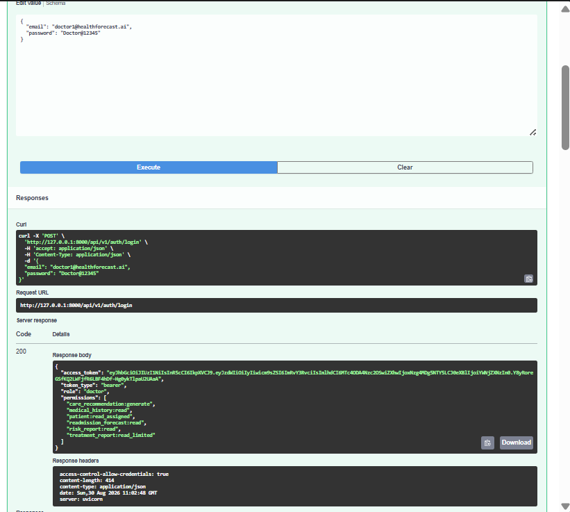
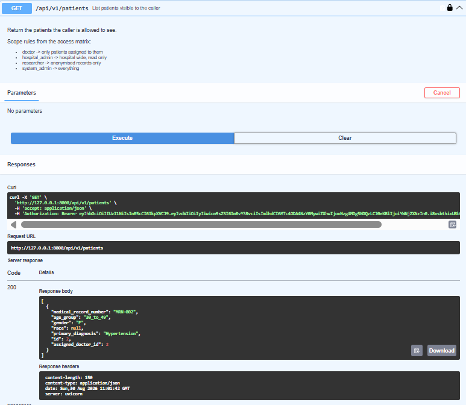

# Milestone 1 report - Week 1 & 2 - Project Initialization, Design Process & Core Setup

- **Intern name:** Parimala M
- **Branch:** `intern/Parimala-M`
- **Submitted on:** 2026-08-30

---

## Scope for this milestone

- Define healthcare workflows and project objectives.
- Design the system architecture and database schema.
- Create UI wireframes and plan the workflows.
- Set up the frontend and backend environments.
- Implement authentication, role-based access control, user permissions and
  dashboard access for Doctors, Hospital Administrators, Healthcare Researchers
  and System Administrators.
- Load the Diabetes 130-US Hospitals dataset.
- Build patient management and healthcare dashboard workflows.

## Evaluation criteria

- Project initialization and architecture setup completed.
- Authentication, role-based access control and patient management workflows implemented.
- Healthcare dashboard functional.
- Dataset integration and preprocessing completed.

---

## What I built

**Authentication (`app/api/v1/endpoints/auth.py`, `app/services/auth_service.py`)**
- Implemented `POST /auth/login`: looks up the user by email, verifies the
  password with the existing bcrypt helper, issues a JWT access token, and
  writes a success/failure row to `audit_logs` on every attempt.
- `authenticate_user()` and `record_login_attempt()` added to the previously
  empty `auth_service.py`, keeping the router thin per the module's own
  docstring convention.

**User management (`app/api/v1/endpoints/users.py`)**
- Implemented `GET /users` (paginated, optional role filter) and
  `POST /users` (creates a user with a hashed password, rejects duplicate
  emails, writes an audit log entry).

**Patient data + RBAC (`app/api/v1/endpoints/patients.py`, `app/services/patient_service.py`)**
- Implemented `GET /patients`, scoped per the access matrix: doctors see only
  patients where `assigned_doctor_id` matches their own id; hospital admins
  and system admins see all patients; researchers are redirected to the
  anonymised endpoint.
- Implemented `POST /patients` (system_admin only, per the `patient:write`
  permission), with duplicate medical-record-number checks and audit logging.
- Added `get_visible_patients()` to the previously empty `patient_service.py`.

**Data preprocessing (`ml/src/data/preprocess.py`, `ml/configs/config.yaml`)**
- Built a pipeline that loads the 5 source tables (admissions, patients,
  diagnoses, hospitals, billing), merges them into one admissions-level
  feature frame, fills the one column with real missing values
  (`insurance_type`), buckets patient age into 4 groups, and drops
  identifier columns.
- Updated `config.yaml` to reflect the dataset actually used (see "Known
  gaps" below for why this differs from the brief).

## How to run it

```bash
git clone https://github.com/GKSJ-AI-CliniScan/HealthForecastAI.git
git checkout intern/Parimala-M

# Backend
cd backend
python -m venv venv
venv\Scripts\Activate.ps1
pip install -r requirements.txt -r requirements-dev.txt

# Local DB (SQLite) + seed data
python scripts\table.py
python scripts\admin.py

# Run the API
uvicorn app.main:app --reload
# Swagger UI: http://localhost:8000/docs

# ML preprocessing
cd ../ml
pip install pandas pyyaml
python tests\test_preprocess.py
```

## Evidence

- `POST /auth/login` with valid admin credentials returns a `200` with a
  JWT, role `system_admin`, and the full permission list from `rbac.py`.
- `POST /auth/login` with an incorrect password returns `401 Incorrect
  email or password`.

  
- `POST /users` (as admin) creates a `doctor` user; `GET /users` then lists
  both the admin and the new doctor.
- Cross-role RBAC test: admin creates patient `MRN-001` assigned to
  themself and `MRN-002` assigned to the doctor. Logged in as the doctor,
  `GET /patients` returns **only** `MRN-002` - confirming the
  assigned-patients-only scope from the access matrix is enforced, not
  
  just documented.
- Doctor attempting `POST /patients` correctly receives `403 - Role
  'doctor' lacks permission 'patient:write'`.
- `ml/tests/test_preprocess.py` run against the real dataset: 120,000 raw
  admission rows in, 120,000 clean rows out across 28 columns, 0 remaining
  nulls in `insurance_type`.

## Metrics

- **API endpoints implemented:** 7 (`POST /auth/login`, `GET /auth/me`,
  `GET /auth/roles`, `GET /users`, `POST /users`, `GET /patients`,
  `POST /patients`).
- **Database tables created:** 6 (`users`, `patients`, `admissions`,
  `risk_predictions`, `treatment_outcomes`, `audit_logs`).
- **Dataset row count after preprocessing:** 120,000 admission records
  (India Hospital Readmission Dataset, 2015-2024) across 28 features.
- **Backend test suite:** 35/35 tests passing (`pytest -v`), 0 lint errors
  (`ruff check .`), 0 formatting issues (`black --check .`).

## Known gaps

- **Dataset substitution:** the brief names the Diabetes 130-US Hospitals
  dataset. I used the India Hospital Readmission Dataset (2015-2024)
  instead, since it covers multiple conditions rather than diabetes only.
  This was flagged to the mentor; awaiting explicit confirmation.
- **Local database:** developed and tested against SQLite rather than
  PostgreSQL, due to a local disk-space constraint blocking the Docker
  Desktop install. All database access goes through SQLAlchemy's ORM, so
  the same code runs unmodified against PostgreSQL; not yet verified
  locally against a real Postgres instance.
- **Frontend and dashboard:** not built this milestone.
- **Researcher anonymisation:** `GET /patients/anonymised` is still a
  stub (`TODO(milestone-3)`), unchanged from the scaffold.