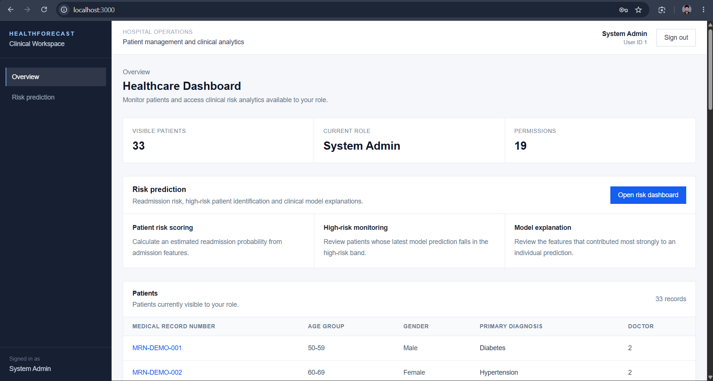
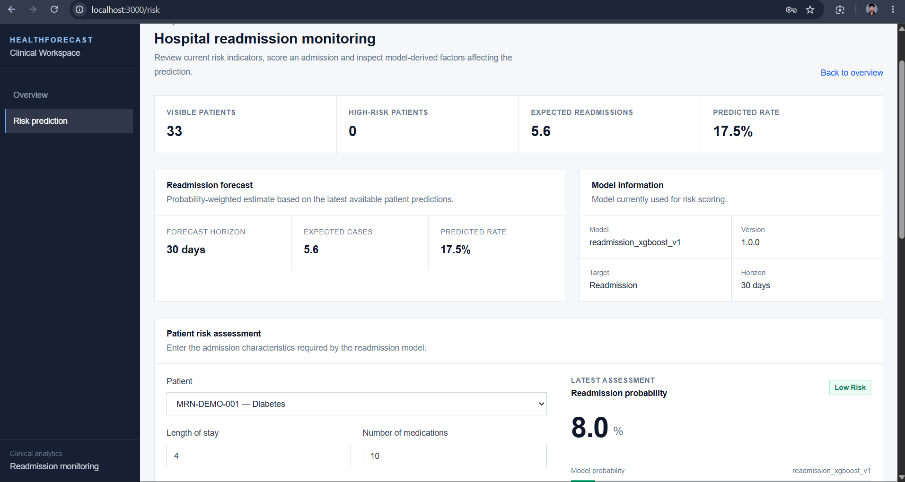

# Milestone 2 report - Week 3 & 4 - Risk Prediction & Readmission Forecasting

-   **Intern name:** Kaaluru Manjunath
-   **Branch:** `intern/26-kaaluru-manjunath`
-   **Submitted on:** 13 September 2026

------------------------------------------------------------------------

## Scope for this milestone

-   Train patient risk prediction models.
-   Generate patient risk scores.
-   Build risk prediction dashboards.
-   Develop readmission forecasting workflows.
-   Generate forecasting reports.
-   Build clinical insights modules.

## Evaluation criteria

-   Patient risk prediction and readmission forecasting workflows
    implemented.
-   Risk scoring and forecasting models functional.
-   Clinical insights generated successfully.
-   AI prediction models integrated.

------------------------------------------------------------------------

## What I built

Milestone 2 implements an end-to-end patient readmission risk prediction
workflow, from model training and evaluation through backend inference,
risk scoring, forecasting, clinical interpretation, and frontend
visualization.

### 1. Risk prediction model training

Implemented and evaluated three machine-learning models:

-   Logistic Regression
-   Random Forest
-   XGBoost

The training pipeline performs:

-   Dataset loading and preprocessing.
-   Train, validation, calibration, and test splitting.
-   Missing-value handling.
-   Numerical feature processing and scaling.
-   Categorical feature processing and one-hot encoding.
-   Class-imbalance handling.
-   Model training and comparison.
-   Decision-threshold tuning with a recall requirement.
-   Probability calibration using a separate calibration dataset.
-   Final evaluation on an untouched test set.
-   Saving the promoted model as a reusable model artifact.

Main implementation files:

-   `ml/src/models/train.py`
-   `ml/src/models/predict.py`
-   `ml/src/models/score.py`
-   `ml/src/evaluation/metrics.py`
-   `ml/src/evaluation/calibration.py`
-   `ml/config.yaml`

The final promoted model is XGBoost.

### 2. Model artifact and inference

The trained model is stored as:

``` text
ml/artifacts/readmission_model.joblib
```

The backend loads this artifact and performs inference through the model
service.

Main backend implementation:

-   `backend/app/services/model_service.py`

The backend is configured to use:

``` text
ACTIVE_RISK_MODEL=readmission_xgboost_v1
MODEL_ARTIFACT_DIR=ml/artifacts
```

The model artifact is mounted read-only into the backend container so
that the API can perform predictions without retraining the model.

### 3. Patient risk scoring API

Implemented the risk prediction API:

``` text
POST /api/v1/risk/predict
```

The API accepts patient-level admission and utilization information and
returns:

-   Readmission probability.
-   Risk category.
-   Model name.
-   Model version.
-   Prediction timestamp.

Risk categories are derived from configured probability bands:

``` text
Low       < 0.40
Medium    >= 0.40 and < 0.70
High      >= 0.70
```

The model's calibrated binary decision threshold is separate from these
dashboard risk bands.

### 4. High-risk patient workflow

Implemented:

``` text
GET /api/v1/risk/high-risk
```

This workflow retrieves the latest prediction for each patient and
identifies patients whose predicted risk falls into the high-risk
category.

This supports the clinical dashboard's high-risk patient list.

### 5. Readmission forecasting

Implemented:

``` text
GET /api/v1/risk/forecast?horizon_days=30
```

The forecasting workflow aggregates the latest patient-level readmission
probabilities to produce:

-   Forecast scope.
-   Forecast horizon.
-   Predicted number of readmissions.
-   Predicted readmission rate.

For the current model, the prediction target represents readmission
within 30 days, and the dashboard uses the 30-day forecast.

### 6. Risk drivers and clinical insights

Implemented:

``` text
POST /api/v1/risk/drivers
```

The service extracts model-derived feature contributions and presents
the most influential factors for an individual prediction.

The clinical insight service converts these model-derived drivers into
readable clinical interpretation, including:

-   Estimated readmission risk.
-   Factors increasing predicted risk.
-   Factors reducing predicted risk.

Main implementation:

``` text
backend/app/services/clinical_insight_service.py
```

### 7. Risk prediction dashboard

Implemented a clinical-style frontend dashboard under:

``` text
/risk
```

The dashboard provides:

-   Patient selection.
-   Risk assessment input.
-   Current risk probability.
-   Risk category.
-   High-risk patient list.
-   Readmission forecast.
-   Prediction factors.
-   Clinical interpretation.
-   Model information.

Main frontend files include:

-   `frontend/src/app/risk/page.tsx`
-   `frontend/src/components/ui/risk-badge.tsx`
-   `frontend/src/components/ui/risk-driver-list.tsx`
-   `frontend/src/components/ui/stat-card.tsx`
-   `frontend/src/hooks/use-auth.tsx`

### 8. Authentication and role-based access

The existing authentication and RBAC system is integrated with the risk
workflows.

The application supports:

-   Doctor
-   Hospital Admin
-   Researcher
-   System Admin

Risk and patient operations are protected using the existing
permission-based access-control system.

### 9. Automated tests

Added backend tests covering:

-   Risk prediction endpoints.
-   Model-service behavior.
-   Clinical insight generation.

The ML test suite covers training, evaluation, calibration, prediction,
and scoring functionality.

The completed backend and ML test suites pass successfully.

### 10. Synthetic demonstration data

Created:

``` text
scripts/demo_seed.ps1
```

The script creates synthetic demonstration users and patients and sends
risk-prediction requests through the API, providing varied data for
dashboard and model demonstration without using real patient
information.

------------------------------------------------------------------------

## How to run it

The application is designed to run using Docker Compose.

### 1. Clone the repository

``` bash
git clone https://github.com/GKSJ-AI-CliniScan/HealthForecastAI.git
cd HealthForecastAI
```

### 2. Checkout the milestone branch

``` bash
git checkout intern/26-kaaluru-manjunath
```

### 3. Start the application

``` bash
docker compose up -d --build
```

### 4. Check the running services

``` bash
docker compose ps
```

### 5. Run backend tests

``` bash
docker compose exec backend pytest -q
```

### 6. Run ML tests

``` bash
docker compose exec ml pytest -q
```

### 7. Run backend linting

``` bash
docker compose exec backend ruff check app tests
```

### 8. Load synthetic demonstration data

From PowerShell on Windows:

``` powershell
powershell -ExecutionPolicy Bypass -File .\scripts\demo_seed.ps1
```

### 9. Open the application

Frontend:

``` text
http://localhost:3000
```

Backend API documentation:

``` text
http://localhost:8000/docs
```

Risk APIs available through Swagger:

``` text
POST /api/v1/risk/predict
GET  /api/v1/risk/high-risk
GET  /api/v1/risk/forecast
POST /api/v1/risk/drivers
```

------------------------------------------------------------------------

## Evidence

------------------------------------------------------------------------


------------------------------------------------------------------------

## Metrics

The readmission target is the `<30` class from the Diabetes 130-US
Hospitals dataset. Because the target is imbalanced, model comparison
considers precision, recall, F1, and ROC-AUC in addition to accuracy.

### Validation-set model comparison

  --------------------------------------------------------------------------------
  Model          Accuracy   Precision     Recall         F1    ROC-AUC    Decision
                                                                         Threshold
  ------------ ---------- ----------- ---------- ---------- ---------- -----------
  Logistic         0.6665      0.1741     0.5155     0.2603     0.6452        0.51
  Regression                                                           

  Random           0.6716      0.1768     0.5155     0.2633     0.6499        0.49
  Forest                                                               

  XGBoost          0.6682      0.1826     0.5508     0.2743     0.6578        0.12
  --------------------------------------------------------------------------------

XGBoost was selected because it achieved the strongest validation
ROC-AUC, recall, precision, and F1 among the three evaluated models.

### Calibration and final test evaluation

After model selection, XGBoost probabilities were calibrated using a
separate calibration split and the decision threshold was tuned again.

Final calibrated decision threshold:

``` text
0.11
```

Final evaluation was performed on the untouched test set.

  Metric        XGBoost
  ----------- ---------
  Accuracy       0.6742
  Precision      0.1872
  Recall         0.5568
  F1             0.2802
  ROC-AUC        0.6686

Final confusion matrix:

                      Predicted Negative   Predicted Positive
  ----------------- -------------------- --------------------
  Actual Negative                  12136                 5470
  Actual Positive                   1003                 1260

The model was selected and evaluated with the objective of maintaining
useful recall on the imbalanced readmission target rather than
optimizing accuracy alone.

### Training split

The data was divided into separate training, validation, calibration,
and test sets:

``` text
Training:     59,605
Validation:    9,934
Calibration:   9,935
Test:         19,869
```

The calibration and test data were kept separate from the model-training
process.

------------------------------------------------------------------------

## Known gaps

-   The current readmission model predicts the `<30` readmission target.
    The forecasting workflow therefore currently represents the model's
    30-day readmission prediction rather than a separately trained model
    for every possible forecasting horizon.
-   The current treatment endpoints remain placeholders for the later
    treatment-effectiveness milestone; treatment-outcome creation and
    deeper treatment analytics are not part of the completed Milestone 2
    implementation.
-   The current clinical insights are model-derived feature
    interpretations and are not intended to replace clinician judgment.
-   The model is trained on the Diabetes 130-US Hospitals dataset and
    should be treated as a demonstration/research model until validated
    on the target healthcare organization's real-world population and
    workflow.
-   Synthetic demonstration data is used for the application showcase.
    No real patient data is included in the demonstration dataset.
-   Further production work would include model monitoring, drift
    detection, prospective validation, model governance, and more
    comprehensive clinical validation.
