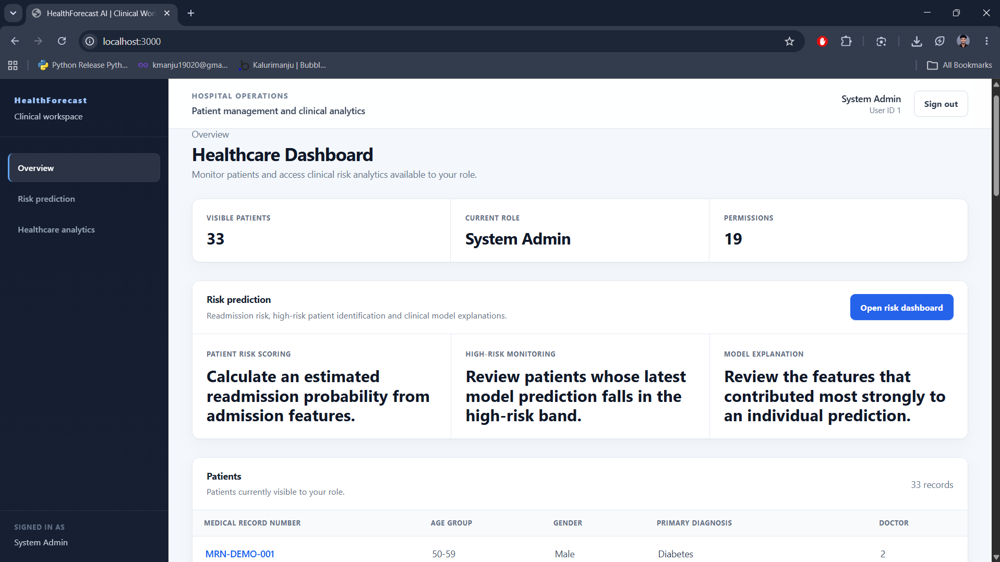
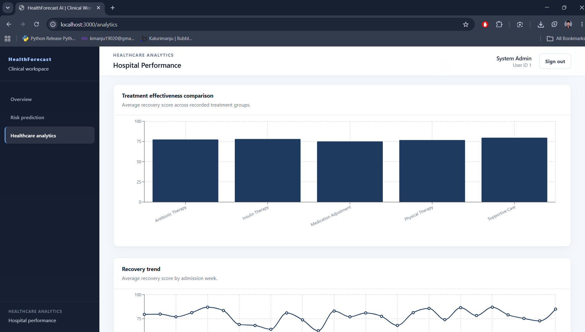
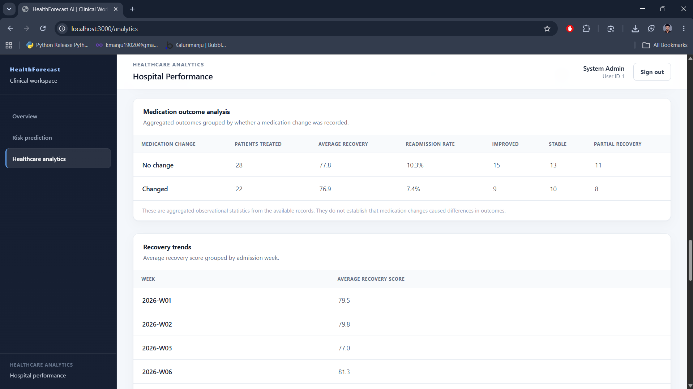
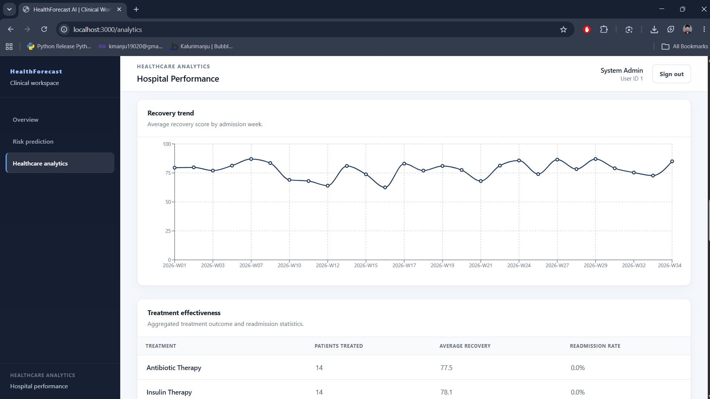
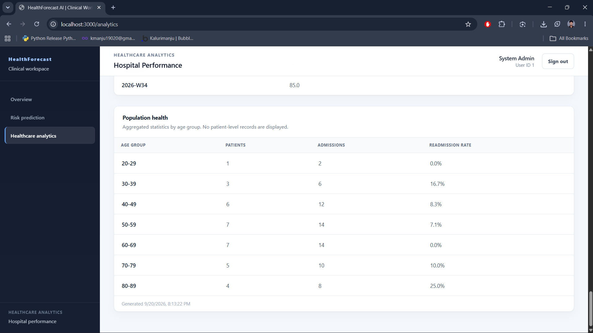
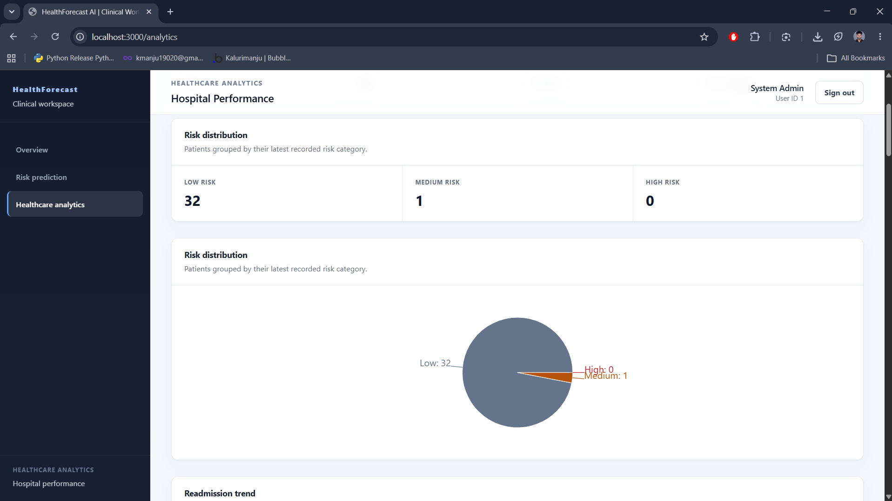
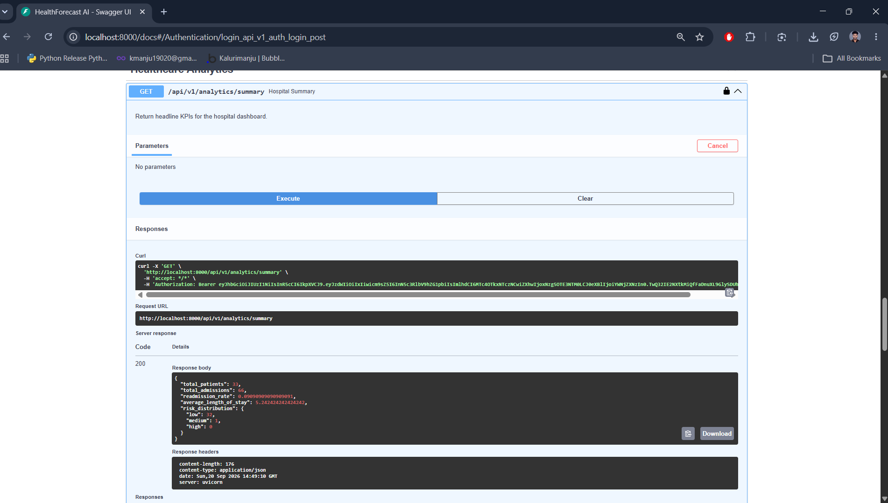
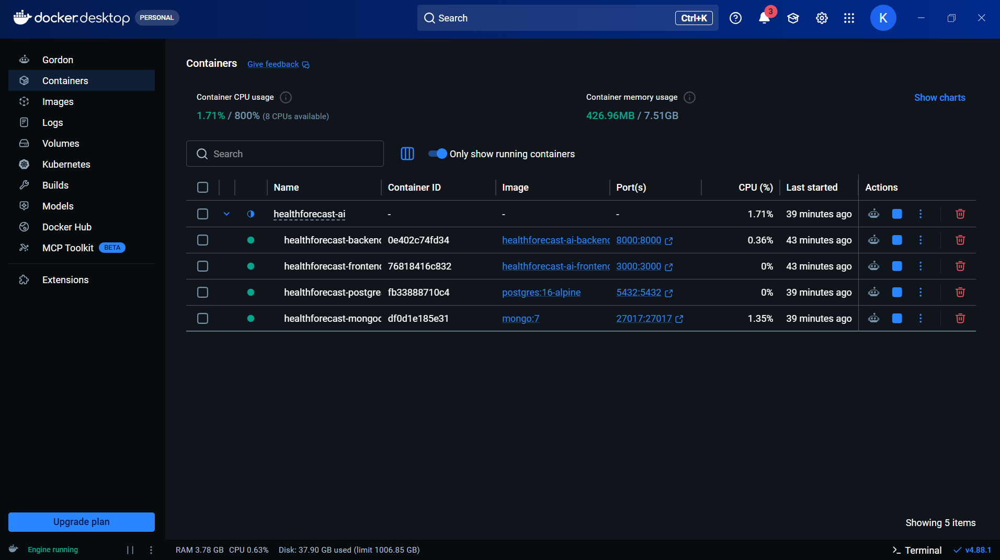

# Milestone 3 report - Week 5 & 6 - Treatment Effectiveness Analysis & Healthcare Analytics

> **How to use this file**
>
> 1. Fill in every section below. Keep all five headings, even if an answer is short.
> 2. Delete the `_Not started_` line once you begin - that line is what tells CI
>    the report is still a blank template.
> 3. Commit it on your own branch. Do not open a pull request to `main`.

* **Intern name:** Kaaluru Manjunath
* **Branch:** `intern/26-kaaluru-manjunath`
* **Submitted on:** 2026-09-20

---

## Scope for this milestone

* Implement treatment evaluation workflows.
* Generate recovery and treatment effectiveness reports.
* Develop medication outcome analysis modules.
* Build healthcare performance dashboards.
* Generate patient outcome analytics reports.
* Develop healthcare trend monitoring tools.

## Evaluation criteria

* Treatment effectiveness analysis and healthcare analytics dashboard implemented.
* Patient outcome reports functional.
* Hospital performance analytics generated successfully.
* Trend monitoring workflows integrated.

---

## What I built

Implemented the Milestone 3 treatment effectiveness and healthcare analytics workflow across the FastAPI backend and Next.js frontend.

### 1. Treatment evaluation workflows

Implemented treatment outcome storage and treatment effectiveness analysis.

Key backend files:

* `backend/app/models/treatment.py`
* `backend/app/schemas/treatment.py`
* `backend/app/services/treatment_outcome_service.py`
* `backend/app/services/treatment_service.py`
* `backend/app/api/v1/endpoints/treatment.py`

The treatment workflow supports recording treatment outcomes against admissions and generating aggregated treatment effectiveness summaries.

The treatment effectiveness report provides:

* Treatment name
* Number of patients treated
* Average recovery score
* Readmission rate

The implemented treatment catalogue used in the synthetic demonstration data includes:

* Medication Adjustment
* Insulin Therapy
* Antibiotic Therapy
* Physical Therapy
* Supportive Care

### 2. Recovery and treatment effectiveness reports

Implemented treatment recovery analysis and weekly recovery trend reporting.

The following backend endpoints were added or extended:

* `GET /api/v1/treatment`
* `GET /api/v1/treatment/recovery-trends`
* `POST /api/v1/treatment/outcomes`

The recovery trend workflow groups treatment outcomes by admission week and calculates the average recovery score for each available period.

### 3. Medication outcome analysis

Implemented medication outcome analysis grouped by whether a medication change was recorded.

The endpoint:

* `GET /api/v1/treatment/medication-outcomes`

returns aggregated statistics including:

* Medication change status
* Patients treated
* Average recovery score
* Readmission rate
* Improved outcome count
* Stable outcome count
* Partial recovery count

The dashboard explicitly identifies these results as aggregated observational statistics and does not treat the differences as evidence of causal treatment effects.

### 4. Healthcare performance analytics

Implemented hospital-level analytics endpoints and dashboard components.

The analytics workflow provides:

* Total patient count
* Total admission count
* Readmission rate
* Average length of stay
* Current risk distribution
* Monthly readmission trends
* Population-health cohort statistics

Relevant backend files include:

* `backend/app/api/v1/endpoints/analytics.py`
* `backend/app/services/analytics_service.py`
* `backend/app/schemas/analytics.py`

Implemented analytics endpoints include:

* `GET /api/v1/analytics/summary`
* `GET /api/v1/analytics/readmissions`
* `GET /api/v1/analytics/population-health`

### 5. Patient outcome analytics

Implemented aggregated patient outcome reporting through treatment recovery, readmission, medication outcome and population-health analytics.

The frontend presents these results using tables and charts while keeping population-health reporting aggregated rather than displaying patient-level records.

### 6. Healthcare trend monitoring

Implemented trend monitoring for:

* Monthly admissions and readmissions
* Monthly readmission rates
* Weekly recovery scores
* Population-health cohort readmission rates
* Hospital risk distribution

The frontend includes dedicated visualisations for readmission and recovery trends using Recharts.

### 7. Frontend healthcare analytics dashboard

Implemented the healthcare analytics dashboard in:

* `frontend/src/app/analytics/page.tsx`

The dashboard includes:

* Hospital overview KPIs
* Risk distribution
* Readmission trend chart
* Readmission trend table
* Treatment effectiveness chart
* Treatment effectiveness table
* Medication outcome analysis
* Recovery trend chart
* Recovery trend table
* Population-health analytics

The dashboard uses permission-aware loading based on the existing RBAC permissions.

### 8. Frontend UI improvements

The frontend UI was also refined to provide a more consistent clinical application experience.

Updated frontend files include:

* `frontend/src/app/globals.css`
* `frontend/src/app/layout.tsx`
* `frontend/src/app/page.tsx`
* `frontend/src/app/risk/page.tsx`
* `frontend/src/app/analytics/page.tsx`
* `frontend/src/components/ui/risk-badge.tsx`
* `frontend/src/components/ui/risk-driver-list.tsx`
* `frontend/src/components/ui/stat-card.tsx`
* `frontend/src/hooks/use-auth.tsx`
* `frontend/src/lib/api.ts`
* `frontend/src/types/index.ts`

The updated interface provides:

* Consistent clinical navigation
* Responsive sidebar/navigation
* Improved dashboard cards
* Improved tables
* Consistent risk indicators
* Improved error states
* Responsive layouts
* Consistent typography, spacing and controls

### 9. Admission workflow

Added admission creation support required by the treatment outcome workflow.

Implemented:

* `backend/app/api/v1/endpoints/admissions.py`
* `backend/app/schemas/admission.py`
* `backend/app/services/admission_service.py`

The admission service validates the patient relationship and admission/discharge date consistency before creating an admission record.

### 10. Synthetic M3 demonstration data

Created a reusable demonstration data seeding script:

* `scripts/seed_m3.ps1`

The demonstration dataset contains synthetic patients, admissions and treatment outcomes used to verify the analytics workflows.

No real patient information is used in the demonstration dataset.

---

## How to run it

The application can be run using Docker Compose.

```bash
git clone <repo-url>
cd HealthForecastAI
git checkout intern/26-kaaluru-manjunath
docker compose up -d --build
docker compose ps
```

The expected services are:

```text
Frontend     http://localhost:3000
Backend      http://localhost:8000
API Docs     http://localhost:8000/docs
PostgreSQL  localhost:5432
MongoDB     localhost:27017
```

### Frontend validation

From the frontend directory:

```bash
cd frontend
npm ci
npm run lint
npm run build
```

Both linting and the production build completed successfully during milestone verification.

### Docker verification

From the repository root:

```bash
docker compose up -d --build frontend
docker compose ps
```

The frontend, backend, PostgreSQL and MongoDB services were running successfully during verification.

### Backend health verification

```bash
curl http://localhost:8000/health
```

Expected response:

```json
{
  "status": "ok",
  "service": "HealthForecastAI",
  "environment": "development"
}
```

### API documentation

Open:

```text
http://localhost:8000/docs
```

### Healthcare analytics

Open:

```text
http://localhost:3000/analytics
```

### Risk dashboard

Open:

```text
http://localhost:3000/risk
```

### M3 demonstration data

The synthetic M3 data can be prepared using:

```powershell
.\scripts\seed_m3.ps1
```

The script creates synthetic demonstration patients, admissions and treatment outcomes required to exercise the analytics workflows.

---

## Evidence


### Screenshot 1 - Healthcare Analytics Dashboard



<br><br><br><br>

### Screenshot 2 - Treatment Effectiveness Analysis



<br><br><br><br>

### Screenshot 3 - Medication Outcome Analysis



<br><br><br><br>

### Screenshot 4 - Recovery and Readmission Trends



<br><br><br><br>

### Screenshot 5 - Population Health Analytics



<br><br><br><br>

### Screenshot 6 - Risk Dashboard



<br><br><br><br>

### Screenshot 7 - API Documentation / Analytics Endpoints



<br><br><br><br>

### Screenshot 8 - Build and Docker Verification



<br><br><br><br>

---

## Metrics

### Treatment effectiveness analysis

Treatment effectiveness is reported using aggregated observational measures rather than predictive accuracy because the M3 treatment module analyzes recorded treatment outcomes and does not have a ground-truth causal treatment-effect label.

The available treatment analysis provides:

* Patients treated per treatment group
* Average recovery score
* Readmission rate

Verified treatment groups included:

| Treatment             | Patients treated | Average recovery score | Readmission rate |
| --------------------- | ---------------: | ---------------------: | ---------------: |
| Antibiotic Therapy    |               14 |                   77.5 |             0.0% |
| Insulin Therapy       |               14 |                   78.1 |             0.0% |
| Medication Adjustment |               13 |                   75.1 |            46.2% |
| Physical Therapy      |               13 |                   76.8 |             0.0% |
| Supportive Care       |               12 |                   79.7 |             0.0% |

These statistics are based on the synthetic demonstration dataset and are not clinical evidence of treatment effectiveness or causal treatment effects.

### Medication outcome analysis

Medication outcome analysis was implemented with two aggregated groups:

| Medication change | Patients treated | Average recovery score | Readmission rate |
| ----------------- | ---------------: | ---------------------: | ---------------: |
| No change         |               28 |                   77.8 |            10.3% |
| Changed           |               22 |                   76.9 |             7.4% |

Outcome counts were also calculated for:

* Improved
* Stable
* Partial recovery

These results are observational statistics from synthetic demonstration data and should not be interpreted as causal evidence.

### Risk classification quality

The readmission model used by the application is the XGBoost model selected during Milestone 2.

Final untouched test-set metrics from the promoted model:

* Accuracy: 67.42%
* Precision: 18.72%
* Recall: 55.68%
* F1 score: 28.02%
* ROC-AUC: 66.86%
* Decision threshold: 0.11

Confusion matrix:

* True negatives: 12,136
* False positives: 5,470
* False negatives: 1,003
* True positives: 1,260

The model metrics are included as the risk-classification quality measure supporting the M3 healthcare analytics dashboard.

### Hospital analytics metrics

The verified synthetic demonstration environment contained:

* 33 patients
* 66 admissions
* 66 treatment outcome records
* 59 risk prediction records

Hospital summary:

* Readmission rate: 9.09%
* Average length of stay: 5.24 days
* Low-risk patients: 32
* Medium-risk patients: 1
* High-risk patients: 0

### Analytics endpoints delivered

The M3 implementation delivered seven analytics/treatment reporting endpoints:

1. `GET /api/v1/analytics/summary`
2. `GET /api/v1/analytics/readmissions`
3. `GET /api/v1/analytics/population-health`
4. `GET /api/v1/treatment`
5. `GET /api/v1/treatment/recovery-trends`
6. `POST /api/v1/treatment/outcomes`
7. `GET /api/v1/treatment/medication-outcomes`

### Dashboard performance

A formal browser performance benchmark was not performed during this milestone. Functional verification was completed through frontend linting, production build validation, Docker deployment, backend health checks and API verification.

---

## Known gaps

* Treatment effectiveness results are observational and based on synthetic demonstration data. They do not establish causal treatment effects.
* A formal causal inference framework, such as propensity-score matching, inverse probability weighting or a randomized treatment-effect evaluation workflow, has not been implemented.
* Dashboard load time has not been formally benchmarked using a browser performance tool.
* The current analytics dataset is synthetic demonstration data and should not be interpreted as real-world clinical evidence.
* Advanced hospital-to-hospital benchmarking is not currently implemented because the current demonstration environment represents a single hospital analytics context.
* Additional longitudinal patient outcome analysis can be added in a future milestone.
* Additional treatment stratification by diagnosis, age group, admission type and other clinical factors can be added in future iterations.
* Automated analytics regression tests can be expanded as additional reporting workflows are introduced.
* Production deployment would require additional operational controls such as production secrets management, monitoring, logging, backup policies and environment-specific configuration.
