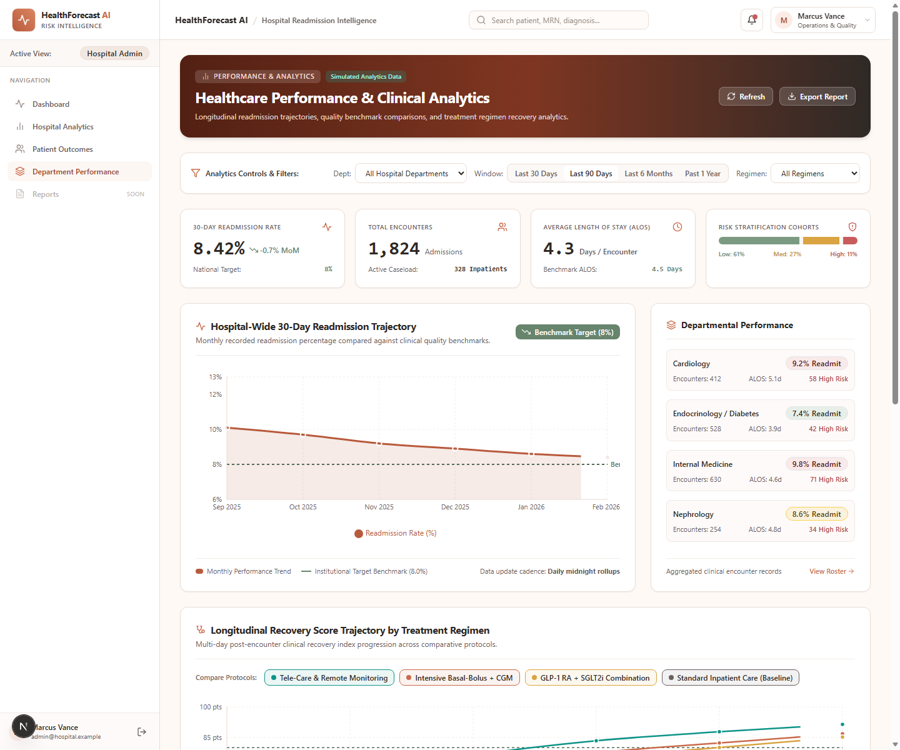
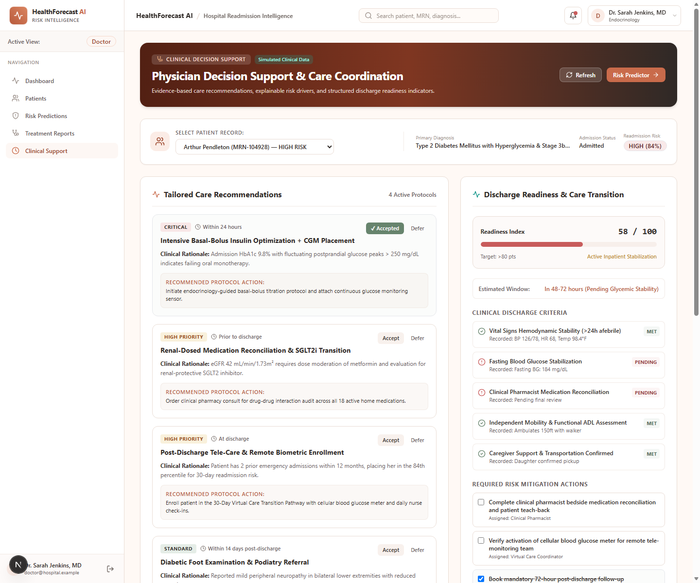

# Milestone 3 report - Week 5 & 6 - Treatment Effectiveness Analysis & Healthcare Analytics

- **Intern name:** Kiruthika B
- **Branch:** `intern/20-kiruthika-b`
- **Submitted on:** 22 September 2026

---

## Scope for this milestone

- Implement treatment evaluation workflows.
- Generate recovery and treatment effectiveness reports.
- Develop medication outcome analysis modules.
- Build healthcare performance dashboards.
- Generate patient outcome analytics reports.
- Develop healthcare trend monitoring tools.

## Evaluation criteria

- Treatment effectiveness analysis and healthcare analytics dashboard implemented.
- Patient outcome reports functional.
- Hospital performance analytics generated successfully.
- Trend monitoring workflows integrated.

---

## What I built

My track for Milestone 3 was **Frontend / Full-Stack Developer**: building the end-to-end user interfaces for Healthcare Performance & Analytics (`/analytics`) and Clinical Decision Support (`/clinical-support`), interactive data visualizations, treatment outcome comparison modules, discharge readiness planning workflows, and typed API service layers prepared for backend ML model and database integration.

> [!NOTE]
> **Frontend Scope & Simulated Data Notice:** Milestone 3 implementation in this branch is **FRONTEND ONLY**. All analytics summaries, readmission trends, department breakdowns, treatment comparisons, clinical recommendations, and discharge readiness scores displayed in the UI are **simulated / mock demonstration data** (`isSimulated: true`, `dataSource: "simulated_mock"`) for interface prototyping, clinical decision support review, and workflow validation. No backend ML models or live clinical databases were modified or connected to production patient records in this phase.

---

### A. Healthcare Performance & Analytics Dashboard (`/analytics`)

A hospital analytics and performance monitoring dashboard enabling administrators, department heads, and researchers to assess clinical outcomes, track monthly readmission trends, evaluate cross-department performance, and compare treatment regimen effectiveness.

| File | What it does |
|---|---|
| `frontend/src/app/(dashboard)/analytics/page.tsx` | Dedicated healthcare performance dashboard with KPI cards, multi-filter toolbar, readmission trend charts, department performance breakdowns, and treatment outcome comparisons |
| `frontend/src/components/charts/ReadmissionChart.tsx` | Interactive multi-series bar and line chart visualizing monthly hospital readmission rates against simulated institutional quality benchmarks (8.0%) and target trajectory |
| `frontend/src/components/charts/RecoveryTrendChart.tsx` | Comparative time-series recovery trajectory chart displaying multi-day clinical recovery score progression (Day 1–30) across 4 comparative treatment protocols (Tele-Care, Intensive Basal-Bolus, GLP-1 RA + SGLT2i, Standard Inpatient Care) |
| `frontend/src/services/mockAnalyticsData.ts` | Realistic, de-identified mock datasets containing hospital KPI summaries, department metrics, monthly readmission timelines, treatment effectiveness benchmarks, and recovery curves |
| `frontend/src/services/analyticsService.ts` | Typed data service handling analytics queries, department filtering, timeframe parameters, and prepared for future `/analytics/summary`, `/analytics/readmissions`, `/treatment`, and `/treatment/recovery-trends` backend endpoints |
| `frontend/src/types/analytics.ts` | Strict TypeScript contracts for hospital performance metrics, department analytics, treatment effectiveness, recovery trends, and query filters |

**Key Analytics Features:**
- **KPI Performance Summary Cards:** Instant visibility into 4 core institutional metrics: 30-Day Readmission Rate (8.42%, with -0.7% MoM trajectory vs. simulated 8.0% quality target), Total Encounters (1,824 Admissions with 328 active inpatients), Average Length of Stay (4.3 Days / Encounter vs. simulated 4.5d benchmark ALOS), and Risk Stratification Cohorts (Low: 61%, Medium: 27%, High: 11%).
- **Monthly Readmission Trend Visualization:** Multi-month time-series comparing historical hospital-wide readmission rates (Sep 2025: 10.1% → Feb 2026: 8.4%) against the simulated 8.0% institutional quality benchmark.
- **Department Performance Breakdown:** Department-level performance cards for 4 key services (Cardiology, Endocrinology / Diabetes, Internal Medicine, Nephrology) displaying encounter volume, readmission rates, average LOS, and high-risk counts.
- **Treatment Effectiveness Comparison:** Detailed clinical comparison table contrasting 6 clinical regimens across category, patient volume, average recovery score, 30-day readmission rate, average LOS, and treatment adherence percentage.
- **Comparative Recovery Trajectory Chart:** Visualizes longitudinal recovery score progression across 4 therapeutic protocols over 30 days.
- **Dynamic Filtering Controls:** Multi-filter controls supporting Department selection (All Hospital Departments, Cardiology, Endocrinology, Internal Medicine, Nephrology), Timeframe scope (Last 30 Days, Last 90 Days, Last 6 Months, Past 1 Year), and Treatment Regimen category (All Regimens, Pharmacological, Care Coordination).
- **Simulated Data & Provenance Transparency:** Explicit status banners, `Simulated Analytics Data` badges, and real-time generation timestamps informing users of mock data state.

---

### B. Clinical Decision Support UI (`/clinical-support`)

An AI-assisted Clinical Decision Support (CDS) dashboard enabling attending physicians to review tailored care recommendations, evaluate patient-specific risk drivers against clinical benchmarks, assess discharge readiness, and formulate structured risk mitigation plans.

| File | What it does |
|---|---|
| `frontend/src/app/(dashboard)/clinical-support/page.tsx` | Clinical decision support interface featuring patient selection, clinical context banner, evidence-based recommendations, risk driver benchmarking, discharge readiness meter, and interactive checklist actions |
| `frontend/src/services/mockClinicalSupportData.ts` | Detailed clinical presets and patient dossiers (e.g., Eleanor Vance [MRN-10029], Arthur Pendelton [MRN-10045], Clara Oswald [MRN-10082]) with risk drivers, simulated clinical benchmarks, tailored care recommendations, and discharge plans |
| `frontend/src/services/clinicalSupportService.ts` | Typed data service managing patient dossier loading, recommendation state updates, and prepared for future `/clinical-support/recommendations/{patient_id}` and `/clinical-support/discharge-plan/{patient_id}` endpoints |
| `frontend/src/types/clinicalSupport.ts` | TypeScript interfaces for care recommendations, priority rankings, risk drivers, patient vs. benchmark metrics, discharge readiness, and mitigation checklists |

**Key Clinical Decision Support Features:**
- **Patient Cohort Selector:** Instant switching across representative clinical dossiers with varying diagnoses and risk levels.
- **Clinical Context Banner:** Displays patient demographics, medical record number, primary diagnosis, admission status, and readmission risk percentage/category.
- **Evidence-Based Care Recommendations:** Priority-ranked clinical suggestions (Critical, High Priority, Standard) with clinical rationales, target timeframes, recommended protocol actions, and interactive **Accepted** / **Deferred** status toggles.
- **Risk Driver & Benchmark Comparison:** Side-by-side comparison of individual patient lab/clinical values against reference simulated benchmark ranges (e.g., HbA1c 9.8% vs. < 7.0%, 18 Active Prescriptions vs. < 8 Formularies, NT-proBNP 4,820 pg/mL vs. < 900 pg/mL).
- **Discharge Readiness Meter:** Visual progress meter calculating readiness index score (e.g., 58/100, 66/100, 88/100) alongside target discharge timeframe and clinical readiness status.
- **Discharge Criteria Checklist:** Interactive clinical criteria checkboxes (vital sign stability, lab stabilization, pharmacist medication reconciliation, functional mobility, caregiver support).
- **Actionable Risk Mitigation Plan:** Interactive checklist of targeted interventions (e.g., pharmacist medication reconciliation, cellular glucometer activation, 72-hour follow-up scheduling).
- **Post-Discharge Instructions:** Structured summaries of medication regimens, fluid/dietary restrictions, and urgent warning signs.
- **Clinical Safety Disclaimer:** Prominent alert reminding practitioners that all insights serve as decision support demonstrations and must not replace professional clinical judgment.

---

### C. Technical Implementation & API Readiness

- **Strict TypeScript Architecture:** Standardized type definitions across [`frontend/src/types/analytics.ts`](../../frontend/src/types/analytics.ts), [`frontend/src/types/clinicalSupport.ts`](../../frontend/src/types/clinicalSupport.ts), and [`frontend/src/types/dashboard.ts`](../../frontend/src/types/dashboard.ts) with zero `any` usage.
- **Service Layer Abstraction:** Decoupled data fetching in [`analyticsService.ts`](../../frontend/src/services/analyticsService.ts) and [`clinicalSupportService.ts`](../../frontend/src/services/clinicalSupportService.ts), maintaining seamless fallback to mock data when backend services are offline.
- **Prepared Backend API Endpoints:**
  - `GET /analytics/summary` — Hospital overview KPIs
  - `GET /analytics/readmissions` — Monthly readmission rate time-series
  - `GET /treatment` — Treatment regimen effectiveness metrics
  - `GET /treatment/recovery-trends` — Multi-regimen recovery trajectories
  - `GET /clinical-support/recommendations/{patient_id}` — Patient-specific care recommendations
  - `GET /clinical-support/discharge-plan/{patient_id}` — Patient discharge readiness and mitigation plan
- **Role-Based Navigation Integration:**
  - Added `/analytics` to Hospital Administrator and Healthcare Researcher navigation menus.
  - Added `/clinical-support` to Doctor navigation menu.
  - Maintained authentication guards and unauthenticated redirects to `/login`.

---

## How to run it

```bash
git clone <repo-url>
cd HealthForecastAI
git checkout intern/20-kiruthika-b

# Navigate to frontend and install dependencies
cd frontend
npm install

# Start the Next.js development server
npm run dev
```

The application will be accessible at `http://localhost:3000`.

### Demo Accounts & Milestone 3 Navigation

Sign in with any of the demo accounts to test role-specific workflows:

| Email | Role | Accessible Milestone 3 Routes |
|---|---|---|
| `doctor@hospital.example` | Doctor | `/clinical-support` (Clinical Decision Support), `/risk`, `/dashboard`, `/patients` |
| `admin@hospital.example` | Hospital Administrator | `/analytics` (Healthcare Performance), `/forecast`, `/dashboard` |
| `researcher@hospital.example` | Healthcare Researcher | `/analytics` (Healthcare Analytics), `/forecast`, `/patients` |
| `sysadmin@hospital.example` | System Administrator | Full navigation access across all routes |

### Verification Commands

Run the following commands in `frontend/` to verify code quality and build integrity:

```bash
npm run typecheck
npm run lint
npm run build
```

---

## Evidence

### 1. Code Quality & Build Checks

- **`npm run typecheck`** — Passed with 0 errors
- **`npm run lint`** — Passed with 0 warnings/errors
- **`npm run build`** — Passed successfully

**Production build output:**
```text
Next.js 15.5.23
✓ Compiled successfully in 16.8s
✓ Linting and checking validity of types
✓ Collecting page data
✓ Generating static pages (12/12)
✓ Finalizing page optimization
✓ Collecting build traces

Route (app)                                 Size  First Load JS
┌ ○ /                                      269 B         120 kB
├ ○ /_not-found                            123 B         103 kB
├ ○ /analytics                           4.21 kB         135 kB
├ ○ /clinical-support                    7.45 kB         135 kB
├ ○ /dashboard                           3.21 kB         127 kB
├ ○ /forecast                             132 kB         251 kB
├ ○ /login                               4.34 kB         120 kB
├ ○ /patients                            2.37 kB         126 kB
├ ƒ /patients/[id]                       7.48 kB         127 kB
├ ○ /register                            4.86 kB         113 kB
└ ○ /risk                                12.8 kB         132 kB
+ First Load JS shared by all             103 kB
  ├ chunks/255-87552e6e05b8e3aa.js       46.4 kB
  ├ chunks/4bd1b696-c023c6e3521b1417.js  54.2 kB
  └ other shared chunks (total)             2 kB

○  (Static)   prerendered as static content
ƒ  (Dynamic)  server-rendered on demand
```

### 2. Route Verification

All 12 application routes compiled and verified without errors, preserving all Milestone 1 and Milestone 2 routes while integrating the new Milestone 3 pages:

| Route | Description | Milestone | Status |
|---|---|:---:|:---:|
| `/analytics` | Healthcare Performance & Analytics Dashboard | M3 | Compiled / Verified (HTTP 200) |
| `/clinical-support` | Clinical Decision Support & Discharge Planning | M3 | Compiled / Verified (HTTP 200) |
| `/risk` | Patient Risk Prediction Dashboard & What-If Simulator | M2 | Preserved / Verified (HTTP 200) |
| `/forecast` | Readmission Forecasting & Multi-Horizon Analytics | M2 | Preserved / Verified (HTTP 200) |
| `/dashboard` | Role-aware clinical overview dashboard | M1 | Preserved / Verified (HTTP 200) |
| `/patients` | Patient directory with multi-filter controls | M1 | Preserved / Verified (HTTP 200) |
| `/patients/[id]` | Patient clinical dossier and admission history | M1 | Preserved / Verified (HTTP 200) |
| `/login` | Practitioner authentication page | M1 | Preserved / Verified (HTTP 200) |
| `/register` | User registration page | M1 | Preserved / Verified (HTTP 200) |
| `/` | Platform landing page | M1 | Preserved / Verified (HTTP 200) |

---

### 3. UI Screenshots & Evidence

#### Healthcare Performance & Analytics Dashboard (`/analytics`)



_Figure 3.1: Healthcare Performance & Clinical Analytics dashboard displaying longitudinal readmission trajectory, hospital quality benchmark comparisons (8% target), department-level performance metrics, and comparative treatment regimen recovery trajectories._

#### Clinical Decision Support Dashboard (`/clinical-support`)



_Figure 3.2: Clinical Decision Support & Care Coordination interface displaying patient dossier selection, clinical context banner, evidence-based care recommendations with Accept/Defer actions, discharge readiness index (58/100), clinical discharge criteria checklist, and required risk mitigation actions._

---

## Metrics

Because this Milestone 3 implementation is **FRONTEND ONLY** and utilizes simulated/mock datasets for UI prototyping:

- **Model Performance Metrics (Accuracy, Precision, Recall, F1 score, ROC-AUC):**
  - **Status:** Pending actual backend ML model training, offline validation, and live inference API integration.
  - No synthetic or fabricated model performance values are reported.
- **Frontend Quality & Route Verification Metrics:**
  - The UI demonstrates complete visual consistency, responsive design, clinical safety disclaimer compliance, and typed service contract preparation ready for backend handoff.

| Metric | Value | Status |
|---|---|:---:|
| Total application routes | 12 (including `/analytics` and `/clinical-support`) | Verified |
| TypeScript errors | 0 (`npm run typecheck`) | Passed |
| ESLint errors / warnings | 0 (`npm run lint`) | Passed |
| Production build status | Success (`next build`, Next.js 15.5.23) | Passed |
| Static / Dynamic pages generated | 12 / 12 | Generated |
| Backend API readiness endpoints prepared | 6 endpoints | Structured & Typed |
| Model Accuracy / Precision / Recall / F1 / ROC-AUC | _Pending backend/ML integration_ | N/A (Frontend Scope) |

---

## Known gaps

- **Live backend / ML API integration pending:** The frontend uses simulated analytics summaries, treatment comparison data, and clinical recommendations. The service layers (`analyticsService.ts`, `clinicalSupportService.ts`) are structured to switch to live backend endpoints (`/analytics/summary`, `/treatment`, `/clinical-support/recommendations/{patient_id}`) once backend services are active.
- **Simulated / mock data scope:** All displayed KPIs, treatment success rates, recovery curves, and clinical recommendations are simulated for UI prototyping and workflow validation.
- **Clinical validation boundary:** Clinical care recommendations and risk mitigation suggestions are for decision support demonstration only and have not undergone clinical trial validation or medical regulatory clearance.
- **Authentication & session management:** Role-based access control and session state are managed through client-side state/session storage; migration to secure backend HttpOnly cookie authentication remains scheduled for subsequent milestones.
