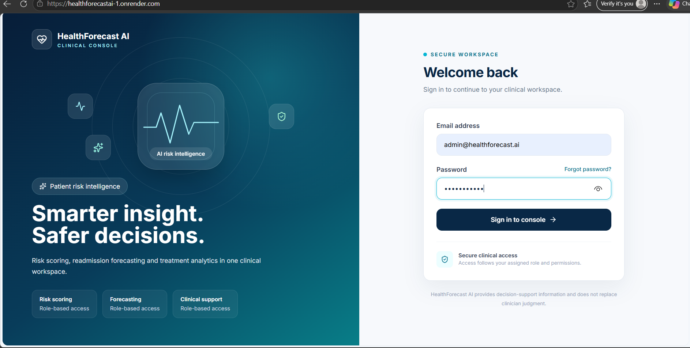
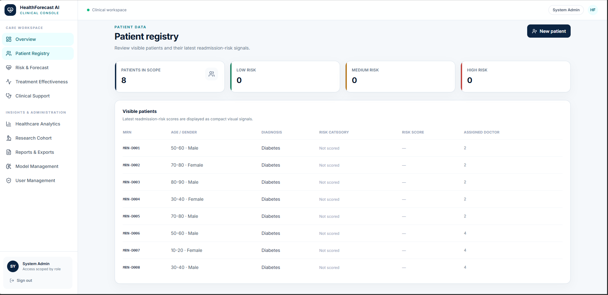
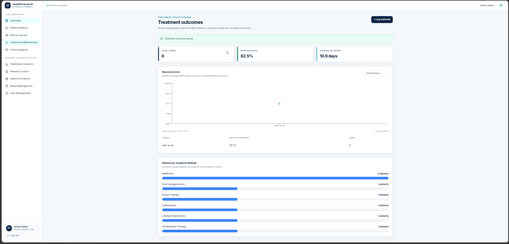
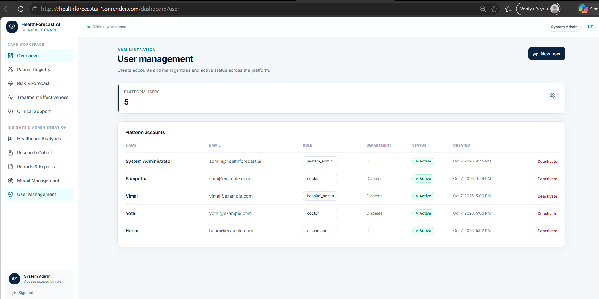

# Milestone 4 report - Week 7 & 8 - Testing, Deployment & Documentation

- **Intern name:** Parimala M
- **Branch:** `intern/24-parimala-m`
- **Submitted on:** 2026-10-05

---

## Scope for this milestone

- Validate prediction accuracy and healthcare analytics quality.
- Optimize healthcare workflows and dashboard responsiveness.
- Deploy the platform using Docker and a cloud environment.
- Prepare the final project documentation and presentation.
- Demonstrate the complete HealthForecast AI platform.

## Evaluation criteria

- Fully deployed frontend and backend.
- Model testing and validation completed.
- Documentation and presentation prepared.
- Successful end-to-end platform demonstration completed.

---

## What I built

The HealthForecastAI platform was completed as an AI-based hospital readmission prediction and patient risk intelligence system.

The following major components were implemented and integrated:

### Frontend

The frontend was developed using Next.js, React, TypeScript, Tailwind CSS, Recharts, and Lucide React.

The completed frontend includes:

- Authentication and login
- Dashboard overview
- Patient registry
- Risk prediction
- High-risk patient records
- Readmission forecasting
- Treatment effectiveness
- Healthcare analytics
- Research cohort
- Clinical support
- Reports and exports
- Model management
- User management
- Role-based and permission-aware navigation

The dashboard provides KPI cards, risk indicators, charts, tables, loading states, error states, empty states, and responsive layouts.

### Backend

The backend was developed using FastAPI, SQLAlchemy, and PostgreSQL.

The completed API functionality includes:

- Authentication
- User management
- Patient management
- Risk prediction
- Risk scores
- High-risk patient retrieval
- Readmission forecasting
- Treatment effectiveness
- Recovery trends
- Healthcare analytics
- Readmission analytics
- Reports and exports
- Model management

JWT authentication and permission-based access control are implemented for protected healthcare functionality.

### Machine Learning

The readmission prediction system uses an XGBoost-based machine learning model.

The ML workflow includes:

- Patient feature processing
- Readmission risk prediction
- Risk categorisation
- High-risk patient identification
- Readmission forecasting

The model artifacts are maintained under `ml/artifacts/` and are excluded from Git according to the repository artifact policy.

The final model evaluation metrics are documented in the Metrics section.

### Deployment and CI/CD

The application was containerized using Docker and prepared for cloud deployment.

The frontend was successfully built and deployed to a cloud environment.

The backend was containerized and deployed as the FastAPI service.

The repository CI/CD workflow was also used to validate:

- Frontend installation
- Frontend build
- Linting
- Type checking
- Documentation structure
- Repository policies
- Model artifact restrictions
## Evidence

The following evidence was used to validate the completed project.

 Application functionality

The following healthcare workflows were tested:

- User authentication  
- Role-based access 
- Patient registry  
- Patient management 
- Readmission risk prediction
- High-risk patient identification
- Readmission forecasting
- Treatment effectiveness analysis 
- Recovery trend analysis
- Healthcare analytics
- Research cohort 
- Clinical support
- Reports and exports 
- Model management
- User Management 
---

## Metrics

### Machine learning model

The final XGBoost model was evaluated using the project validation and test workflow.

- Model: XGBoost
- Decision threshold: 0.11
- Test accuracy: 0.6769
- Test precision: 0.1859
- Test recall: 0.5435
- Test F1-score: 0.2770
- Test ROC-AUC: 0.6692

These metrics are evaluation results for the project model and should not be interpreted as clinical performance for real-world hospital deployment.

### Code quality and CI validation

The repository CI workflow was used to validate the project.

- Frontend build: Passed
- Frontend linting: Passed
- Frontend type checking: Passed
- Backend linting: Passed
- Backend formatting check: Passed
- ML linting: Passed
- ML formatting check: Passed
- Milestone report structure: Passed

### Deployment

| Component | Status |
|---|---|
| Frontend | Deployed |
| Backend | Deployed |
| Database | Configured for deployment |
| ML model | Integrated |
| Frontend-backend integration | Pending final end-to-end verification |
| End-to-end application | Pending final verification |

### Live deployment

- Frontend: `https://healthforecastai-1.onrender.com`
- Backend: `https://healthforecastai-sarj.onrender.com`
- Backend API base: `https://healthforecastai-sarj.onrender.com/api/v1`

Formal response-time, concurrent-user, and load-testing benchmarks were not performed during this milestone.

## Known gaps

- The current machine learning model should be further validated using independent hospital datasets before being used in a real clinical environment.
- The model performance can be improved through additional data, feature engineering, hyperparameter tuning, and external validation.
- Clinical support provides decision-support guidance and should not replace professional clinical judgement.
- Long-term production deployment would require continuous monitoring of model performance, data drift, and prediction quality.
- Additional performance testing under high concurrent user loads can be performed as a future enhancement.
- Future versions can improve model explainability, monitoring, automated retraining, dataset diversity, and integration with hospital information systems.

## How to run it

### Clone the repository

```bash
git clone https://github.com/GKSJ-AI-CliniScan/HealthForecastAI.git
cd HealthForecastAI
git checkout intern/24-parimala-m 
```