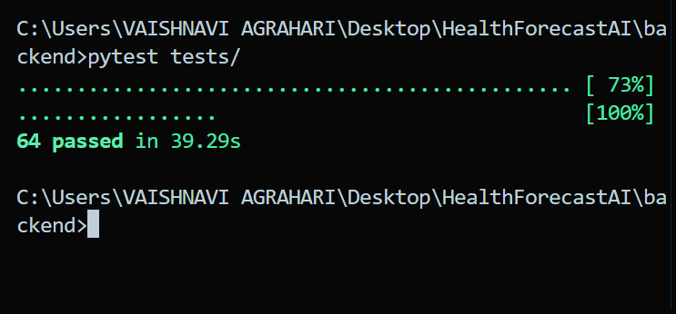
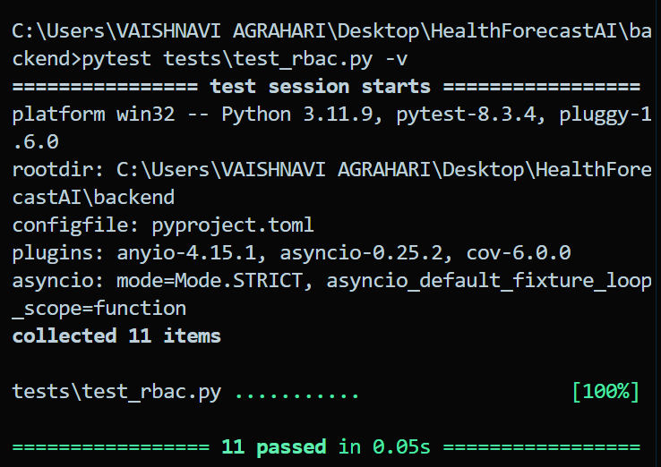
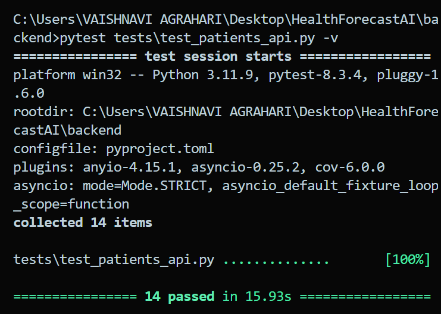
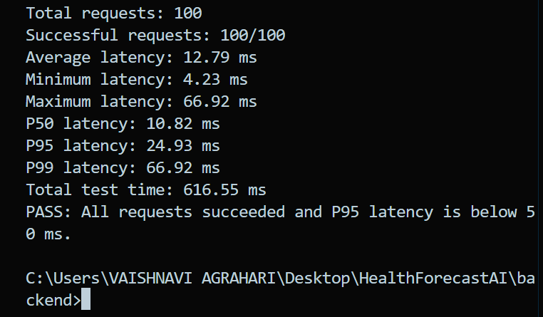

# Milestone 4 report - Week 7 & 8 - Testing, Deployment & Documentation


- **Intern name:** Vaishnavi Agrahari
- **Branch:** `intern/08-vaishnavi-agrahari`
- **Submitted on:** 04 October 2026

---

## Scope for this milestone

- Validate prediction accuracy and healthcare analytics quality.
- Optimize healthcare workflows and dashboard responsiveness.
- Deploy the platform using Docker and a cloud environment.
- Prepare the final project documentation and presentation.
- Demonstrate the complete HealthForecast AI platform.

## Evaluation criteria

- Fully deployed frontend and backend.
- Model testing and validation completed.
- Documentation and presentation prepared.
- Successful end-to-end platform demonstration completed.

---

## What I built

### 1. API Performance & Load Testing

Added:

- `backend/tests/load/test_profile_load.py`

The load test sends authenticated requests to:

`GET /api/v1/auth/me`

It measures average, minimum, maximum, P50, P95 and P99 latency.

The benchmark uses 5 concurrent workers with 20 requests per worker, for a total of 100 requests.

### 2. Security & RBAC Matrix Audit

Updated and validated the RBAC implementation for:

- Doctor
- Hospital Administrator
- Healthcare Researcher
- System Administrator

Updated:

- `backend/app/core/rbac.py`
- `backend/app/api/deps.py`
- `backend/app/api/v1/endpoints/patients.py`

Patient-history authorization requires an appropriate patient-read permission together with `MEDICAL_HISTORY_READ`.

Added/updated tests:

- `backend/tests/test_rbac.py`
- `backend/tests/test_patients_api.py`
- `tests/e2e/test_role_access.py`

### 3. Automated Database Backup & Restore

Added:

- `database/postgres/backup/backup_postgres.bat`
- `database/mongodb/backup/backup_mongodb.bat`

The PostgreSQL script uses `pg_dump` from the Docker container.

The MongoDB script uses `mongodump` with archive output.

Both backup procedures were tested with restore verification.

---

## How to run it

Clone the repository and switch to the assigned branch:

```bash
git clone https://github.com/GKSJ-AI-CliniScan/HealthForecastAI.git
cd HealthForecastAI
git checkout intern/08-vaishnavi-agrahari

### Backend quality checks

cd backend
ruff check --fix .
ruff format .
pytest tests/

### RBAC tests

pytest tests/test_rbac.py -v
pytest tests/test_patients_api.py -v

### API load test

python -m tests.load.test_profile_load

### PostgreSQL backup

cd ..
database/postgres/backup/backup_postgres.bat

### MongoDB backup

database/mongodb/backup/backup_mongodb.bat
```

## Evidence

### Automated test evidence

- Full backend test suite: **64 passed in 39.29s**
- RBAC tests: **11 passed in 0.05s**
- Patient API authorization tests: **14 passed in 15.93s**
- E2E RBAC tests: **2 passed**

### API performance evidence

- **100/100** authenticated requests completed successfully.
- **5 concurrent workers** were used.
- Average latency: **12.79 ms**
- P50 latency: **10.82 ms**
- P95 latency: **24.93 ms**
- P99 latency: **66.92 ms**
- Maximum latency: **66.92 ms**
- Total test time: **616.55 ms**
- **PASS:** P95 latency was below the 50 ms target.

### Database backup evidence

- PostgreSQL backup and restore were successfully verified.
- MongoDB backup and restore were successfully verified.
- Temporary synthetic MongoDB test data was removed after verification.

### Test evidence










## Metrics

<!--
Record: prediction response time, dashboard loading speed, concurrent request
handling, final model metrics, test count and coverage, and the live deployment URL.
-->

### API load testing

Endpoint:

`GET /api/v1/auth/me`

Test configuration:

- Concurrent workers: **5**
- Requests per worker: **20**
- Total requests: **100**
- Successful requests: **100/100**
- Target P95 latency: **< 50 ms**

Successful benchmark run:

- Average latency: **12.79 ms**
- P50 latency: **10.82 ms**
- P95 latency: **24.93 ms**
- P99 latency: **66.92 ms**
- Maximum latency: **66.92 ms**
- Total test time: **616.55 ms**
- Result: **PASS** — P95 latency was below the 50 ms target.

### Automated testing

- Full backend tests: **64 passed in 39.29s**
- RBAC tests: **11 passed in 0.05s**
- Patient API tests: **14 passed in 15.93s**
- E2E RBAC tests: **2 passed**

A higher-concurrency local test with 20 concurrent workers showed P95 latency of approximately **551 ms**, which is documented as a scalability observation.

No live deployment URL or production dashboard-performance metric is included because it was not verified as part of this backend M4 work.

## Known gaps

- The higher-concurrency local test with 20 concurrent workers exceeded the 50 ms P95 target, with P95 latency of approximately **551 ms**. Further performance testing should be performed in a production-like deployment environment.
- The current load test focuses on the authenticated **`/api/v1/auth/me`** endpoint. Additional high-traffic endpoints should be benchmarked for a more comprehensive performance evaluation.
- Production deployment and final model-validation metrics are not included in this backend-specific report because they were not part of the verified work documented here.
- GitHub Actions CI must be verified after the final commit and push.