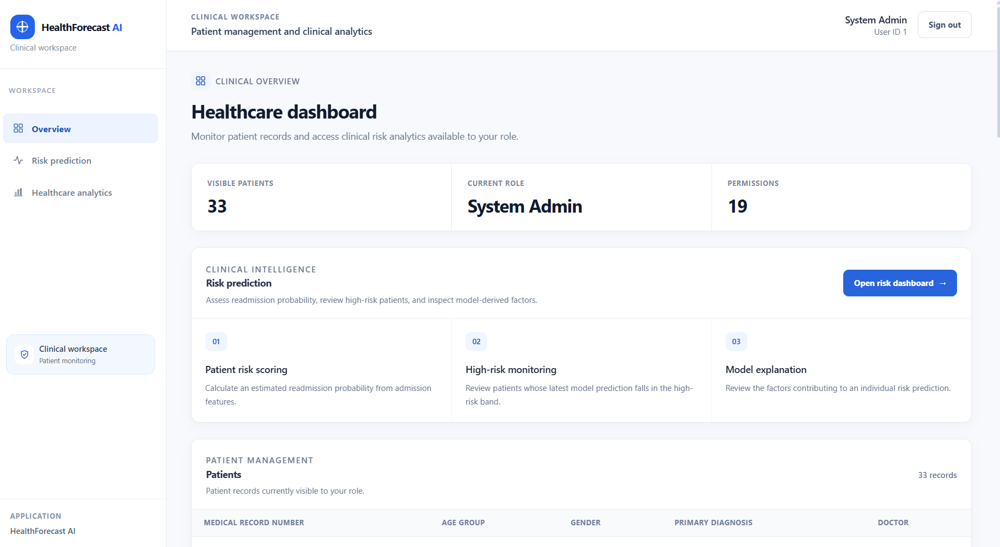
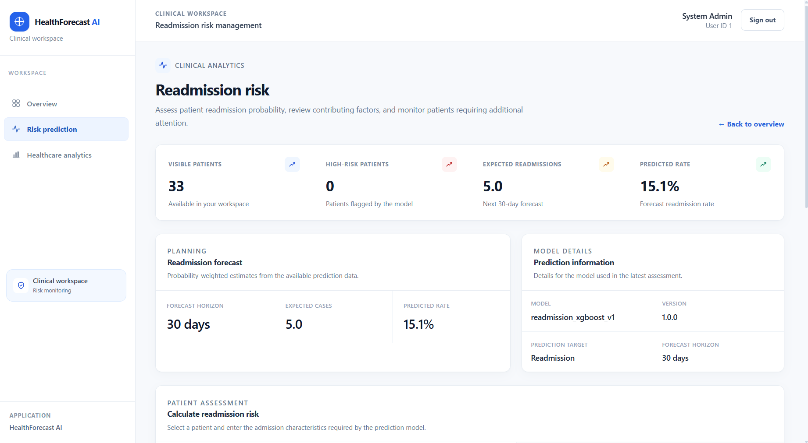
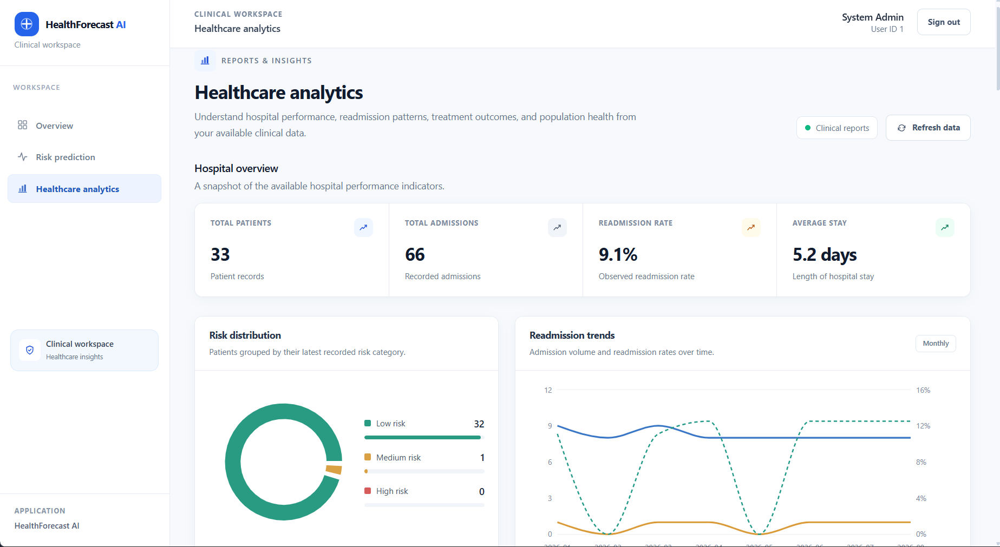
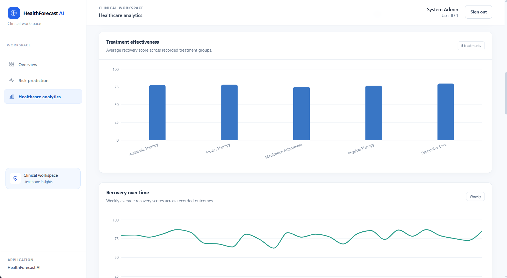
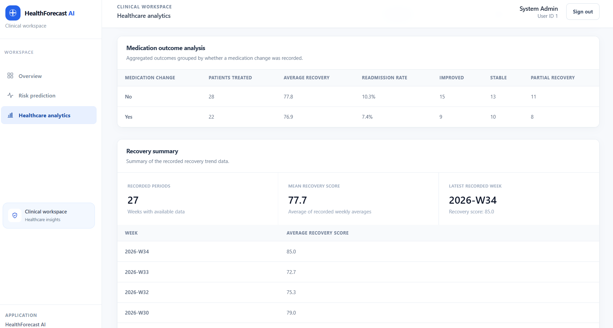
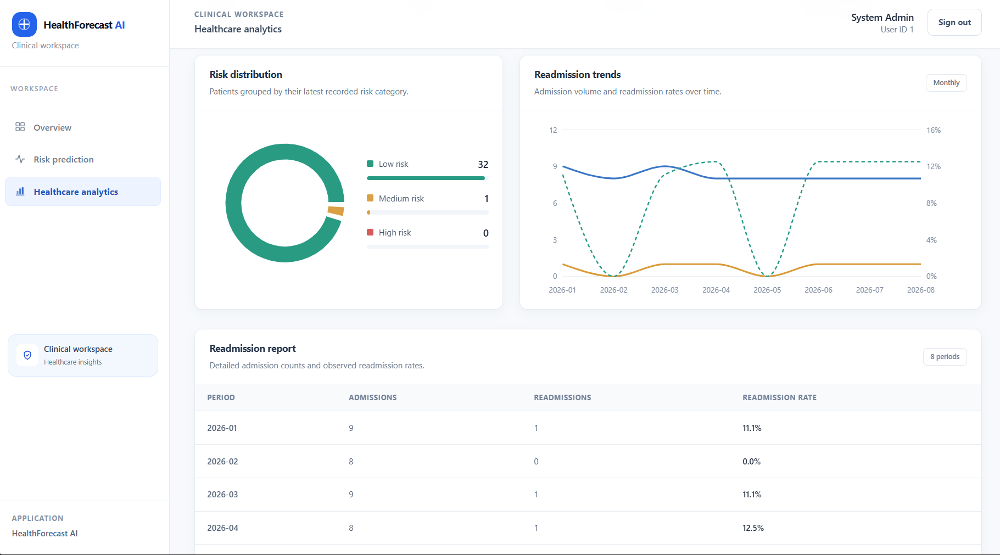
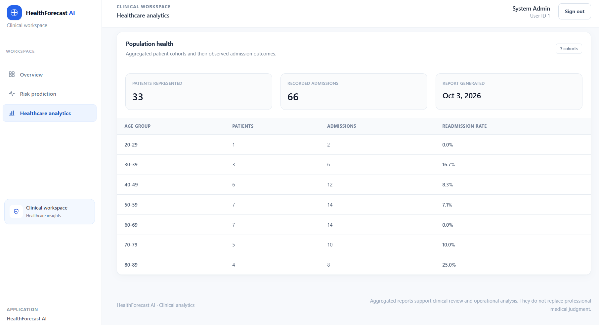
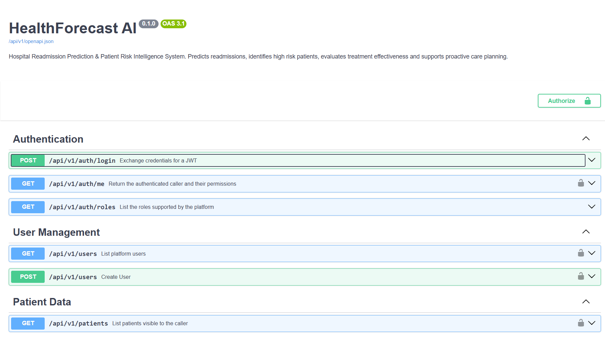
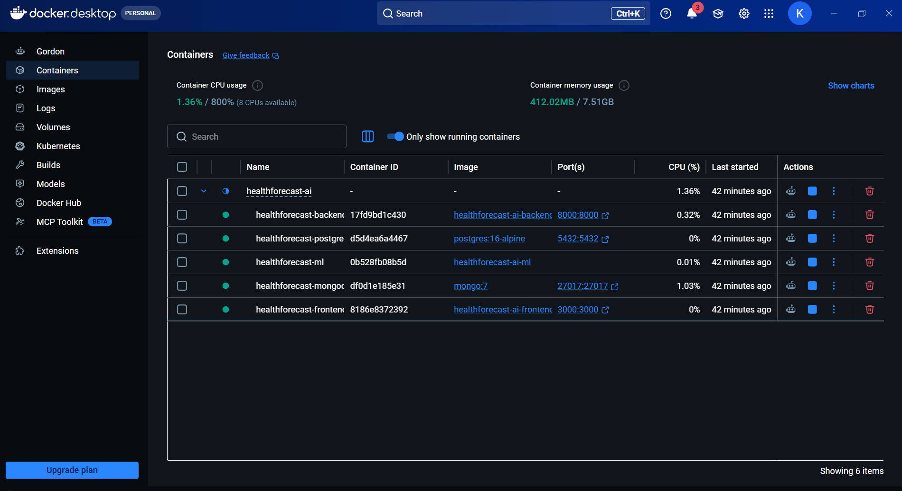
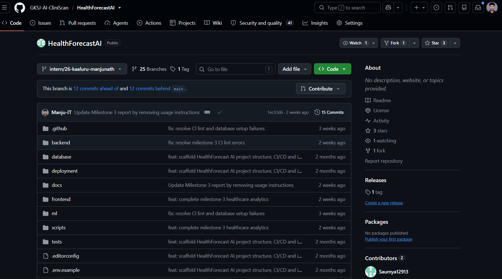

# Milestone 4 report - Week 7 & 8 - Testing, Deployment & Documentation

- **Intern name:** Kaaluru Manjunath
- **Branch:** `intern/26-kaaluru-manjunath`
- **Submitted on:** 2026-09-21

---

## Scope for this milestone

- Validate prediction accuracy and healthcare analytics quality.
- Optimize healthcare workflows and dashboard responsiveness.
- Deploy the platform using Docker and a cloud environment.
- Prepare the final project documentation and presentation.
- Demonstrate the complete HealthForecast AI platform.

## Evaluation criteria

- Fully deployed frontend and backend.
- Model testing and validation completed.
- Documentation and presentation prepared.
- Successful end-to-end platform demonstration completed.

---

## What I built

Milestone 4 focused on final validation, release preparation, deployment readiness and documentation of the HealthForecastAI platform.

The previous milestones were consolidated into a complete healthcare AI application containing:

- FastAPI backend
- Next.js frontend
- PostgreSQL database
- MongoDB database
- Machine-learning risk prediction pipeline
- JWT authentication
- Role-based access control
- Readmission risk prediction
- Risk-driver analysis
- Readmission forecasting
- Treatment effectiveness analytics
- Medication outcome analysis
- Recovery trend analysis
- Hospital performance analytics
- Population-health analytics
- Healthcare dashboards
- Docker-based application deployment

### 1. Backend testing and validation

The backend test suite was extended and validated across the main application modules.

Testing areas include:

- Authentication
- Authorization and RBAC
- Patient workflows
- Risk prediction
- Risk forecasting
- Risk drivers
- Treatment outcomes
- Treatment effectiveness
- Medication outcomes
- Recovery trends
- Hospital analytics
- Population-health analytics
- Health endpoint validation

The M3 analytics service tests were also formatted and validated against the repository Ruff and Black checks.

The final CI validation commands are:

```bash
cd backend

ruff check app tests
black --check --diff app tests
pytest
```

### 2. Machine-learning validation

The promoted readmission model from Milestone 2 is the XGBoost model.

The final untouched test-set metrics are:

| Metric | Result |
|---|---:|
| Accuracy | 67.42% |
| Precision | 18.72% |
| Recall | 55.68% |
| F1 score | 28.02% |
| ROC-AUC | 66.86% |
| Decision threshold | 0.11 |

Confusion matrix:

| | Predicted negative | Predicted positive |
|---|---:|---:|
| Actual negative | 12,136 | 5,470 |
| Actual positive | 1,003 | 1,260 |

These measurements were obtained from the untouched M2 test split and are carried forward as the final documented model evaluation.

### 3. Frontend validation

The Next.js frontend was validated using production build checks.

Validation commands:

```bash
cd frontend
npm ci
npm run lint
npm run build
```

The production build completed successfully during milestone validation.

The frontend includes:

- Application dashboard
- Risk dashboard
- Healthcare analytics dashboard
- Patient risk assessment
- Risk drivers
- Readmission forecast
- Treatment effectiveness
- Medication outcomes
- Recovery trends
- Population-health analytics
- Responsive navigation
- Loading and error states
- Permission-aware analytics rendering

### 4. Docker deployment validation

The complete application stack was validated using Docker Compose.

The stack contains:

- Frontend
- FastAPI backend
- PostgreSQL
- MongoDB
- ML application components

Docker validation includes:

```bash
docker compose build
docker compose up -d
docker compose ps
```

The backend health endpoint was validated using:

```bash
curl http://localhost:8000/health
```

Expected response:

```json
{
  "status": "ok",
  "service": "HealthForecastAI",
  "environment": "development"
}
```

### 5. API validation

The FastAPI application exposes interactive API documentation through:

```text
http://localhost:8000/docs
```

Important validated workflows include:

- Authentication
- Patient management
- Risk prediction
- High-risk patient retrieval
- Readmission forecasting
- Risk-driver analysis
- Treatment effectiveness
- Treatment outcomes
- Medication outcomes
- Recovery trends
- Hospital analytics
- Readmission trends
- Population-health analytics

### 6. Healthcare analytics validation

The M3 synthetic demonstration environment contained:

- 33 patients
- 66 admissions
- 66 treatment outcome records
- 59 risk prediction records

Hospital analytics produced:

- Readmission rate: 9.09%
- Average length of stay: 5.24 days
- Low-risk patients: 32
- Medium-risk patients: 1
- High-risk patients: 0

The analytics results are based on synthetic demonstration data and are not clinical evidence.

### 7. Security and RBAC validation

The application retains the role-based permission model implemented in earlier milestones.

The main roles are:

- Doctor
- Hospital Admin
- Researcher
- System Admin

Permissions are enforced at the backend API layer rather than relying only on frontend visibility.

Examples include:

- Patient access restrictions
- Risk-report permissions
- Aggregated analytics permissions
- Treatment-report permissions
- Population-health permissions
- Research data permissions
- Administrative permissions

### 8. Documentation

Final project documentation covers:

- Project architecture
- Installation
- Environment configuration
- Backend development
- Frontend development
- Machine-learning pipeline
- API usage
- Testing
- Docker deployment
- Analytics
- RBAC
- Known limitations
- Future improvements

Final presentation material was also prepared to demonstrate the complete HealthForecastAI workflow from authentication through prediction and analytics.

### 9. End-to-end demonstration

The final demonstration workflow is:

```text
User Login
    ↓
Application Dashboard
    ↓
Patient Selection
    ↓
Readmission Risk Prediction
    ↓
Risk Drivers
    ↓
Readmission Forecast
    ↓
Healthcare Analytics
    ↓
Treatment Effectiveness
    ↓
Medication Outcomes
    ↓
Recovery Trends
    ↓
Population Health
    ↓
API / Deployment Verification
```

This demonstrates the integration of the major features delivered across all four milestones.

---

## How to run it

Clone the repository and switch to the milestone branch:

```bash
git clone https://github.com/GKSJ-AI-CliniScan/HealthForecastAI.git
cd HealthForecastAI
git checkout intern/26-kaaluru-manjunath
```

### Environment configuration

Create a local `.env` file from the project's example environment configuration.

Do not commit `.env`.

Configure:

- PostgreSQL connection
- MongoDB connection
- JWT secret
- application environment
- CORS origins
- other deployment-specific settings

### Start the application

```bash
docker compose up -d --build
```

Verify the containers:

```bash
docker compose ps
```

Backend:

```text
http://localhost:8000
```

Frontend:

```text
http://localhost:3000
```

API documentation:

```text
http://localhost:8000/docs
```

Health check:

```bash
curl http://localhost:8000/health
```

### Backend tests

```bash
cd backend

ruff check app tests
black --check --diff app tests
pytest
```

### Frontend validation

```bash
cd frontend

npm ci
npm run lint
npm run build
```

### Docker validation

From the repository root:

```bash
docker compose build
docker compose up -d
docker compose ps
```

---

## Evidence

The following evidence should be attached to this report using synthetic demonstration data only.

### Screenshot 1 - Application Dashboard



### Screenshot 2 - Risk Dashboard



### Screenshot 3 - Healthcare Analytics Dashboard



### Screenshot 4 - Treatment Effectiveness



### Screenshot 5 - Medication Outcome Analysis



### Screenshot 6 - Recovery and Readmission Trends



### Screenshot 7 - Population Health



### Screenshot 8 - FastAPI Documentation



### Screenshot 9 - Docker Services



### Screenshot 10 - CI Validation




---

## Metrics

### Final model metrics

| Metric | Result |
|---|---:|
| Accuracy | 67.42% |
| Precision | 18.72% |
| Recall | 55.68% |
| F1 score | 28.02% |
| ROC-AUC | 66.86% |
| Threshold | 0.11 |

### Healthcare analytics metrics

| Metric | Result |
|---|---:|
| Patients | 33 |
| Admissions | 66 |
| Treatment outcomes | 66 |
| Risk predictions | 59 |
| Readmission rate | 9.09% |
| Average length of stay | 5.24 days |

### Test metrics

The final report should record the exact number of tests and coverage percentage from the completed M4 test run.

Use:

```bash
pytest --cov=app --cov-report=term-missing
```

and record the actual:

- Total tests
- Passed tests
- Failed tests
- Skipped tests
- Coverage percentage

No test count or coverage percentage is fabricated in this report.

### Performance metrics

The final report should record actual measurements obtained during M4 validation for:

- Risk prediction response time
- Analytics endpoint response time
- Dashboard loading time
- Docker startup time
- Concurrent request handling

These values must be measured in the final environment rather than estimated.

### Deployment

Local Docker deployment was validated during development.

The final report should record the real cloud deployment URL after the application has been deployed and smoke-tested.

---

## Known gaps

- The model is a readmission-risk prediction model and should not be interpreted as a clinical diagnosis system.
- The M3 treatment analytics are observational statistics based on synthetic demonstration data and do not establish causal treatment effectiveness.
- Formal causal inference methods have not been implemented.
- The demonstration dataset is synthetic and is not clinical evidence.
- Production healthcare deployment would require additional compliance, privacy, security, monitoring, backup and operational controls.
- Formal browser performance benchmarking should be recorded from the actual production environment.
- Concurrent-load measurements should be recorded from an actual load-testing run.
- A cloud deployment URL should only be recorded after the application has been deployed and successfully smoke-tested.
- Additional production hardening may include managed database services, centralized logging, metrics, alerting, secret management, automated backups and disaster recovery.
- The application should undergo appropriate security, privacy and regulatory review before use with real patient information.