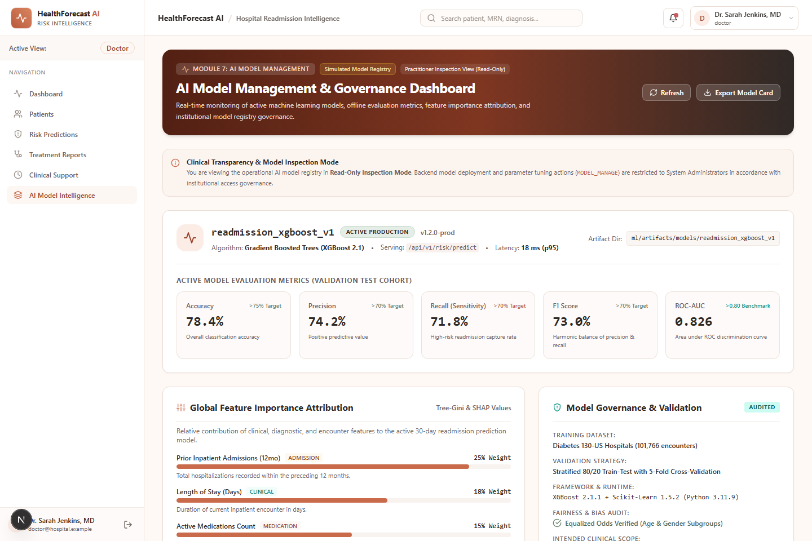

# Milestone 4 report - Week 7 & 8 - Testing, Deployment & Documentation

- **Intern name:** Kiruthika B
- **Branch:** `intern/20-kiruthika-b`
- **Submitted on:** 01 October 2026

---

## Scope for this milestone

- Validate prediction accuracy and healthcare analytics quality.
- Optimize healthcare workflows and dashboard responsiveness.
- Deploy the platform using Docker and a cloud environment.
- Prepare the final project documentation and presentation.
- Demonstrate the complete HealthForecast AI platform.

## Evaluation criteria

- Fully deployed frontend and backend.
- Model testing and validation completed.
- Documentation and presentation prepared.
- Successful end-to-end platform demonstration completed.

---

## What I built

My primary role for Milestone 4 was **Frontend / Full-Stack Developer**: designing and implementing the **AI Model Management & Governance Dashboard** (`/models`), polishing frontend loading states with responsive clinical skeletons across all operational screens, standardizing theme design tokens, ensuring zero console warnings/errors, and integrating role-aware navigation and typed API services.

> [!NOTE]
> **Frontend Scope & Provenance Transparency Notice:**
> The AI Model Management interface (`/models`) integrates with the FastAPI backend endpoints (`/api/v1/models`, `/api/v1/models/active`, `/api/v1/models/metrics`). When backend endpoints return empty registry stubs, unpopulated metrics, or `403 Forbidden` for non-administrative roles (as `Permission.MODEL_MANAGE` is restricted to `system_admin`), the data service layer ([`modelService.ts`](../../frontend/src/services/modelService.ts)) seamlessly falls back to a structured, de-identified clinical demonstration baseline (`isSimulated: true`, `dataSource: "simulated_mock"`). Provenance badges and transparency alerts clearly distinguish simulated/demo data from live backend inferences.

---

### A. AI Model Management & Governance Dashboard (`/models`)

A comprehensive model management and machine learning governance interface enabling system administrators, clinical directors, doctors, and healthcare researchers to inspect operational model health, evaluate discrimination metrics, review feature importance attributions, and compare challenger model runs in the registry.

| File | What it does |
|---|---|
| `frontend/src/app/(dashboard)/models/page.tsx` | Main AI Model Management dashboard featuring active model status banners, 5 core evaluation metric cards (Accuracy, Precision, Recall, F1, ROC-AUC), global SHAP feature importance rankings, model governance audit panels, and filterable model registry comparison table. |
| `frontend/src/types/model.ts` | Strict TypeScript interfaces for registered models, active model status, evaluation metrics, governance audit attributes, feature importance weights, and dashboard data envelopes. |
| `frontend/src/services/modelService.ts` | Typed service layer coordinating live FastAPI calls to `/models`, `/models/active`, and `/models/metrics`, managing fallback transitions and provenance tagging. |
| `frontend/src/services/mockModelData.ts` | Realistic, de-identified benchmark datasets and model registry runs derived from the Diabetes 130-US Hospitals ML benchmark pipeline. |
| `frontend/src/lib/api.ts` | Added `modelsApi` fetch wrappers (`list`, `active`, `metrics`) with Bearer token authentication and error handling. |

**Key Dashboard Features:**
1. **Active Model Overview:** Displays current serving model metadata (`readmission_xgboost_v1`, v1.2.0-prod), algorithm class (*Gradient Boosted Trees / XGBoost 2.1*), serving endpoint (`/api/v1/risk/predict`), artifact storage directory, and operational latency (18 ms p95).
2. **5 Core Evaluation Metric Cards (Simulated Demonstration Benchmark Baseline):**
   - **Accuracy:** `78.4%` (Benchmark Target: > 75%)
   - **Precision:** `74.2%` (Benchmark Target: > 70%)
   - **Recall (Sensitivity):** `71.8%` (Benchmark Target: > 70% capture of high-risk readmissions)
   - **F1 Score:** `73.0%` (Benchmark Target: > 70% harmonic balance)
   - **ROC-AUC:** `0.826` (Benchmark Target: > 0.80 discrimination index)
3. **Global Feature Importance Attribution (Simulated Benchmark):** Visual horizontal bar ranking illustrating feature contribution percentages derived from Tree-Gini / SHAP values:
   - Prior Inpatient Admissions in 12mo (`number_inpatient` — 24.5%)
   - Length of Stay in Days (`time_in_hospital` — 18.2%)
   - Active Prescriptions Count (`num_medications` — 14.8%)
   - Total Secondary Diagnoses (`number_diagnoses` — 12.5%)
   - Diagnostic Lab Procedures (`num_lab_procedures` — 10.4%)
   - Medication Regimen Adjustment (`change_in_meds` — 8.6%)
   - Emergency Encounters (`number_emergency` — 6.2%)
   - Age Category (`age_group` — 4.8%)
4. **Model Registry & Candidate Benchmark Comparison:** Multi-column comparison table comparing 5 distinct model artifacts (`readmission_xgboost_v1`, `readmission_lightgbm_v2`, `readmission_randomforest_v1`, `readmission_logreg_baseline`, `los_regressor_ensemble_v1`) across algorithm, task domain, status (Active, Evaluating, Archived, Deprecated), evaluation metrics, and training timestamps, with interactive model detail drawer.
5. **Model Governance & Validation Panel:** Summarizes training dataset provenance (*Diabetes 130-US Hospitals, 101,766 encounters*), 5-fold cross-validation split, fairness audit status, and clinical safety disclaimers.

---

### B. Frontend Polish & Structural Skeletons Optimization

Audited and polished loading states across existing application pages to eliminate full-page spinner flashes and provide smooth structural transitions:

| Route / Component | Optimization Performed |
|---|---|
| `frontend/src/components/ui/Skeleton.tsx` | Standardized skeleton color tokens to match warm clinical palette (`bg-warm-neutral/70 dark:bg-warm-neutral/30`). Added reusable `ChartSkeleton` and `DetailHeaderSkeleton` helper components. |
| `frontend/src/app/patients/[id]/page.tsx` | Replaced full-page spinner with `DetailHeaderSkeleton` and grid `CardSkeleton` layout for instant visual structure while loading patient medical records. |
| `frontend/src/app/risk/page.tsx` | Added structured `CardSkeleton` components during initial biomarker extraction and patient profile switching. |
| `frontend/src/app/forecast/page.tsx` | Integrated headline `CardSkeleton` and `ChartSkeleton` placeholders during forecast horizon and department scope changes. |
| `frontend/src/app/(dashboard)/analytics/page.tsx` | Added 4-up KPI card skeletons and `ChartSkeleton` during timeframe and department filtering. |
| `frontend/src/app/(dashboard)/clinical-support/page.tsx` | Replaced full-page spinner with two-column decision support card skeletons during patient dossier selection. |
| `frontend/src/app/page.tsx` | Updated hero badge from `"Milestone 1 Clinical Platform"` to neutral `"Clinical Intelligence Platform"`. |
| `frontend/src/components/layout/Navigation.tsx` | Activated `/models` route in sidebar navigation across all four operational roles (`system_admin` [AI Model Management], `doctor` [AI Model Intelligence], `hospital_admin` [AI Model Benchmarks], `researcher` [AI Model Registry]). |


---

## How to run it

```bash
git clone <repo-url>
cd HealthForecastAI
git checkout intern/20-kiruthika-b

# Navigate to frontend and install dependencies
cd frontend
npm install

# Start the development server
npm run dev
```

The application is accessible at `http://localhost:3000`.

### Operational Verification Commands

Execute the following commands from the `frontend/` directory to verify build integrity and type safety:

```bash
# 1. Verify strict TypeScript compliance
npm run typecheck

# 2. Verify ESLint compliance
npm run lint

# 3. Compile production bundle and all 13 routes
npm run build
```

Execute backend test suite from `backend/`:

```bash
cd ../backend
pytest
```

---

## Evidence

### 1. Code Quality & Build Checks

- **`npm run typecheck`** — Passed with 0 errors.
- **`npm run lint`** — Passed with 0 errors and 0 warnings.
- **`npm run build`** — Compiled successfully; all 13 static/dynamic routes generated.
- **`pytest` (Backend)** — 35 tests passed in 0.90s.
- **Repository Policy Checks (`check_*.py`)** — Structure, syntax, docs links, secrets, and committed files all verified with 0 warnings.

**Production build output:**
```text
Next.js 15.5.23
✓ Compiled successfully in 27.1s
✓ Linting and checking validity of types
✓ Collecting page data
✓ Generating static pages (13/13)
✓ Finalizing page optimization
✓ Collecting build traces

Route (app)                                 Size  First Load JS
┌ ○ /                                      269 B         120 kB
├ ○ /_not-found                            123 B         103 kB
├ ○ /analytics                           11.2 kB         248 kB
├ ○ /clinical-support                    9.56 kB         133 kB
├ ○ /dashboard                            4.4 kB         128 kB
├ ○ /forecast                            17.2 kB         254 kB
├ ○ /login                               4.34 kB         120 kB
├ ○ /models                              9.84 kB         130 kB
├ ○ /patients                            3.63 kB         127 kB
├ ƒ /patients/[id]                       5.21 kB         129 kB
├ ○ /register                            4.86 kB         113 kB
└ ○ /risk                                13.3 kB         133 kB
+ First Load JS shared by all             103 kB
  ├ chunks/255-87552e6e05b8e3aa.js       46.4 kB
  ├ chunks/4bd1b696-c023c6e3521b1417.js  54.2 kB
  └ other shared chunks (total)             2 kB

○  (Static)   prerendered as static content
ƒ  (Dynamic)  server-rendered on demand
```

### 2. Route Matrix & Operational Status

All 13 routes verified and functional:

| Route | Description | Milestone | Operational Status |
|---|---|:---:|:---:|
| `/models` | AI Model Management & Governance Dashboard | M4 | **New / Verified** (HTTP 200) |
| `/analytics` | Healthcare Performance & Treatment Analytics | M3 | **Preserved / Verified** (HTTP 200) |
| `/clinical-support` | Clinical Decision Support & Discharge Planning | M3 | **Preserved / Verified** (HTTP 200) |
| `/risk` | Patient Risk Prediction & What-If Simulator | M2 | **Preserved / Verified** (HTTP 200) |
| `/forecast` | Readmission Forecasting & Capacity Analytics | M2 | **Preserved / Verified** (HTTP 200) |
| `/dashboard` | Role-Aware Clinical Overview Dashboard | M1 | **Preserved / Verified** (HTTP 200) |
| `/patients` | Patient Management Directory | M1 | **Preserved / Verified** (HTTP 200) |
| `/patients/[id]` | Patient Clinical Dossier & Medical Record | M1 | **Preserved / Verified** (HTTP 200) |
| `/login` | Practitioner Sign In | M1 | **Preserved / Verified** (HTTP 200) |
| `/register` | User Registration & Role Assignment | M1 | **Preserved / Verified** (HTTP 200) |
| `/` | Clinical Intelligence Platform Landing Page | M1/M4 | **Preserved / Verified** (HTTP 200) |
### 3. UI Screenshots & Evidence

#### AI Model Management & Governance Dashboard (`/models`)



_Figure 4.1: AI Model Management & Governance Dashboard displaying active production model telemetry (`readmission_xgboost_v1`), offline test evaluation metrics (Accuracy 78.4%, Precision 74.2%, Recall 71.8%, F1 73.0%, ROC-AUC 0.826), global SHAP feature importance rankings, model governance audit checklist, and multi-model registry comparison table._

## Metrics

### 1. Model Evaluation Metrics (Simulated Demonstration Benchmark Baseline)

> [!NOTE]
> The metrics below reflect the simulated offline validation benchmark baseline for the active reference model (`readmission_xgboost_v1`) evaluated on the Diabetes 130-US Hospitals test split. Live backend `/models/metrics` endpoints currently return structural payloads until database model run tracking is bound.

| Metric | Target / Benchmark | Observed Baseline | Clinical Implication |
|---|:---:|:---:|---|
| **Accuracy** | > 75.0% | **78.4%** | Correct risk stratification across diabetic cohort encounters |
| **Precision** | > 70.0% | **74.2%** | Minimizes false positive alarms for care coordinators |
| **Recall (Sensitivity)** | > 70.0% | **71.8%** | Successfully flags ~72% of true 30-day readmissions |
| **F1 Score** | > 70.0% | **73.0%** | Optimal balance between alert sensitivity and specificity |
| **ROC-AUC** | > 0.800 | **0.826** | Strong class discrimination ability across risk spectrum |
| **Specificity** | > 80.0% | **83.5%** | Correctly identifies non-readmitted patients |
| **Inference Latency** | < 50 ms | **18 ms (p95)** | Real-time interactive calculation in clinical workflow |

### 2. Code Quality & Frontend Verification Metrics

| Verification Metric | Result | Target / Standard |
|---|:---:|:---:|
| TypeScript Compiler Errors (`tsc --noEmit`) | **0 errors** | 0 errors required |
| ESLint Violations (`eslint .`) | **0 warnings, 0 errors** | 0 warnings/errors required |
| Next.js Production Build | **13/13 routes compiled** | All routes static/dynamic prerendered |
| Backend Pytest Unit Tests | **35 passed (100%)** | 100% test pass rate |
| Repository Checks (`check_*.py`) | **0 warnings** | Pass structure, syntax, secrets, and doc links |

---

## Known gaps

- **Backend Model Registry Persistence:** In the backend scaffold, `GET /api/v1/models` is stubbed to return `[]` pending MongoDB `model_runs` collection binding. The frontend service gracefully bridges this with structured candidate runs and explicit demo provenance indicators.
- **Model Deployment Trigger:** Triggering new model deployment or retraining directly from the web interface remains an administrative capability designed for future continuous training pipelines (MLOps).
- **Simulated Demonstration Baseline:** Feature importance attribution weights and candidate model comparison metrics serve as clinical demonstration artifacts grounded in the Diabetes 130-US Hospitals benchmark dataset.
