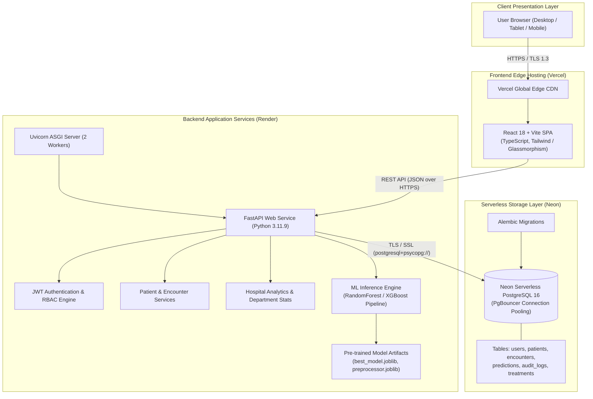

# System Architecture — HealthForecast AI

HealthForecast AI is an enterprise-grade hospital readmission prediction and clinical intelligence platform. It couples a modern responsive Single Page Application (SPA) with a high-throughput FastAPI backend, a scikit-learn machine learning inference pipeline, and a serverless PostgreSQL database.

---

## 1. Cloud & System Architecture Diagram

---

## 2. Architectural Components

### 2.1 Frontend Layer (Vercel)
- **Framework**: React 18, TypeScript, Vite.
- **Routing**: React Router v6 with Role-Based Route Guards (`DoctorRoute`, `AdminRoute`, `ResearcherRoute`).
- **Styling**: Curated glassmorphism design system, CSS design tokens, responsive typography.
- **Hosting**: Deployed on Vercel's global edge network for sub-100ms asset delivery.
- **Security**: Strict HTTP security headers (`X-Frame-Options: DENY`, `X-Content-Type-Options: nosniff`).

### 2.2 Backend Application Layer (Render)
- **Framework**: FastAPI (ASGI), Python 3.11.9.
- **Concurrency**: Uvicorn running multiple asynchronous workers.
- **Routing & Controllers**: Versioned API endpoints under `/api/v1/` (`/auth`, `/patients`, `/predictions`, `/analytics`, `/encounters`, `/treatments`, `/users`).
- **Data Access**: SQLAlchemy 2.0 ORM with asynchronous session management and psycopg3 driver.
- **Validation**: Pydantic v2 schemas for strict request/response data contract enforcement.

### 2.3 Machine Learning Inference Engine
- **Models**: Calibrated Random Forest Classifier / XGBoost Classifier trained on the 130-US Hospitals Diabetes Dataset.
- **Features**: Patient demographics, admission type, length of stay, discharge disposition, lab procedures, medications, diagnosis codes (ICD-9 mapping), and comorbidities.
- **Performance**: In-memory vectorized inference delivering sub-50ms risk scores (0–100 probability scale with low/medium/high risk classification).

### 2.4 Data & Storage Layer (Neon)
- **Database**: Serverless PostgreSQL 16.
- **Security**: Mandatory SSL encryption (`sslmode=require`).
- **Scalability**: Decoupled compute and storage with built-in connection pooling (`-pooler` hostname) to support high concurrent workloads.
- **Schema Management**: Managed via Alembic migrations tracking versioned database transitions.

---

## 3. Data Flow & Request Lifecycle

1. **User Authentication**:
   - The user authenticates with email/password at `/api/v1/auth/login`.
   - The backend validates credentials using bcrypt password hashing.
   - An RFC 7519 compliant JSON Web Token (JWT) is issued with user ID and Role.
2. **Clinical Decision Support Request**:
   - A clinician selects a patient or submits an encounter profile.
   - The frontend calls `POST /api/v1/predictions/predict`.
   - The ML service transforms categorical and numerical features via `preprocessor.joblib`.
   - The Random Forest pipeline computes the 30-day readmission probability.
   - The prediction record, confidence interval, and top contributing risk factors are persisted to PostgreSQL and returned to the UI.
3. **Researcher Cohort Query**:
   - A researcher requests cohort analytics.
   - The backend enforces role-based de-identification, hashing patient names and identifiers into salted pseudonyms (`ANON-PAT-XXXXXX`).
   - Aggregate statistics, ROC-AUC performance metrics, and cohort distributions are returned without exposing protected health information (PHI).
