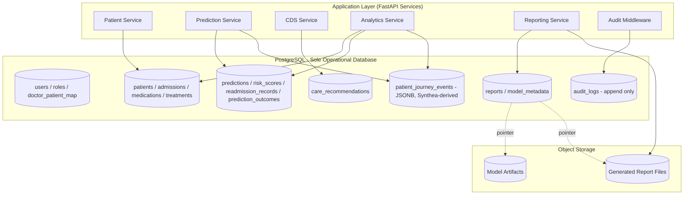
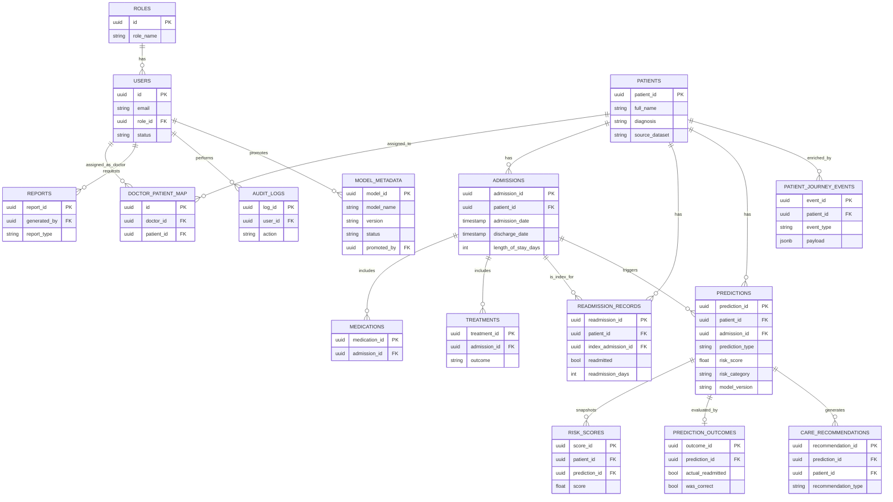

# HealthForecast AI - Database Design Document

**Document Version:** 1.0
**Companion Documents:** `HealthForecastAI_SRS.md`, `HealthForecastAI_System_Design.md`
**Project:** HealthForecast AI: Hospital Readmission Prediction & Patient Risk Intelligence System
**Database Engine:** PostgreSQL 15+ (sole operational database — MongoDB is explicitly excluded from this design)

---

## 1. Introduction

### 1.1 Purpose

This document defines the complete physical and logical database design for HealthForecast AI. It translates the functional requirements in `HealthForecastAI_SRS.md` and the architectural decisions in `HealthForecastAI_System_Design.md` into an implementation-ready PostgreSQL schema. It is the authoritative reference for schema creation, migrations, indexing, security, and data lifecycle management.

### 1.2 Scope

This document covers:

- The relational schema for all operational entities: users, roles, patients, admissions, readmission records, predictions, risk scores, reports, audit logs, and ML model metadata.
- Constraints, relationships, and referential integrity rules.
- Indexing and query optimization strategy.
- Data security design (encryption, hashing, access control at the data layer).
- Backup, recovery, retention, archival, and growth strategy.

This document does **not** cover application-layer business logic (see System Design §4, Module-Wise Architecture) or model training methodology (see `HealthForecastAI_ML_Design.md`).

### 1.3 Database Objectives

| # | Objective | Description |
|---|---|---|
| D1 | Single source of truth | All application, analytics, prediction, reporting, and audit data resides in PostgreSQL — no secondary document store. |
| D2 | Referential integrity | Enforce relationships between users, patients, admissions, and predictions at the database layer, not only in application code. |
| D3 | Auditability | Guarantee an immutable, queryable record of every access and administrative action. |
| D4 | Predictable performance | Support sub-2-second prediction inference and sub-3-second dashboard loads (per SRS §8) through targeted indexing. |
| D5 | Security by design | Protect PII/PHI through hashing, encryption, and role-scoped data access enforced at the schema and query layer. |
| D6 | Evolvability | Support schema evolution (new model versions, new report types) without breaking existing relationships. |

### 1.4 Relationship to System Architecture

Per the System Design document, PostgreSQL sits in the **Data & Storage Layer** and is written to and read from by every backend service (Patient Service, Prediction Service, CDS Service, Analytics Service, Reporting Service, Audit middleware). Unlike the original reference architecture diagram in the source project brief — which showed MongoDB as a supplementary flexible-document store — this design consolidates **all** data, including semi-structured analytics/journey data derived from Synthea, into PostgreSQL using native `JSONB` columns. This decision is explained in §2.1 below and must be treated as binding for implementation.

---

## 2. Database Architecture Overview

### 2.1 Why PostgreSQL Was Selected (and Why MongoDB Is Excluded)

| Consideration | Rationale |
|---|---|
| Data shape | Patient, admission, prediction, and audit data are inherently relational (patients have many admissions; admissions have many predictions; users have many audit entries). A relational model expresses these relationships and enforces them natively via foreign keys. |
| ACID guarantees | Clinical and audit data require strict consistency — a prediction must never reference a non-existent patient, and an audit log must never be silently lost. PostgreSQL's transactional guarantees satisfy this; a document store would require the application layer to reimplement integrity checks. |
| Semi-structured data handling | The original architecture proposed MongoDB specifically for Synthea's FHIR-like semi-structured resources. PostgreSQL's native `JSONB` type (with GIN indexing) provides equivalent flexibility — schema-on-read querying, nested attributes, partial updates — without introducing a second database technology, a second connection pool, a second backup/DR procedure, and a second point of operational failure. |
| Operational simplicity | A single database engine reduces deployment complexity, cuts DevOps overhead (one backup strategy, one monitoring stack, one set of credentials to rotate), and removes cross-database consistency problems (e.g., a patient existing in Postgres but their journey data missing from Mongo after a partial failure). |
| Analytical capability | PostgreSQL supports window functions, materialized views, and full aggregate/statistical querying needed for the Analytics module — sufficient for the hospital-wide and population-level reporting required by SRS §7.7, without needing a document store's aggregation pipeline. |
| Team/tooling fit | FastAPI + SQLAlchemy/SQLModel + Alembic gives a single, well-typed migration and ORM path when there is one database engine, reducing the chance of schema drift between two stores. |

**Conclusion:** PostgreSQL is the sole operational database for HealthForecast AI. Every reference to MongoDB in the source project brief and in `HealthForecastAI_System_Design.md` §2–§3 is superseded by this document: any data previously scoped to MongoDB (Synthea-derived journey/analytics documents) is instead stored in PostgreSQL `JSONB` columns within the `patient_journey_events` and `treatment_effectiveness` tables (see §5).

### 2.2 Database Responsibilities

- Persist all identity, authorization, and RBAC data (`users`, `roles`, `doctor_patient_map`).
- Persist the clinical system of record (`patients`, `admissions`, `medications`, `treatments`).
- Persist all ML outputs (`predictions`, `risk_scores`, `readmission_records`, `prediction_outcomes`).
- Persist derived clinical intelligence (`care_recommendations`).
- Persist operational artifacts (`reports`, `model_metadata`).
- Persist the immutable security trail (`audit_logs`).
- Enforce every relationship, uniqueness, and validity rule defined in §6 and §8 at the schema level as a second line of defense behind application-layer validation.

### 2.3 Data Persistence Strategy

- **Primary storage:** PostgreSQL managed instance (AWS RDS for PostgreSQL or Azure Database for PostgreSQL Flexible Server), Multi-AZ/zone-redundant for production.
- **Model artifacts:** Trained model binaries (`.pkl`/`.joblib`/`.json` for XGBoost boosters) are **not** stored as database blobs; they live in object storage (S3/Azure Blob). PostgreSQL's `model_metadata` table stores only the pointer (`artifact_path`) and evaluation metrics — this keeps the database lean and backups fast.
- **Generated reports:** PDF/Excel files generated by the Reporting module are stored in object storage; `reports.file_path` stores the reference, following the same pattern as model artifacts.
- **Cache layer:** Frequently-read, rarely-changed aggregates (e.g., today's hospital-wide readmission rate) may be cached (Redis) in front of PostgreSQL to meet the 3-second dashboard SLA, but PostgreSQL remains the source of truth; the cache is invalidated on write.

### 2.4 Transaction Management

- All multi-table writes that must succeed or fail together are wrapped in explicit transactions:
  - Creating a prediction record **and** its associated risk-tier classification.
  - Creating an admission record **and** updating the patient's derived `length_of_stay`.
  - Deactivating a user **and** reassigning their `doctor_patient_map` scope.
- **Isolation level:** `READ COMMITTED` (PostgreSQL default) for standard OLTP operations; `REPEATABLE READ` for report-generation transactions that must see a consistent snapshot across multiple aggregate queries.
- **Audit writes are never rolled back with the parent transaction's business failure** — audit logging uses a separate, always-committed write path (see §10.3) so that a failed prediction attempt is still recorded.

### 2.5 Security Considerations (Database-Layer Summary)

Full detail in §10; summarized here for architectural completeness:

- Application connects via a least-privilege database role (no superuser access from the API).
- Separate, more restrictive roles for the analytics/reporting read path versus the transactional write path.
- PII/PHI columns (`patients.full_name`, `patients.date_of_birth`) encrypted at rest via `pgcrypto` or transparent disk encryption, per SRS §8 Privacy requirements.
- Row-level security (RLS) policies enforce Doctor-to-assigned-patient scoping directly in PostgreSQL as a defense-in-depth measure behind the API's own RBAC middleware.

### Mermaid Diagram



### ASCII Diagram

```
+------------------------------------------------------------------+
|                     FASTAPI BACKEND SERVICES                     |
|  Patient Svc | Prediction Svc | CDS Svc | Analytics | Reporting  |
|                    Audit Middleware (all requests)                |
+------------------------------------------------------------------+
                              |
                              v
+------------------------------------------------------------------+
|                  POSTGRESQL (SOLE OPERATIONAL DB)                |
|--------------------------------------------------------------------
|  Identity:        users, roles, doctor_patient_map                |
|  Clinical:        patients, admissions, medications, treatments   |
|  ML Outputs:       predictions, risk_scores, readmission_records,  |
|                    prediction_outcomes                            |
|  Clinical Intel:  care_recommendations                            |
|  Ops:             reports, model_metadata                         |
|  Security:        audit_logs (append-only)                        |
|  Enrichment:      patient_journey_events (JSONB, Synthea-derived) |
+------------------------------------------------------------------+
                              |
                     pointers only (no blobs)
                              v
+------------------------------------------------------------------+
|                        OBJECT STORAGE (S3/Blob)                  |
|          Model artifacts (.pkl/.json)   |   Report files (PDF/XLSX)|
+------------------------------------------------------------------+
```

---

## 3. Database Design Principles

### 3.1 Normalization Strategy

- The schema is normalized to **Third Normal Form (3NF)** for all transactional/OLTP tables (`users`, `patients`, `admissions`, `medications`, `treatments`, `predictions`, `risk_scores`, `readmission_records`).
- Controlled denormalization is applied only where read performance materially matters and the data is immutable once written:
  - `predictions.risk_tier` is stored alongside `predictions.score` (rather than requiring a join/lookup against a threshold table) because thresholds change over time (per model version) and a prediction's tier must remain frozen to what was true at prediction time.
  - `admissions.length_of_stay_days` is a stored, derived column (trigger-maintained) rather than computed on every read, since it is queried heavily in analytics.
- `JSONB` columns (`audit_logs.metadata`, `patient_journey_events.payload`) are intentionally **not** normalized further — they hold variable-shape enrichment data by design (see §2.1); GIN indexes provide query performance without forcing a rigid schema onto inherently variable source data (Synthea's FHIR-like resources).

### 3.2 Data Integrity

- **Entity integrity:** Every table has a single-column surrogate primary key (`UUID`, generated via `gen_random_uuid()` from the `pgcrypto`/`pgcrypto` extension or `uuid-ossp`).
- **Domain integrity:** `CHECK` constraints restrict enumerated columns (`role`, `prediction_type`, `risk_tier`, `readmitted`) to valid values; numeric ranges (`score BETWEEN 0 AND 1`, `age >= 0`) are enforced at the column level.
- **User-defined integrity:** Business rules that cross tables (e.g., "a Doctor can only be assigned to patients, not to other Doctors") are enforced via `CHECK` constraints combined with application-layer validation, and reinforced by RLS policies (§10.4).

### 3.3 Referential Integrity

- All foreign keys are declared with explicit `ON DELETE` behavior:
  - `ON DELETE RESTRICT` for foreign keys where deletion would destroy clinical history (e.g., `admissions.patient_id`, `predictions.patient_id`) — patients and admissions are **never** hard-deleted; see §12.1 Data Retention.
  - `ON DELETE CASCADE` only for genuinely dependent, non-clinical rows (e.g., `doctor_patient_map` rows when a `users` row for that doctor is hard-deleted during account cleanup, which itself is discouraged in favor of soft-delete — see §3.5).
- Foreign keys are always indexed (PostgreSQL does not auto-index FK columns) — see §9.

### 3.4 Scalability Considerations

- UUID primary keys allow safe multi-writer inserts without central sequence contention and make future horizontal partitioning/sharding by `patient_id` or `hospital_id` straightforward if the platform expands to multi-hospital scope (a documented future enhancement in the System Design).
- Large, append-only tables (`audit_logs`, `predictions`, `risk_scores`) are designed for **time-based partitioning** from day one (see §12.3) so that query performance and vacuum overhead do not degrade as history accumulates across years of operation (the primary dataset spans 2015–2024).

### 3.5 Performance Considerations

- Read-heavy dashboard queries (Analytics module) are served by indexed aggregate queries and, where needed, materialized views refreshed on a schedule (§9.3).
- Write-heavy paths (prediction ingestion, audit logging) avoid unnecessary indexes on high-churn columns to keep insert latency low.
- Soft-delete (`is_active` / `deactivated_at` columns) is used instead of hard deletes for `users` and `patients`, preserving referential integrity for historical predictions and audit trails while still letting the application "hide" deactivated records — this also avoids expensive cascading deletes.

### 3.6 Auditability

- Every table that represents a security- or clinically-relevant action is either itself append-only (`audit_logs`) or has `created_at`/`updated_at` timestamps that feed into the audit trail.
- No table permits `UPDATE` or `DELETE` on `audit_logs` at the database privilege level (see §10.3) — enforced via `REVOKE UPDATE, DELETE` on that table for the application role.

---

## 4. Entity Identification

| Entity | Purpose | Key Responsibilities | Primary Relationships |
|---|---|---|---|
| **Users** | Represents every platform login (Doctor, Hospital Administrator, Healthcare Researcher, System Administrator). | Authentication, role assignment, audit attribution. | 1—N with `AuditLogs`, `Reports`, `DoctorPatientMap`. |
| **Roles** | Reference table of the four RBAC roles and their descriptions. | Central definition of role names used across the RBAC matrix. | 1—N with `Users`. |
| **DoctorPatientMap** | Join table scoping which patients a given Doctor may access. | Enforces FR-USR-03 (Doctor scope). | N—N resolver between `Users` (doctors) and `Patients`. |
| **Patients** | The clinical system of record for a patient. | Demographics, primary diagnosis, source dataset lineage. | 1—N with `Admissions`, `Predictions`, `Treatments`, `Medications`. |
| **Admissions** | Represents a single inpatient admission/discharge episode. | Tracks admission/discharge dates, length of stay, department, attending doctor. | N—1 with `Patients`; 1—N with `ReadmissionRecords`, `Predictions`. |
| **Medications** | Medications prescribed during an admission. | Supports treatment-effectiveness analysis and CDS. | N—1 with `Admissions`. |
| **Treatments** | Treatment/procedure records tied to an admission. | Supports treatment-effectiveness analysis. | N—1 with `Admissions`. |
| **ReadmissionRecords** | Ground-truth record of whether/when a patient was readmitted after a given admission. | Serves as the training label source and outcome-feedback record. | N—1 with `Patients`, N—1 with `Admissions` (the index admission). |
| **Predictions** | A single model inference event (risk or readmission) for a patient. | Stores the model's score, tier, and model version. | N—1 with `Patients`; N—1 with `Admissions` (nullable, for on-demand risk scoring without an active admission); 1—N with `RiskScores` (history entries). |
| **RiskScores** | Time-series history of a patient's risk score, distinct from the single "current" prediction record. | Enables trend tracking (FR-RISK-04). | N—1 with `Patients`; N—1 with `Predictions`. |
| **PredictionOutcomes** | Compares a prediction's forecast against the actual observed outcome. | Feeds model retraining/monitoring (FR-READM-04). | N—1 with `Predictions`. |
| **CareRecommendations** | Clinical Decision Support output tied to a prediction. | Ranked recommendations, follow-up plans, discharge checklists. | N—1 with `Predictions`, N—1 with `Patients`. |
| **Reports** | Metadata for a generated PDF/Excel export. | Tracks who generated what, and where the file lives in object storage. | N—1 with `Users` (requested_by). |
| **AuditLogs** | Immutable record of every authentication event, patient-data access, prediction request, and admin action. | Compliance and forensic trail. | N—1 with `Users`. |
| **ModelMetadata** | Registry of every trained/deployed model version and its evaluation metrics. | Supports Model Management module and promotion/rollback decisions. | Referenced by `Predictions.model_version` (soft reference by version string, not FK, to allow model retirement without breaking historical prediction records). |
| **PatientJourneyEvents** | PostgreSQL-native replacement for the originally-proposed MongoDB analytics collection; stores Synthea-derived semi-structured encounter/observation data as JSONB. | Enrichment for treatment-effectiveness and population-health analytics. | N—1 with `Patients` (nullable link — Synthea data may be synthetic/unlinked demo data). |

---

## 5. Complete Database Schema

All tables use `UUID` primary keys generated via `gen_random_uuid()` (requires the `pgcrypto` extension). All timestamps are `TIMESTAMPTZ` (timezone-aware) to avoid ambiguity across deployment regions.

```sql
CREATE EXTENSION IF NOT EXISTS pgcrypto;
```

### 5.1 Roles

**Table Description:** Reference table defining the four RBAC roles available on the platform. Seeded once at deployment; rarely modified thereafter.

| Column | Data Type | Constraints | Description |
|---|---|---|---|
| id | UUID | PRIMARY KEY DEFAULT gen_random_uuid() | Unique role identifier |
| role_name | VARCHAR(50) | UNIQUE NOT NULL, CHECK (role_name IN ('doctor','hospital_admin','researcher','system_admin')) | Canonical role name |
| description | TEXT | NOT NULL | Human-readable description of the role's purpose |
| created_at | TIMESTAMPTZ | NOT NULL DEFAULT now() | Row creation time |

### 5.2 Users

**Table Description:** Every platform login account across all four roles.

| Column | Data Type | Constraints | Description |
|---|---|---|---|
| id | UUID | PRIMARY KEY DEFAULT gen_random_uuid() | Unique user identifier |
| full_name | VARCHAR(150) | NOT NULL | User's full name |
| email | VARCHAR(255) | UNIQUE NOT NULL | Login email |
| password_hash | VARCHAR(255) | NOT NULL | Bcrypt/Argon2 password hash (never plaintext) |
| role_id | UUID | NOT NULL, FOREIGN KEY REFERENCES roles(id) ON DELETE RESTRICT | Assigned RBAC role |
| status | VARCHAR(20) | NOT NULL DEFAULT 'active', CHECK (status IN ('active','inactive','locked')) | Account lifecycle status |
| failed_login_attempts | INTEGER | NOT NULL DEFAULT 0 | Tracks FR-AUTH-05 lockout logic |
| locked_until | TIMESTAMPTZ | NULLABLE | Lockout expiry timestamp, if locked |
| created_at | TIMESTAMPTZ | NOT NULL DEFAULT now() | Record creation time |
| updated_at | TIMESTAMPTZ | NOT NULL DEFAULT now() | Last modification time (trigger-maintained) |

### 5.3 DoctorPatientMap

**Table Description:** Resolves the many-to-many scope between Doctors and the Patients they are permitted to access (FR-USR-03).

| Column | Data Type | Constraints | Description |
|---|---|---|---|
| id | UUID | PRIMARY KEY DEFAULT gen_random_uuid() | Unique mapping identifier |
| doctor_id | UUID | NOT NULL, FOREIGN KEY REFERENCES users(id) ON DELETE CASCADE | The assigned doctor |
| patient_id | UUID | NOT NULL, FOREIGN KEY REFERENCES patients(patient_id) ON DELETE CASCADE | The assigned patient |
| assigned_at | TIMESTAMPTZ | NOT NULL DEFAULT now() | When the scope assignment was made |
| assigned_by | UUID | FOREIGN KEY REFERENCES users(id) ON DELETE SET NULL | Administrator who made the assignment |
| UNIQUE(doctor_id, patient_id) | | | Prevents duplicate scope rows |

### 5.4 Patients

**Table Description:** The clinical system of record. `full_name` and `date_of_birth` are treated as PII and are subject to column-level encryption (§10.2).

| Column | Data Type | Constraints | Description |
|---|---|---|---|
| patient_id | UUID | PRIMARY KEY DEFAULT gen_random_uuid() | Unique patient identifier |
| full_name | VARCHAR(150) | NOT NULL | Patient's full name (encrypted at rest) |
| date_of_birth | DATE | NULLABLE | Date of birth (encrypted at rest); source dataset may only provide age band |
| age | INTEGER | CHECK (age >= 0 AND age <= 130) | Patient age at last known encounter (required when DOB unavailable, per source dataset) |
| gender | VARCHAR(20) | | Patient gender as recorded in source data |
| region | VARCHAR(100) | | Geographic region (India Hospital Readmission Dataset field) |
| diagnosis | VARCHAR(255) | | Primary diagnosis / condition |
| source_dataset | VARCHAR(50) | NOT NULL DEFAULT 'india_hospital_readmission', CHECK (source_dataset IN ('india_hospital_readmission','synthea','manual_entry')) | Data lineage flag, used to separate real training data from synthetic enrichment data |
| is_active | BOOLEAN | NOT NULL DEFAULT TRUE | Soft-delete flag |
| created_at | TIMESTAMPTZ | NOT NULL DEFAULT now() | Record creation time |
| updated_at | TIMESTAMPTZ | NOT NULL DEFAULT now() | Last modification time |

> Note: `admission_date`, `discharge_date`, and `length_of_stay` from the source project brief's flat "Patients" concept are modeled on the **Admissions** table below, since a patient has many admissions over the 2015–2024 dataset window — flattening them onto `Patients` would violate 3NF and make multi-admission history impossible to represent.

### 5.5 Admissions

**Table Description:** One row per inpatient admission/discharge episode.

| Column | Data Type | Constraints | Description |
|---|---|---|---|
| admission_id | UUID | PRIMARY KEY DEFAULT gen_random_uuid() | Unique admission identifier |
| patient_id | UUID | NOT NULL, FOREIGN KEY REFERENCES patients(patient_id) ON DELETE RESTRICT | Linked patient |
| admission_type | VARCHAR(50) | | Emergency / Elective / Transfer, etc. |
| department | VARCHAR(100) | | Admitting department |
| attending_doctor | UUID | FOREIGN KEY REFERENCES users(id) ON DELETE SET NULL | Attending doctor (nullable — historical dataset rows may predate a matched user account) |
| diagnosis_code | VARCHAR(50) | | Diagnosis classification code |
| admission_date | TIMESTAMPTZ | NOT NULL | Admission timestamp |
| discharge_date | TIMESTAMPTZ | NULLABLE, CHECK (discharge_date IS NULL OR discharge_date >= admission_date) | Discharge timestamp |
| length_of_stay_days | INTEGER | CHECK (length_of_stay_days >= 0) | Derived stay duration (trigger-maintained from admission/discharge dates) |
| prior_admission_count | INTEGER | NOT NULL DEFAULT 0, CHECK (prior_admission_count >= 0) | Snapshot of the patient's admission count prior to this one (feature for ML pipeline) |
| created_at | TIMESTAMPTZ | NOT NULL DEFAULT now() | Record creation time |

### 5.6 Medications

**Table Description:** Medications associated with an admission episode.

| Column | Data Type | Constraints | Description |
|---|---|---|---|
| medication_id | UUID | PRIMARY KEY DEFAULT gen_random_uuid() | Unique medication record identifier |
| admission_id | UUID | NOT NULL, FOREIGN KEY REFERENCES admissions(admission_id) ON DELETE CASCADE | Linked admission |
| medication_name | VARCHAR(255) | NOT NULL | Medication name |
| dosage | VARCHAR(100) | | Dosage description |
| start_date | DATE | | Medication start date |
| end_date | DATE | NULLABLE | Medication end date |
| created_at | TIMESTAMPTZ | NOT NULL DEFAULT now() | Record creation time |

### 5.7 Treatments

**Table Description:** Treatment/procedure records associated with an admission, used for treatment-effectiveness analysis.

| Column | Data Type | Constraints | Description |
|---|---|---|---|
| treatment_id | UUID | PRIMARY KEY DEFAULT gen_random_uuid() | Unique treatment record identifier |
| admission_id | UUID | NOT NULL, FOREIGN KEY REFERENCES admissions(admission_id) ON DELETE CASCADE | Linked admission |
| treatment_type | VARCHAR(255) | NOT NULL | Procedure/treatment name |
| outcome | VARCHAR(50) | CHECK (outcome IN ('improved','unchanged','worsened','unknown')) | Recorded recovery outcome |
| notes | TEXT | | Free-text clinical notes |
| created_at | TIMESTAMPTZ | NOT NULL DEFAULT now() | Record creation time |

### 5.8 ReadmissionRecords

**Table Description:** Ground-truth readmission outcome tied to an index admission — the primary label source for the readmission model.

| Column | Data Type | Constraints | Description |
|---|---|---|---|
| readmission_id | UUID | PRIMARY KEY DEFAULT gen_random_uuid() | Unique readmission record identifier |
| patient_id | UUID | NOT NULL, FOREIGN KEY REFERENCES patients(patient_id) ON DELETE RESTRICT | Linked patient |
| index_admission_id | UUID | NOT NULL, FOREIGN KEY REFERENCES admissions(admission_id) ON DELETE RESTRICT | The admission this readmission followed |
| readmitted | BOOLEAN | NOT NULL DEFAULT FALSE | Ground-truth readmission flag |
| readmission_days | INTEGER | CHECK (readmission_days IS NULL OR readmission_days >= 0) | Days between discharge and readmission |
| readmission_window | VARCHAR(10) | CHECK (readmission_window IN ('30_day','90_day')) | Which forecast horizon this record satisfies/violates |
| reason | VARCHAR(255) | | Reason for readmission |
| created_at | TIMESTAMPTZ | NOT NULL DEFAULT now() | Record creation time |

### 5.9 Predictions

**Table Description:** A single model inference event — either a risk-score prediction or a readmission-probability prediction.

| Column | Data Type | Constraints | Description |
|---|---|---|---|
| prediction_id | UUID | PRIMARY KEY DEFAULT gen_random_uuid() | Unique prediction identifier |
| patient_id | UUID | NOT NULL, FOREIGN KEY REFERENCES patients(patient_id) ON DELETE RESTRICT | Linked patient |
| admission_id | UUID | NULLABLE, FOREIGN KEY REFERENCES admissions(admission_id) ON DELETE SET NULL | Linked admission (null for standalone risk scoring) |
| prediction_type | VARCHAR(30) | NOT NULL, CHECK (prediction_type IN ('risk','readmission')) | Prediction category |
| risk_score | FLOAT | NOT NULL, CHECK (risk_score >= 0 AND risk_score <= 1) | Calibrated probability output by the model |
| risk_category | VARCHAR(20) | NOT NULL, CHECK (risk_category IN ('Low','Medium','High')) | Threshold-mapped risk tier at time of prediction |
| readmission_probability | FLOAT | CHECK (readmission_probability IS NULL OR (readmission_probability >= 0 AND readmission_probability <= 1)) | Populated only for prediction_type = 'readmission' |
| confidence_score | FLOAT | CHECK (confidence_score IS NULL OR (confidence_score >= 0 AND confidence_score <= 1)) | Model confidence derived from output distribution |
| model_version | VARCHAR(50) | NOT NULL | Version string of the model used (soft reference to `model_metadata.version`) |
| prediction_date | TIMESTAMPTZ | NOT NULL DEFAULT now() | Timestamp of the inference event |

### 5.10 RiskScores

**Table Description:** Time-series history of a patient's risk score, enabling trend tracking independent of the "latest prediction" record above (FR-RISK-04).

| Column | Data Type | Constraints | Description |
|---|---|---|---|
| score_id | UUID | PRIMARY KEY DEFAULT gen_random_uuid() | Unique score history entry identifier |
| patient_id | UUID | NOT NULL, FOREIGN KEY REFERENCES patients(patient_id) ON DELETE RESTRICT | Linked patient |
| prediction_id | UUID | NOT NULL, FOREIGN KEY REFERENCES predictions(prediction_id) ON DELETE CASCADE | The prediction event this score snapshot came from |
| score | FLOAT | NOT NULL, CHECK (score >= 0 AND score <= 1) | Risk score value |
| category | VARCHAR(20) | NOT NULL, CHECK (category IN ('Low','Medium','High')) | Risk category at time of snapshot |
| created_at | TIMESTAMPTZ | NOT NULL DEFAULT now() | Snapshot timestamp |

### 5.11 PredictionOutcomes

**Table Description:** Compares a readmission prediction's forecast to the actual observed outcome, feeding model monitoring and retraining (FR-READM-04).

| Column | Data Type | Constraints | Description |
|---|---|---|---|
| outcome_id | UUID | PRIMARY KEY DEFAULT gen_random_uuid() | Unique outcome record identifier |
| prediction_id | UUID | NOT NULL, FOREIGN KEY REFERENCES predictions(prediction_id) ON DELETE CASCADE | The prediction being evaluated |
| actual_readmitted | BOOLEAN | NOT NULL | Actual observed readmission outcome |
| predicted_readmitted | BOOLEAN | NOT NULL | Whether the model's probability crossed the decision threshold |
| was_correct | BOOLEAN | NOT NULL | Derived: actual_readmitted = predicted_readmitted |
| evaluated_at | TIMESTAMPTZ | NOT NULL DEFAULT now() | When the outcome comparison was recorded |

### 5.12 CareRecommendations

**Table Description:** Clinical Decision Support output generated from a prediction's risk drivers.

| Column | Data Type | Constraints | Description |
|---|---|---|---|
| recommendation_id | UUID | PRIMARY KEY DEFAULT gen_random_uuid() | Unique recommendation identifier |
| prediction_id | UUID | NOT NULL, FOREIGN KEY REFERENCES predictions(prediction_id) ON DELETE CASCADE | Source prediction |
| patient_id | UUID | NOT NULL, FOREIGN KEY REFERENCES patients(patient_id) ON DELETE RESTRICT | Linked patient |
| recommendation_type | VARCHAR(50) | NOT NULL, CHECK (recommendation_type IN ('care','follow_up','risk_mitigation','discharge_checklist')) | Category of recommendation (maps to FR-CDS-01..04) |
| content | TEXT | NOT NULL | The recommendation text |
| priority_rank | INTEGER | NOT NULL DEFAULT 1 | Ranking among concurrent recommendations |
| created_at | TIMESTAMPTZ | NOT NULL DEFAULT now() | Generation timestamp |

### 5.13 Reports

**Table Description:** Metadata for a generated export; the file itself lives in object storage.

| Column | Data Type | Constraints | Description |
|---|---|---|---|
| report_id | UUID | PRIMARY KEY DEFAULT gen_random_uuid() | Unique report identifier |
| report_type | VARCHAR(50) | NOT NULL | Report category (operational, patient outcome, research export, etc.) |
| generated_by | UUID | NOT NULL, FOREIGN KEY REFERENCES users(id) ON DELETE RESTRICT | Requesting/generating user |
| format | VARCHAR(10) | NOT NULL, CHECK (format IN ('pdf','xlsx')) | Export format |
| file_path | VARCHAR(500) | NOT NULL | Object storage pointer to the generated file |
| filters | JSONB | | Report parameters/filters used (date range, department, etc.) |
| generated_at | TIMESTAMPTZ | NOT NULL DEFAULT now() | Generation timestamp |

### 5.14 AuditLogs

**Table Description:** Append-only immutable audit trail. No `UPDATE`/`DELETE` privilege is granted to the application role on this table (§10.3).

| Column | Data Type | Constraints | Description |
|---|---|---|---|
| log_id | UUID | PRIMARY KEY DEFAULT gen_random_uuid() | Unique log entry identifier |
| user_id | UUID | FOREIGN KEY REFERENCES users(id) ON DELETE SET NULL | Actor performing the action (nullable to preserve the log row if a user account is later removed) |
| action | VARCHAR(100) | NOT NULL | Action category (login, logout, patient_access, prediction_request, admin_action, etc.) |
| resource_type | VARCHAR(50) | | Type of resource acted upon (patient, prediction, report, user, model) |
| resource_id | UUID | NULLABLE | Related resource identifier |
| ip_address | INET | | Originating IP address |
| metadata | JSONB | | Additional contextual detail (request payload summary, previous/new values for admin actions) |
| timestamp | TIMESTAMPTZ | NOT NULL DEFAULT now() | Event time |

### 5.15 ModelMetadata

**Table Description:** Registry of every trained/deployed ML model version and its evaluation metrics, supporting the Model Management module and promotion/rollback decisions.

| Column | Data Type | Constraints | Description |
|---|---|---|---|
| model_id | UUID | PRIMARY KEY DEFAULT gen_random_uuid() | Unique model registry identifier |
| model_name | VARCHAR(100) | NOT NULL | Model family name (e.g., 'readmission_xgboost', 'risk_random_forest') |
| version | VARCHAR(50) | NOT NULL | Semantic or timestamp-based version string |
| algorithm | VARCHAR(50) | NOT NULL, CHECK (algorithm IN ('xgboost','random_forest','ensemble')) | Underlying algorithm |
| accuracy | FLOAT | CHECK (accuracy IS NULL OR (accuracy >= 0 AND accuracy <= 1)) | Evaluation accuracy |
| precision_score | FLOAT | CHECK (precision_score IS NULL OR (precision_score >= 0 AND precision_score <= 1)) | Evaluation precision |
| recall | FLOAT | CHECK (recall IS NULL OR (recall >= 0 AND recall <= 1)) | Evaluation recall |
| f1_score | FLOAT | CHECK (f1_score IS NULL OR (f1_score >= 0 AND f1_score <= 1)) | Evaluation F1 score |
| roc_auc | FLOAT | CHECK (roc_auc IS NULL OR (roc_auc >= 0 AND roc_auc <= 1)) | Evaluation ROC-AUC |
| artifact_path | VARCHAR(500) | NOT NULL | Object storage pointer to the serialized model artifact |
| status | VARCHAR(20) | NOT NULL DEFAULT 'staged', CHECK (status IN ('staged','production','retired','rejected')) | Deployment lifecycle status |
| trained_at | TIMESTAMPTZ | NOT NULL | When training completed |
| promoted_at | TIMESTAMPTZ | NULLABLE | When promoted to production, if applicable |
| promoted_by | UUID | FOREIGN KEY REFERENCES users(id) ON DELETE SET NULL | System Administrator who approved promotion |
| UNIQUE(model_name, version) | | | Prevents duplicate version registration |

### 5.16 PatientJourneyEvents

**Table Description:** PostgreSQL-native replacement for the MongoDB analytics collection referenced in the original architecture. Stores Synthea-derived semi-structured encounter, condition, medication, procedure, and observation data as JSONB for treatment-effectiveness and population-health enrichment. This table is the mechanism by which "no MongoDB" is achieved without losing the flexibility the original design sought from a document store.

| Column | Data Type | Constraints | Description |
|---|---|---|---|
| event_id | UUID | PRIMARY KEY DEFAULT gen_random_uuid() | Unique event identifier |
| patient_id | UUID | FOREIGN KEY REFERENCES patients(patient_id) ON DELETE SET NULL | Linked patient (nullable — Synthea synthetic patients may not map 1:1 to `patients` rows) |
| synthea_patient_ref | VARCHAR(100) | | Original Synthea synthetic patient identifier, for traceability |
| event_type | VARCHAR(50) | NOT NULL, CHECK (event_type IN ('encounter','condition','medication','procedure','observation','care_plan')) | Type of FHIR-style resource this event represents |
| event_date | TIMESTAMPTZ | | Date/time the clinical event occurred |
| payload | JSONB | NOT NULL | Full semi-structured event content (mapped from Synthea's FHIR-style resource) |
| created_at | TIMESTAMPTZ | NOT NULL DEFAULT now() | Row ingestion time |

---

## 6. Relationships

### Relationship Table

| Parent | Child | Relationship Type | Notes |
|---|---|---|---|
| Roles | Users | One-to-Many | Every user has exactly one role |
| Users | DoctorPatientMap | One-to-Many | A doctor may be scoped to many patients |
| Patients | DoctorPatientMap | One-to-Many | A patient may be scoped to multiple doctors (co-managed cases) |
| Patients | Admissions | One-to-Many | A patient has many admission episodes |
| Admissions | Medications | One-to-Many | An admission has many medications |
| Admissions | Treatments | One-to-Many | An admission has many treatments |
| Patients | ReadmissionRecords | One-to-Many | A patient may have multiple readmission events over time |
| Admissions | ReadmissionRecords | One-to-Many | A given index admission may be referenced by at most one readmission outcome row in practice, modeled as 1—N for schema flexibility |
| Patients | Predictions | One-to-Many | A patient accumulates many predictions over time |
| Admissions | Predictions | One-to-Many (optional) | A prediction may optionally be tied to a specific admission |
| Predictions | RiskScores | One-to-One (per prediction) / One-to-Many (per patient) | Each prediction generates one risk-score history snapshot |
| Predictions | PredictionOutcomes | One-to-One | Each readmission prediction is evaluated exactly once against the actual outcome |
| Predictions | CareRecommendations | One-to-Many | A single prediction can generate multiple ranked recommendations |
| Users | Reports | One-to-Many | A user may generate many reports |
| Users | AuditLogs | One-to-Many | A user's actions generate many audit entries |
| Users | ModelMetadata | One-to-Many | Tracks which administrator promoted which model version |
| Patients | PatientJourneyEvents | One-to-Many (optional) | Synthea enrichment events optionally linked to a patient |

---

## 7. ER Diagram

### Mermaid ER Diagram



### ASCII ER Diagram

```
ROLES (1) ----< USERS (many)
USERS (1) ----< DOCTOR_PATIENT_MAP (many) >---- (1) PATIENTS
PATIENTS (1) ----< ADMISSIONS (many)
ADMISSIONS (1) ----< MEDICATIONS (many)
ADMISSIONS (1) ----< TREATMENTS (many)
PATIENTS (1) ----< READMISSION_RECORDS (many) >---- (1) ADMISSIONS (index admission)
PATIENTS (1) ----< PREDICTIONS (many) >---- (0..1) ADMISSIONS
PREDICTIONS (1) ----< RISK_SCORES (many)
PREDICTIONS (1) ----o PREDICTION_OUTCOMES (0..1)
PREDICTIONS (1) ----< CARE_RECOMMENDATIONS (many)
USERS (1) ----< REPORTS (many)
USERS (1) ----< AUDIT_LOGS (many)
USERS (1) ----< MODEL_METADATA (many, as promoted_by)
PATIENTS (1) ----< PATIENT_JOURNEY_EVENTS (many, optional link)
```

---

## 8. Database Constraints

### 8.1 Primary Keys

Every table uses a single `UUID` surrogate primary key generated via `gen_random_uuid()`. No composite natural keys are used, avoiding key-column duplication across foreign key references.

### 8.2 Foreign Keys

| Table | Column | References | On Delete |
|---|---|---|---|
| users | role_id | roles(id) | RESTRICT |
| doctor_patient_map | doctor_id | users(id) | CASCADE |
| doctor_patient_map | patient_id | patients(patient_id) | CASCADE |
| doctor_patient_map | assigned_by | users(id) | SET NULL |
| admissions | patient_id | patients(patient_id) | RESTRICT |
| admissions | attending_doctor | users(id) | SET NULL |
| medications | admission_id | admissions(admission_id) | CASCADE |
| treatments | admission_id | admissions(admission_id) | CASCADE |
| readmission_records | patient_id | patients(patient_id) | RESTRICT |
| readmission_records | index_admission_id | admissions(admission_id) | RESTRICT |
| predictions | patient_id | patients(patient_id) | RESTRICT |
| predictions | admission_id | admissions(admission_id) | SET NULL |
| risk_scores | patient_id | patients(patient_id) | RESTRICT |
| risk_scores | prediction_id | predictions(prediction_id) | CASCADE |
| prediction_outcomes | prediction_id | predictions(prediction_id) | CASCADE |
| care_recommendations | prediction_id | predictions(prediction_id) | CASCADE |
| care_recommendations | patient_id | patients(patient_id) | RESTRICT |
| reports | generated_by | users(id) | RESTRICT |
| audit_logs | user_id | users(id) | SET NULL |
| model_metadata | promoted_by | users(id) | SET NULL |
| patient_journey_events | patient_id | patients(patient_id) | SET NULL |

### 8.3 Unique Constraints

- `roles.role_name`
- `users.email`
- `doctor_patient_map (doctor_id, patient_id)` — composite uniqueness
- `model_metadata (model_name, version)` — composite uniqueness

### 8.4 Check Constraints

| Table.Column | Constraint |
|---|---|
| users.role reference via roles.role_name | `role_name IN ('doctor','hospital_admin','researcher','system_admin')` |
| users.status | `status IN ('active','inactive','locked')` |
| patients.age | `age BETWEEN 0 AND 130` |
| patients.source_dataset | `source_dataset IN ('india_hospital_readmission','synthea','manual_entry')` |
| admissions.discharge_date | `discharge_date IS NULL OR discharge_date >= admission_date` |
| admissions.length_of_stay_days | `length_of_stay_days >= 0` |
| admissions.prior_admission_count | `prior_admission_count >= 0` |
| treatments.outcome | `outcome IN ('improved','unchanged','worsened','unknown')` |
| readmission_records.readmission_window | `readmission_window IN ('30_day','90_day')` |
| predictions.prediction_type | `prediction_type IN ('risk','readmission')` |
| predictions.risk_score | `risk_score BETWEEN 0 AND 1` |
| predictions.risk_category | `risk_category IN ('Low','Medium','High')` |
| predictions.readmission_probability | `BETWEEN 0 AND 1` when not null |
| risk_scores.score | `score BETWEEN 0 AND 1` |
| reports.format | `format IN ('pdf','xlsx')` |
| model_metadata.algorithm | `algorithm IN ('xgboost','random_forest','ensemble')` |
| model_metadata.status | `status IN ('staged','production','retired','rejected')` |
| model_metadata metric columns | all metric columns `BETWEEN 0 AND 1` when not null |
| patient_journey_events.event_type | `event_type IN ('encounter','condition','medication','procedure','observation','care_plan')` |

### 8.5 Default Values

| Table.Column | Default |
|---|---|
| All `*_id` primary keys | `gen_random_uuid()` |
| All `created_at` columns | `now()` |
| users.status | `'active'` |
| users.failed_login_attempts | `0` |
| patients.source_dataset | `'india_hospital_readmission'` |
| patients.is_active | `TRUE` |
| admissions.prior_admission_count | `0` |
| readmission_records.readmitted | `FALSE` |
| care_recommendations.priority_rank | `1` |
| model_metadata.status | `'staged'` |

---

## 9. Indexing Strategy

### 9.1 Query Optimization

The following indexes directly support the SRS §8 performance requirements (≤2s prediction inference, ≤3s dashboard load):

```sql
-- Foreign key lookups (every FK column that is not already covered by a PK/unique index)
CREATE INDEX idx_users_role_id ON users(role_id);
CREATE INDEX idx_dpm_doctor_id ON doctor_patient_map(doctor_id);
CREATE INDEX idx_dpm_patient_id ON doctor_patient_map(patient_id);
CREATE INDEX idx_admissions_patient_id ON admissions(patient_id);
CREATE INDEX idx_admissions_attending_doctor ON admissions(attending_doctor);
CREATE INDEX idx_medications_admission_id ON medications(admission_id);
CREATE INDEX idx_treatments_admission_id ON treatments(admission_id);
CREATE INDEX idx_readmission_patient_id ON readmission_records(patient_id);
CREATE INDEX idx_readmission_index_admission ON readmission_records(index_admission_id);
CREATE INDEX idx_predictions_patient_id ON predictions(patient_id);
CREATE INDEX idx_predictions_admission_id ON predictions(admission_id);
CREATE INDEX idx_riskscores_patient_id ON risk_scores(patient_id);
CREATE INDEX idx_riskscores_prediction_id ON risk_scores(prediction_id);
CREATE INDEX idx_careRec_prediction_id ON care_recommendations(prediction_id);
CREATE INDEX idx_careRec_patient_id ON care_recommendations(patient_id);
CREATE INDEX idx_reports_generated_by ON reports(generated_by);
CREATE INDEX idx_auditlogs_user_id ON audit_logs(user_id);
CREATE INDEX idx_journey_patient_id ON patient_journey_events(patient_id);

-- Hot query patterns
CREATE INDEX idx_admissions_dates ON admissions(admission_date, discharge_date);
CREATE INDEX idx_predictions_type_date ON predictions(prediction_type, prediction_date DESC);
CREATE INDEX idx_predictions_category ON predictions(risk_category) WHERE risk_category = 'High';
CREATE INDEX idx_auditlogs_timestamp ON audit_logs(timestamp DESC);
CREATE INDEX idx_auditlogs_action ON audit_logs(action);

-- JSONB GIN indexes for semi-structured querying
CREATE INDEX idx_auditlogs_metadata_gin ON audit_logs USING GIN (metadata);
CREATE INDEX idx_journey_payload_gin ON patient_journey_events USING GIN (payload);
CREATE INDEX idx_reports_filters_gin ON reports USING GIN (filters);
```

### 9.2 Search Optimization

- `patients.full_name` uses a `pg_trgm` trigram GIN index to support fast partial-name search in the Doctor's patient-search UI, if the application requires it, while the column itself is encrypted (see §10.2 for the encryption/searchability trade-off).
- `patients.diagnosis` and `admissions.diagnosis_code` are indexed with standard B-tree indexes to support diagnosis-based filtering in analytics.

### 9.3 Reporting Optimization

- A materialized view `mv_hospital_readmission_summary` pre-aggregates readmission rate by department/month, refreshed on a nightly schedule (or on-demand via `REFRESH MATERIALIZED VIEW CONCURRENTLY`), to keep the Hospital Administrator dashboard within the 3-second SLA even as history grows across the 2015–2024 dataset window.
- A materialized view `mv_risk_tier_distribution` supports the "high-risk patient count" widget without scanning the full `predictions` table on every dashboard load.

---

## 10. Data Security Design

### 10.1 Password Hashing

- Passwords are hashed using **bcrypt** (cost factor ≥ 12) or **Argon2id** at the application layer before insertion; `users.password_hash` never stores or logs plaintext.
- Password reset tokens (FR-AUTH-04) are stored hashed and time-limited in a short-lived table/cache (Redis), not in the primary `users` table, to keep reset-token churn out of the OLTP tables.

### 10.2 Sensitive Data Protection

- `patients.full_name` and `patients.date_of_birth` are encrypted at rest using `pgcrypto`'s `pgp_sym_encrypt`/`pgp_sym_decrypt` (application-managed key, rotated via a documented key-rotation runbook) or, alternatively, via the managed database provider's transparent data encryption (TDE) at the storage-volume level, per the deployment environment's compliance posture.
- Where column-level encryption is used for `full_name`, the `pg_trgm` search index described in §9.2 is applied instead to a maintained, tokenized/hashed search-surrogate column rather than the plaintext, so that search remains possible without decrypting at query time.
- All PII/PHI columns are documented in a data classification register (maintained outside this document) referenced by the audit and compliance process.

### 10.3 Audit Logging

- The application database role is granted `INSERT, SELECT` on `audit_logs` only — `UPDATE` and `DELETE` are explicitly revoked:

```sql
REVOKE UPDATE, DELETE ON audit_logs FROM app_write_role;
GRANT INSERT, SELECT ON audit_logs TO app_write_role;
```

- Audit writes happen on a code path that is independent of the business transaction's commit/rollback outcome (e.g., a failed login attempt is still logged even though no session is created).
- `audit_logs.timestamp` combined with partitioning (§12.3) ensures years of audit history remain queryable without degrading write throughput.

### 10.4 Access Controls

- **Application-level RBAC** (primary enforcement) is implemented in the FastAPI middleware per System Design §10.
- **Database-level Row-Level Security (RLS)** is enabled as defense-in-depth on `patients`, `admissions`, and `predictions`:

```sql
ALTER TABLE patients ENABLE ROW LEVEL SECURITY;

CREATE POLICY doctor_scope_patients ON patients
    USING (
        current_setting('app.current_role') = 'system_admin'
        OR current_setting('app.current_role') = 'hospital_admin'
        OR (
            current_setting('app.current_role') = 'doctor'
            AND patient_id IN (
                SELECT patient_id FROM doctor_patient_map
                WHERE doctor_id = current_setting('app.current_user_id')::uuid
            )
        )
        OR current_setting('app.current_role') = 'researcher'  -- restricted to an anonymized VIEW, see below
    );
```

- **Researcher access** is further restricted by exposing a dedicated `v_patients_anonymized` view (dropping `full_name`, `date_of_birth`, and other direct identifiers, and generalizing `age` into 5-year bands) — Researchers are granted `SELECT` only on this view, never on the base `patients` table, satisfying SRS FR-ANL-04 and the RBAC restriction "Cannot access personally identifiable patient information."
- Distinct database roles are provisioned per service concern:
  - `app_write_role` — used by transactional API services (Patient, Prediction, CDS).
  - `app_analytics_role` — read-only, granted `SELECT` on tables and the anonymized views, used by the Analytics/Reporting services.
  - `app_migration_role` — used only by the CI/CD migration runner (Alembic), never by the running application.

### 10.5 Encryption in Transit

- All client-to-database connections require TLS (`sslmode=require` or stricter) — enforced at the managed PostgreSQL instance level (AWS RDS / Azure Flexible Server force-SSL setting).

---

## 11. Backup & Recovery Strategy

### 11.1 Backup Frequency

| Backup Type | Frequency | Retention |
|---|---|---|
| Automated full snapshot | Daily | 35 days (production), 7 days (staging) |
| Continuous WAL archiving (point-in-time recovery) | Continuous | 35 days |
| Pre-migration manual snapshot | Before every schema migration deploy | Retained until next successful migration + 7 days |
| Logical export (`pg_dump`) of critical tables | Weekly | 90 days, stored in a separate object storage bucket/region |

### 11.2 Recovery Process

1. For point-in-time recovery: restore the most recent base snapshot, then replay WAL up to the desired timestamp using the managed provider's PITR tooling.
2. For a single accidentally-corrupted table: restore the relevant `pg_dump` logical export into a scratch schema, validate row counts against `audit_logs`, and selectively re-insert/repair rather than restoring the entire instance.
3. All recovery actions are themselves logged to `audit_logs` (via an out-of-band operational log, since the primary audit table may itself be part of the recovery).

### 11.3 Disaster Recovery Considerations

- Production database is deployed Multi-AZ (or zone-redundant) so that a single availability-zone failure does not cause data loss and triggers automatic failover.
- Cross-region backup replication is enabled for the production instance so that a full-region outage does not result in total data loss (RPO target: ≤ 5 minutes via continuous WAL shipping; RTO target: ≤ 1 hour for full instance restoration).
- Object storage holding model artifacts and report files is configured with cross-region replication independently of the database backup schedule, since these are referenced by pointer from `model_metadata` and `reports` and must remain available even during a database restore window.

---

## 12. Database Growth Strategy

### 12.1 Data Retention

- **Clinical and prediction data** (`patients`, `admissions`, `predictions`, `readmission_records`) is retained indefinitely by default, consistent with the 2015–2024 historical dataset scope and the need for longitudinal model evaluation; hard deletion is not performed. Deactivation uses `is_active`/`status` soft-delete flags.
- **Audit logs** are retained for a minimum of 7 years in an archived (cold) state to satisfy typical healthcare-data-governance expectations referenced in SRS §8 Compliance, even though this is an academic/demonstration-grade system rather than a certified regulatory platform.
- **Reports** older than 1 year are retained as metadata rows, but the underlying object-storage file may be moved to a cold-storage/archive tier (see §12.2) to reduce storage cost.

### 12.2 Archival

- `audit_logs` partitions (see §12.3) older than 12 months are moved to a separate archive tablespace or exported to cold object storage in Parquet format and detached from the live partition set, keeping the actively-queried partition small.
- `patient_journey_events` (Synthea-derived, high-volume, low-per-row-value) older than 24 months is similarly candidate for cold-tier archival, since it is enrichment data rather than the primary clinical record.

### 12.3 Partitioning Strategy

- `audit_logs` is **range-partitioned by month** on `timestamp` from initial deployment:

```sql
CREATE TABLE audit_logs (
    -- columns as defined in §5.14
) PARTITION BY RANGE (timestamp);

CREATE TABLE audit_logs_2026_01 PARTITION OF audit_logs
    FOR VALUES FROM ('2026-01-01') TO ('2026-02-01');
-- subsequent monthly partitions created via a scheduled job
```

- `predictions` and `risk_scores` are candidates for **yearly range partitioning** on `prediction_date`/`created_at` once volume justifies it (recommended trigger: >10 million rows in a single table), consistent with the multi-year (2015–2024) historical dataset this platform is built around.
- `patient_journey_events` is partitioned by `event_type` (list partitioning) in addition to time, since Synthea enrichment queries typically filter by resource type first.

### 12.4 Future Scaling

- If the platform extends to genuine multi-hospital deployment (documented as a future enhancement in the System Design), a `hospital_id` column is added to `patients`, `admissions`, and `users`, and read-replica-per-region or logical sharding by `hospital_id` becomes the natural next step — the UUID primary-key strategy already adopted throughout this schema makes that migration additive rather than disruptive.
- Read replicas are introduced for the Analytics/Reporting read path before considering write-sharding, since the workload is read-heavy for dashboards and write-heavy only for prediction/audit ingestion, which is comparatively low-volume per patient.

---

*End of HealthForecastAI_Database_Design.md*
