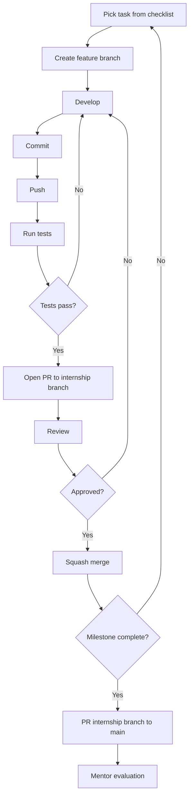
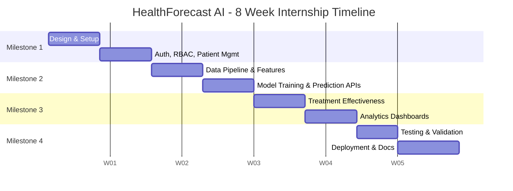
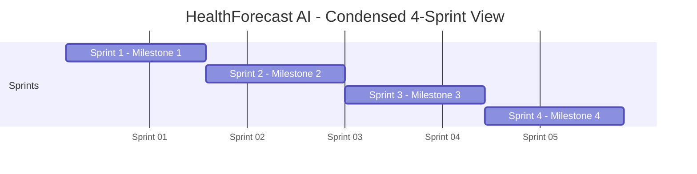

# HealthForecastAI_Implementation_Plan.md

**Document Version:** 1.0
**Status:** Execution-Ready
**Companion Documents:** `HealthForecastAI_SRS.md`, `HealthForecastAI_System_Design.md`, `HealthForecastAI_Database_Design.md`, `HealthForecastAI_ML_Design.md`, Original HealthForecast AI Project Document (PDF), Internship Guide
**Project:** HealthForecast AI — Hospital Readmission Prediction & Patient Risk Intelligence System

---

## 1. Introduction

### 1.1 Purpose

This document exists to answer one question precisely: **exactly what must be built, in what order, by whom, and how, to complete the HealthForecast AI internship project and pass every official milestone evaluation.** It is the single execution reference that sits on top of the four design documents and the original project brief — it does not redesign the system, it sequences its delivery.

### 1.2 How This Plan Relates to the Other Project Documents

| Document | Role | This Plan's Relationship to It |
|---|---|---|
| Internship Guide | Defines evaluation authority and internship process rules | Highest-priority source; this plan never contradicts it |
| Original HealthForecast AI Project Document (PDF) | Defines the official milestones (Week 2/4/6/8), modules, roles, and outcomes | This plan preserves its milestone sequence, objectives, and evaluation criteria exactly |
| `HealthForecastAI_SRS.md` | Defines functional/non-functional requirements, RBAC, dataset requirements | This plan converts every FR-xxx requirement into scheduled implementation tasks |
| `HealthForecastAI_System_Design.md` | Defines architecture, modules, APIs, data flows | This plan sequences the build order of every module/API defined there |
| `HealthForecastAI_Database_Design.md` | Defines the PostgreSQL-only schema | This plan sequences schema creation, migrations, and indexing as dependency-ordered tasks |
| `HealthForecastAI_ML_Design.md` | Defines dataset strategy, feature engineering, model selection | This plan sequences the ML pipeline into weekly phases aligned to Milestone 2 |

### 1.3 How Developers Should Use This Plan

1. Find your current week/milestone in **Section 5**.
2. Open the matching **Detailed Milestone Breakdown** (Section 5) and **Milestone Implementation Plan** (Sections 6–9).
3. Pull the specific checklist items for your module from **Sections 10–13**.
4. Validate your work against **Section 14 (Testing)** and **Section 16 (Definition of Done)** before marking a task complete.
5. Track overall progress against **Section 17 (Timeline)** and **Section 18 (Final Delivery Checklist)**.

This plan assumes the reader is implementing on their **personal internship branch** and will be evaluated by mentors against the **original project milestones** (PDF §5–§6), not against this document's structure.

---

## 2. Project Execution Strategy

### 2.1 Development Methodology

**Recommended approach: Milestone-Based Iterative Development within an Agile/Scrum-lite framework.**

**Justification:**
- The internship is already structured around four fixed, mentor-evaluated milestones (Week 2, 4, 6, 8) — this is inherently milestone-based delivery, not free-form Agile.
- Within each 2-week milestone, work is organized into **weekly sprints** with daily/self-managed task tracking, giving the benefits of Agile (visible progress, early feedback, adaptability) without violating the fixed milestone structure.
- Iterative development is mandatory for the ML components (Milestone 2) — model training is inherently a build-evaluate-refine loop, not a single linear pass.

| Principle | Application Here |
|---|---|
| Fixed milestone cadence | Weeks 2, 4, 6, 8 are non-negotiable evaluation checkpoints (PDF §5–§6) |
| Sprint-level iteration | Each milestone = 2 one-week sprints with a mid-point self-check |
| Incremental delivery | Every sprint ends with a demoable, working increment (never a partial/broken build) |
| Continuous integration | Every merge to the internship branch must pass tests before the next sprint starts |

### 2.2 Branch Strategy

```text
main (or org default branch — protected, mentor-reviewed only)
 └── internship/<your-name>-healthforecast-ai   (your personal internship branch)
       ├── feature/auth-rbac
       ├── feature/patient-management
       ├── feature/risk-prediction-model
       ├── feature/readmission-prediction
       ├── feature/clinical-decision-support
       ├── feature/analytics-dashboard
       ├── feature/reporting-module
       └── feature/deployment-docker
```

**Rules:**
- All work happens on `feature/*` branches cut from your personal internship branch — never commit directly to the internship branch.
- Each `feature/*` branch maps to exactly one module from Section 3 (Repository Analysis) or one row of Section 4 (Milestone Mapping).
- Your personal internship branch is merged into `main`/`develop` only at milestone boundaries (Week 2, 4, 6, 8), after mentor review.

### 2.3 Merge Strategy

- **Feature → Internship branch:** Squash merge after self-review and passing tests (keeps history clean per feature).
- **Internship branch → main/develop:** Merge commit (preserves milestone history) after mentor approval.
- **Never force-push** to the internship branch after a mentor has reviewed it.
- Every PR/merge must reference the milestone and module it satisfies (e.g., `[Milestone 1][Auth] Implement JWT login`).

### 2.4 Git Workflow

```text
Task (from Section 10-13 checklist)
 ↓
Create feature branch (feature/<module-name>)
 ↓
Development (small, atomic commits)
 ↓
Commit (conventional commit message: feat/fix/test/docs/chore)
 ↓
Push (to remote feature branch)
 ↓
Testing (unit + integration, Section 14)
 ↓
Self-review against Definition of Done (Section 16)
 ↓
Open PR into internship branch
 ↓
Review (self or peer/mentor)
 ↓
Merge (squash)
 ↓
Repeat for next task; at milestone boundary → PR internship branch → main
```



---

## 3. Repository Analysis

| Directory | Purpose | Ownership | Expected Deliverables |
|---|---|---|---|
| `frontend/` | Next.js/React/TypeScript/Tailwind application; role-specific dashboards, patient search, risk views, analytics, reports UI | Frontend responsibility (may be same developer in solo internship) | Working UI for all 4 roles; consumes backend REST APIs only |
| `backend/` | FastAPI services: Auth, User, Patient, Prediction, CDS, Analytics, Reporting, Audit | Backend responsibility | All REST endpoints from System Design §7, RBAC middleware, PostgreSQL integration |
| `ml/` | Data pipeline, feature engineering, model training (XGBoost, Random Forest), risk score engine, model artifacts | ML responsibility | Trained/versioned models, reusable preprocessing pipeline, inference service consumed by `backend/` |
| `docs/` | This plan, SRS, System Design, Database Design, ML Design, API docs, milestone reports | All contributors | Up-to-date documentation at every milestone boundary |
| `tests/` | Unit, integration, API, security, ML validation tests (mirrors `backend/`, `ml/`, `frontend/` structure) | All contributors, module-owner writes tests for their module | Passing test suite gating every merge |
| `scripts/` | DB migration runners, dataset download/preprocessing scripts, seed data scripts, Docker helper scripts | Backend/ML shared | Repeatable one-command setup for new environments |

**Expected top-level layout:**

```text
repo/
├── frontend/
│   ├── app/ (or pages/)
│   ├── components/
│   └── lib/api-client/
├── backend/
│   ├── app/
│   │   ├── routers/        # auth, users, patients, predictions, cds, analytics, reports, audit
│   │   ├── services/
│   │   ├── models/         # SQLAlchemy/SQLModel ORM models
│   │   ├── schemas/        # Pydantic request/response schemas
│   │   ├── middleware/     # auth, rbac, audit
│   │   └── core/           # config, security
│   └── alembic/            # migrations
├── ml/
│   ├── data/                # raw/, processed/ (gitignored, or DVC-tracked)
│   ├── pipeline/            # ingestion, validation, cleaning, feature_engineering.py
│   ├── training/            # train_risk_model.py, train_readmission_model.py
│   ├── evaluation/
│   └── artifacts/           # versioned model files (or pointer to object storage)
├── docs/
├── tests/
│   ├── backend/
│   ├── ml/
│   └── frontend/
├── scripts/
├── docker-compose.yml
└── README.md
```

---

## 4. Official Milestone Mapping

This table is the binding contract between the **original project milestones** (PDF §5–§6) and the **refined architecture** (System/Database/ML Design docs). It exists to demonstrate — for mentor evaluation — that the approved architectural improvements (PostgreSQL-only, India Hospital Readmission Dataset + Synthea) still satisfy every original milestone requirement.

| Original Milestone | Original Objective (PDF) | Updated Implementation Strategy | Architectural Changes Applied |
|---|---|---|---|
| **Milestone 1** (Week 1–2) | Project init, design, auth/RBAC/user permissions, load dataset, patient management, healthcare dashboard | Same objective; dataset load step now targets the **India Hospital Readmission Dataset (2015–2024)** instead of the Diabetes 130-US Hospitals dataset referenced in the original PDF | Dataset substitution (approved); PostgreSQL-only schema created from the start (no MongoDB provisioning step) |
| **Milestone 2** (Week 3–4) | Train risk models, generate risk scores, risk dashboards, readmission forecasting workflows, forecasting reports, clinical insights | Same objective; models trained on India Hospital Readmission Dataset; Synthea introduced as enrichment source for clinical insight generation, not as a label source | ML stack fixed to XGBoost + Random Forest (as originally specified); Synthea scoped strictly to enrichment per ML Design §3.2 |
| **Milestone 3** (Week 5–6) | Treatment evaluation workflows, recovery/treatment-effectiveness reports, medication outcome analysis, healthcare performance dashboards, patient outcome analytics, trend monitoring | Same objective; treatment-effectiveness and population-health features draw on Synthea-derived `patient_journey_events` JSONB data stored in PostgreSQL | Synthea data stored in PostgreSQL `JSONB` columns (Database Design §2.1) instead of a separate MongoDB collection shown in the original architecture diagram |
| **Milestone 4** (Week 7–8) | Validate prediction accuracy, optimize workflows/dashboards, Docker + cloud deployment, final documentation, demonstration | Same objective; deployment uses a single-database (PostgreSQL) Docker Compose stack, simplifying the deployment surface described in the original architecture diagram | Deployment topology simplified: one database container instead of two (Postgres + Mongo) |

**Explicitly out of scope for all milestones** (per project brief and confirmed in SRS §1.2 / ML Design future enhancements): EHR/HIS integration, laboratory/pharmacy system integration, federated learning, explainable-AI (SHAP/LIME) dashboards, real-time streaming analytics, multi-hospital federation. These appear only in Section 14 ("Future Enhancements") of the System Design document and must **not** be scheduled as implementation tasks in this plan.

---

## 5. Detailed Milestone Breakdown

### Milestone 1 — Week 1 & 2: Project Initialization, Design Process & Core Setup

**Objective:** Stand up the full-stack skeleton, implement authentication/RBAC for all four roles, load the primary dataset, and deliver a working patient-management + dashboard shell.

**Deliverables:**
- Repository structure (Section 3) initialized and pushed
- PostgreSQL schema (Users, Roles, DoctorPatientMap, Patients, Admissions) created and migrated
- JWT authentication + RBAC middleware functional for all 4 roles
- Patient CRUD + admission tracking APIs functional
- India Hospital Readmission Dataset loaded and validated
- Role-specific dashboard shells rendering in the frontend

**Dependencies:** None (first milestone) — but Database Design §5.1–§5.5 and SRS §7.1–§7.3 must be read before coding starts.

**Tasks:** See Section 6 for the full checklist.

**Validation Criteria:**
- All 4 roles can register/login and receive correctly-scoped JWTs
- A Doctor cannot retrieve a patient outside their `doctor_patient_map` assignment (verified via RBAC test)
- Dataset load script runs end-to-end without schema violations

**Risks:** Dataset schema mismatches with the `patients`/`admissions` tables (mitigation: run the ETL validation rules in SRS §11 before bulk insert).

**Completion Criteria:** Matches PDF §6 "Milestone 1 (Week 2)" evaluation criteria exactly — see Section 16.

---

### Milestone 2 — Week 3 & 4: Risk Prediction & Readmission Forecasting

**Objective:** Train and serve the risk and readmission prediction models; expose prediction APIs; build the initial risk/readmission dashboards; generate first clinical insights.

**Deliverables:**
- Cleaned, feature-engineered training dataset
- Trained Random Forest + XGBoost models meeting SRS §14 thresholds (ROC-AUC ≥ 0.75, High-risk F1 ≥ 0.70)
- `POST /api/predictions/risk` and `POST /api/predictions/readmission` live and integrated
- Risk tier classification (Low/Medium/High) and high-risk patient flagging functional
- Risk/readmission dashboard views for Doctor and Hospital Administrator roles

**Dependencies:** Milestone 1 complete (patients/admissions data + auth/RBAC must exist before predictions can be scoped to a role).

**Tasks:** See Section 7.

**Validation Criteria:** Evaluation metrics meet or exceed SRS §14 thresholds on held-out test data; prediction inference returns within 2 seconds (p95).

**Risks:** Class imbalance skewing the readmission model (mitigation: class weighting/resampling per ML Design §6/SRS §12).

**Completion Criteria:** Matches PDF §6 "Milestone 2 (Week 4)" evaluation criteria — see Section 16.

---

### Milestone 3 — Week 5 & 6: Treatment Effectiveness Analysis & Healthcare Analytics

**Objective:** Build treatment-effectiveness evaluation, healthcare analytics dashboards, and population-health/trend reporting.

**Deliverables:**
- Treatment/medication outcome analysis module
- Healthcare Analytics Dashboard (readmission analytics, hospital performance, patient outcome analysis, trend visualization)
- Anonymized/aggregated views for the Healthcare Researcher role
- Synthea-derived `patient_journey_events` and `treatment_effectiveness` tables populated

**Dependencies:** Milestone 2 complete (analytics/trend views consume prediction outputs).

**Tasks:** See Section 8.

**Validation Criteria:** Researcher role can never retrieve PII; aggregate dashboards load within 3 seconds (p95).

**Risks:** Schema mismatch between Synthea's FHIR-like export and the internal schema (mitigation: explicit ETL mapping layer per SRS §12 Technical Risks).

**Completion Criteria:** Matches PDF §6 "Milestone 3 (Week 6)" evaluation criteria — see Section 16.

---

### Milestone 4 — Week 7 & 8: Testing, Deployment & Documentation

**Objective:** Full integration/security/model validation, Dockerized deployment, final documentation and demonstration.

**Deliverables:**
- Full test suite passing (unit, API, DB, security, ML validation)
- Docker Compose stack (frontend, backend, ML service, PostgreSQL) deployed to a cloud environment (AWS/Azure)
- Final project documentation set complete
- End-to-end platform demonstration

**Dependencies:** Milestones 1–3 complete and merged.

**Tasks:** See Section 9.

**Validation Criteria:** Zero unauthorized cross-role access in RBAC testing; 100% of prediction requests and patient-record accesses captured in audit logs (SRS §14).

**Risks:** Deployment environment configuration drift from local dev (mitigation: identical Docker Compose definitions across dev/staging/prod, per System Design §11).

**Completion Criteria:** Matches PDF §6 "Milestone 4 (Week 8)" evaluation criteria — see Section 16.

---

## 6. Milestone 1 Implementation Plan

### Authentication

```markdown
- [ ] Design `users` table per Database Design §5.2 (user_id, full_name, email, password_hash, role, is_active, created_at)
- [ ] Implement password hashing with bcrypt/argon2 (System Design §10)
- [ ] Implement `POST /api/auth/login` — validate credentials, issue JWT access + refresh token (FR-AUTH-01)
- [ ] Implement `POST /api/auth/refresh` — token refresh without re-login (FR-AUTH-03)
- [ ] Implement `POST /api/auth/logout`
- [ ] Implement `POST /api/auth/reset-password` (time-limited reset token) (FR-AUTH-04)
- [ ] Implement account lockout after repeated failed logins (FR-AUTH-05)
- [ ] Write `AuthMiddleware` to validate JWT on every protected route (FR-AUTH-02)
```

### RBAC

```markdown
- [ ] Create `roles` table with 4 fixed roles: doctor, hospital_admin, researcher, system_admin (Database Design §5.1)
- [ ] Create `doctor_patient_map` table for Doctor-to-patient scoping (Database Design §5.3)
- [ ] Implement RBAC middleware evaluating role + scope on every request (System Design §10)
- [ ] Implement row-level scope filter: Doctor sees only assigned patients (FR-USR-03, FR-PAT-04)
- [ ] Implement the RBAC access matrix from SRS §9 as enforced permission checks (not just documentation)
- [ ] Write RBAC negative tests: verify 403 responses for out-of-scope/out-of-role access
```

### User Management

```markdown
- [ ] Implement `POST /api/users` — System Administrator creates users (FR-USR-01)
- [ ] Implement `GET /api/users` — paginated user list (System Administrator only) (FR-USR-04)
- [ ] Implement `PUT /api/users/{id}` — update user
- [ ] Implement `POST /api/users/{id}/scope` — assign Doctor-patient scope
- [ ] Enforce exactly one primary role per user at creation time (FR-USR-02)
- [ ] Build System Administrator "Manage Users" UI screen
```

### Patient Management

```markdown
- [ ] Create `patients`, `admissions`, `medications`, `treatments` tables (Database Design §5.4-5.7)
- [ ] Implement `POST /api/patients` — create patient record (FR-PAT-01)
- [ ] Implement `GET /api/patients/{id}` — retrieve patient (role-scoped per RBAC matrix) (FR-PAT-04)
- [ ] Implement `GET /api/patients/{id}/admissions` — admission/discharge timeline (FR-PAT-02)
- [ ] Implement `POST /api/patients/{id}/treatments` — medication/treatment logging (FR-PAT-03)
- [ ] Implement patient search (by name/ID/condition, scoped to role)
- [ ] Build Doctor "Patient Dashboard" and "Patient Search" UI screens
```

### Database Setup

```markdown
- [ ] Provision PostgreSQL 15+ instance (local Docker for dev; managed instance for staging/prod)
- [ ] Set up Alembic (or equivalent) migration tooling
- [ ] Create initial migration: users, roles, doctor_patient_map, patients, admissions, medications, treatments
- [ ] Apply primary key, foreign key, unique, and check constraints per Database Design §8
- [ ] Apply initial indexes on patient_id, admission_date (Database Design §9)
- [ ] Write and run the India Hospital Readmission Dataset load/validation script (SRS §11 validation rules)
- [ ] Seed a small local dev dataset for fast iteration
```

### Testing

```markdown
- [ ] Unit tests: password hashing, JWT issuance/validation
- [ ] Unit tests: RBAC permission-check function for every role x resource combination
- [ ] API tests: `/api/auth/*`, `/api/users/*`, `/api/patients/*` (happy path + 401/403/404 cases)
- [ ] DB tests: constraint violations correctly rejected (e.g., duplicate email, negative length_of_stay)
- [ ] Manual QA: log in as each of the 4 roles and confirm dashboard shell renders only role-appropriate navigation
```

---

## 7. Milestone 2 Implementation Plan

### Dataset Acquisition

```markdown
- [ ] Download India Hospital Readmission Dataset (2015–2024) from Kaggle
- [ ] Download/generate Synthea synthetic patient data (secondary/enrichment)
- [ ] Store raw datasets outside version control (`ml/data/raw/`, gitignored) with a documented fetch script
```

### Data Validation

```markdown
- [ ] Implement schema validation checks (SRS §11): discharge_date ≥ admission_date, readmission flag derivable, plausible age/length-of-stay ranges
- [ ] Implement referential integrity checks for Synthea encounter → patient references
- [ ] Document missing-value rate per critical feature; threshold at >40% missing → exclude/impute
```

### Data Cleaning

```markdown
- [ ] De-duplicate admission records by patient + admission timestamp
- [ ] Apply median/mode imputation for numeric/categorical fields; retain missingness-indicator flags where informative
- [ ] Clip/flag physiologically implausible values; winsorize extreme outliers
- [ ] Document and address class imbalance (readmitted vs. not) via resampling/weighting
```

### Feature Engineering

```markdown
- [ ] One-hot encode low-cardinality categoricals (gender, region)
- [ ] Target/frequency encode high-cardinality diagnosis codes
- [ ] Engineer demographic, clinical, admission, treatment, and historical features (ML Design §7)
- [ ] Standardize continuous features for pipeline consistency
- [ ] Run Random Forest feature-importance pass to prune low-signal features before XGBoost training
- [ ] Split dataset (train/validation/test) with class-stratified splitting
```

### Risk Prediction

```markdown
- [ ] Train Random Forest risk model
- [ ] Train XGBoost risk model
- [ ] Implement risk score ensemble/aggregation logic (ML Design §12)
- [ ] Implement Low/Medium/High threshold-based risk tier classification
- [ ] Evaluate against SRS §14 thresholds (F1 ≥ 0.70 for High-risk tier)
```

### Readmission Prediction

```markdown
- [ ] Train XGBoost/Random Forest ensemble for readmission probability
- [ ] Implement confidence-score derivation from model output distribution (FR-READM-02)
- [ ] Evaluate against SRS §14 thresholds (ROC-AUC ≥ 0.75)
- [ ] Implement `prediction_outcomes` feedback logging for future retraining (FR-READM-04)
```

### Model Training

```markdown
- [ ] Build reusable training pipeline (ingestion → validation → cleaning → feature engineering → training → evaluation)
- [ ] Apply cross-validation and early stopping (XGBoost) / bootstrapped bagging (Random Forest)
- [ ] Version every trained model artifact; record version in `model_metadata` table (Database Design §5.15)
- [ ] Store model binaries in object storage; store only the artifact path + metrics in PostgreSQL
```

### Evaluation

```markdown
- [ ] Compute Accuracy, Precision, Recall, F1, ROC-AUC on held-out test data for both models
- [ ] Compare Random Forest vs. XGBoost; document which is used standalone vs. in the ensemble
- [ ] Produce an evaluation report (docs/) summarizing metrics against SRS §14 thresholds
```

### Prediction APIs

```markdown
- [ ] Implement `POST /api/predictions/risk` (FR-RISK-01)
- [ ] Implement `GET /api/predictions/risk/{patientId}` (FR-RISK-02)
- [ ] Implement `GET /api/predictions/risk/high-risk-list` — flagged high-risk patients (FR-RISK-03)
- [ ] Implement `POST /api/predictions/readmission` (FR-READM-01)
- [ ] Implement `GET /api/predictions/readmission/{patientId}` — trend history (FR-READM-03)
- [ ] Implement `POST /api/predictions/feedback` — actual outcome logging (FR-READM-04)
- [ ] Persist every prediction to the `predictions`/`risk_scores`/`readmission_records` tables
- [ ] Build Doctor "Risk Score View" and Hospital Administrator "Readmission Forecast" dashboard screens
- [ ] Build initial Clinical Decision Support recommendation stub (full CDS module completes here per PDF outcomes: "Build clinical insights modules")
```

---

## 8. Milestone 3 Implementation Plan

### Analytics

```markdown
- [ ] Implement `GET /api/analytics/readmissions` — hospital-wide readmission analytics (FR-ANL-01)
- [ ] Implement `GET /api/analytics/outcomes` — patient outcome analysis, cross-tabulated vs. treatment (FR-ANL-02)
- [ ] Implement time-bucketed trend aggregation queries (FR-ANL-03)
- [ ] Implement `GET /api/analytics/research-export` — de-identified/aggregated researcher export (FR-ANL-04)
- [ ] Implement re-identification-risk guard: block export if cohort size is too small (SRS Use Case: Export Anonymized Research Dataset)
```

### Clinical Insights

```markdown
- [ ] Complete `RecommendationEngine`: map risk drivers to ranked care recommendations (FR-CDS-01)
- [ ] Implement `FollowUpPlanner`: map risk tier to follow-up cadence template (FR-CDS-02)
- [ ] Implement risk mitigation suggestion matching for high-risk patients (FR-CDS-03)
- [ ] Implement `DischargeChecklistBuilder` (FR-CDS-04)
- [ ] Expose `GET /api/cds/recommendations/{patientId}` and `GET /api/cds/discharge-checklist/{patientId}`
```

### Reporting

```markdown
- [ ] Implement `GET /api/reports/export` — PDF/Excel generation (FR-RPT-01)
- [ ] Implement `GET /api/reports/{id}/download`
- [ ] Implement scheduled/on-demand operational reports for administrators (FR-RPT-02)
- [ ] Implement patient outcome reports for doctors (FR-RPT-03)
- [ ] Store generated report files in object storage; persist metadata in `reports` table
```

### Dashboard Development

```markdown
- [ ] Build Healthcare Analytics Dashboard (readmission analytics, hospital performance, patient outcomes, trend charts)
- [ ] Build Hospital Administrator full-access dashboard views (SRS §9 RBAC matrix: "Full Access")
- [ ] Build Healthcare Researcher aggregated-only dashboard views
- [ ] Wire dashboard widgets to the Analytics and Reporting APIs
```

### Treatment Effectiveness Analysis

```markdown
- [ ] Design and create `treatment_effectiveness` and `patient_journey_events` PostgreSQL JSONB tables (Database Design §5.16, §2.1)
- [ ] Build Synthea → internal schema ETL/mapping layer (SRS §11 Synthea validation rules)
- [ ] Implement treatment outcome evaluation workflow
- [ ] Implement recovery analysis logic
- [ ] Implement medication effectiveness assessment
- [ ] Implement clinical performance monitoring views
```

### Population Health Analytics

```markdown
- [ ] Implement population-level aggregation queries (condition prevalence, regional trends) from Synthea-enriched data
- [ ] Expose population health reports to Hospital Administrator and Healthcare Researcher roles per RBAC matrix
- [ ] Build "Population Health Reports" UI screen
```

---

## 9. Milestone 4 Implementation Plan

### Integration Testing

```markdown
- [ ] End-to-end test: registration → login → patient creation → prediction → CDS recommendation → analytics → report export
- [ ] Cross-module integration test: prediction write correctly triggers CDS recommendation generation
- [ ] Load test dashboards under ≤200 concurrent users (SRS §8 Performance)
```

### Security Testing

```markdown
- [ ] Full RBAC matrix test: every role x every endpoint, confirm allow/deny matches SRS §9 exactly
- [ ] Verify JWT expiry, refresh, and revocation behavior
- [ ] Verify password hashes are never returned in any API response or log
- [ ] Verify PII/PHI fields are encrypted at rest (Database Design §10.2)
- [ ] Confirm 100% of authentication, patient-access, and prediction events appear in `audit_logs` (FR-AUD-01/02/03)
```

### Model Validation

```markdown
- [ ] Re-run full evaluation suite on final trained models; confirm thresholds still met (SRS §14)
- [ ] Validate model_metadata records reflect the exact deployed model version
- [ ] Confirm prediction inference latency ≤ 2 seconds (p95) under load
```

### Dockerization

```markdown
- [ ] Write Dockerfile for frontend (Next.js)
- [ ] Write Dockerfile for backend (FastAPI)
- [ ] Write Dockerfile for ML inference service
- [ ] Write `docker-compose.yml` orchestrating frontend, backend, ML service, PostgreSQL (single-database topology per Database Design §2.1)
- [ ] Verify full stack starts with a single `docker compose up` on a clean machine
```

### Deployment

```markdown
- [ ] Provision managed PostgreSQL instance (AWS RDS or Azure Database for PostgreSQL)
- [ ] Deploy containerized stack to AWS/Azure (staging first, then production)
- [ ] Configure load balancer in front of frontend/backend replicas
- [ ] Configure health check endpoints (`/health`) monitored by the orchestration layer
- [ ] Configure centralized structured logging and basic alerting (System Design §13)
```

### Final Documentation

```markdown
- [ ] Update README with setup/run instructions
- [ ] Finalize API documentation (OpenAPI/Swagger, auto-generated by FastAPI)
- [ ] Compile final model evaluation report
- [ ] Prepare milestone completion summary against Section 16 (Definition of Done)
```

### Project Submission

```markdown
- [ ] Confirm internship branch is merged and up to date
- [ ] Confirm repository matches the structure in Section 3
- [ ] Prepare final demonstration script/walkthrough
- [ ] Submit per Internship Guide submission process
```

---

## 10. Backend Development Roadmap

### Authentication Layer

| Aspect | Detail |
|---|---|
| Components | `AuthController`, `TokenService`, `PasswordHasher`, `AuthMiddleware` |
| APIs | `POST /api/auth/login`, `/refresh`, `/logout`, `/reset-password` |
| DB Dependencies | `users` |
| Testing | Unit (hashing, JWT), API (login success/failure, lockout), Security (token expiry/theft resistance) |

### RBAC Layer

| Aspect | Detail |
|---|---|
| Components | `AuthMiddleware` (role decode), `RBACMiddleware` (permission/scope check) |
| APIs | Cross-cutting — applied to every protected endpoint |
| DB Dependencies | `roles`, `doctor_patient_map` |
| Testing | Full role x endpoint permission matrix test (Section 9 Security Testing) |

### Patient Module

| Aspect | Detail |
|---|---|
| Components | `PatientController`, `AdmissionService`, `TreatmentLogService` |
| APIs | `POST/GET /api/patients`, `GET /api/patients/{id}/admissions`, `POST /api/patients/{id}/treatments` |
| DB Dependencies | `patients`, `admissions`, `treatments`, `medications` |
| Testing | CRUD unit tests, scope-filtering API tests |

### Prediction Module

| Aspect | Detail |
|---|---|
| Components | `FeatureBuilder`, `RiskModelService`, `RiskTierClassifier`, `ReadmissionModelService`, `ConfidenceEstimator`, `OutcomeFeedbackService` |
| APIs | `POST /api/predictions/risk`, `POST /api/predictions/readmission`, `POST /api/predictions/feedback` |
| DB Dependencies | `predictions`, `risk_scores`, `readmission_records`, `prediction_outcomes` |
| Testing | Model unit tests, API latency test (≤2s p95), ML validation (Section 14) |

### Analytics Module

| Aspect | Detail |
|---|---|
| Components | `AnalyticsAggregator`, `TrendService`, `AnonymizationService` |
| APIs | `GET /api/analytics/readmissions`, `/outcomes`, `/research-export` |
| DB Dependencies | `predictions`, `admissions`, `patients` (anonymized view), `patient_journey_events` |
| Testing | Aggregation correctness tests, anonymization/re-identification-risk tests |

### Reporting Module

| Aspect | Detail |
|---|---|
| Components | `ReportBuilder`, `PDFExporter`, `ExcelExporter` |
| APIs | `GET /api/reports/export`, `GET /api/reports/{id}/download` |
| DB Dependencies | `reports` |
| Testing | Report content correctness tests, format validation (PDF/XLSX) |

---

## 11. Database Development Roadmap

| Task | Priority | Dependency | Milestone |
|---|---|---|---|
| Create `roles`, `users` tables + constraints | High | None | 1 |
| Create `doctor_patient_map` table | High | `users`, `patients` | 1 |
| Create `patients`, `admissions` tables + constraints | High | None | 1 |
| Create `medications`, `treatments` tables | Medium | `admissions` | 1 |
| Index `patients.patient_id`, `admissions.admission_date` | High | Core tables exist | 1 |
| India Hospital Readmission Dataset load + validation | High | `patients`, `admissions` schema | 1 |
| Create `predictions`, `risk_scores` tables | High | `patients` | 2 |
| Create `readmission_records`, `prediction_outcomes` tables | High | `admissions` | 2 |
| Index `predictions.prediction_type`, `patient_id` | High | `predictions` table | 2 |
| Create `model_metadata` table | Medium | None | 2 |
| Create `care_recommendations` table | Medium | `predictions` | 3 |
| Create `patient_journey_events` (JSONB) table | Medium | Synthea ETL ready | 3 |
| Create `treatment_effectiveness` table | Medium | `patient_journey_events` | 3 |
| Create `reports` table | Medium | `users` | 3 |
| Create `audit_logs` (append-only) table | High | `users` | 1 (schema) / enforced across all |
| Apply Row-Level Security (RLS) for Doctor-patient scoping | High | `doctor_patient_map` | 1–4 (defense-in-depth, hardened in 4) |
| Encrypt PII/PHI columns (`patients.full_name`, `date_of_birth`) | High | `patients` table | 1 |
| Set up automated backup schedule | High | Managed instance provisioned | 4 |
| Apply partitioning strategy for `audit_logs`/`predictions` growth | Low | Production data volume | 4 (future-ready) |

**Seed Data:** A representative sampled subset of the India Hospital Readmission Dataset must be seeded into the local Docker Compose Postgres instance for fast developer iteration (System Design §11 Development Environment).

---

## 12. ML Development Roadmap

### Phase 1 — Dataset Setup
- **Inputs:** India Hospital Readmission Dataset (Kaggle), Synthea generator/export
- **Outputs:** Raw datasets staged locally, fetch scripts committed
- **Deliverables:** `ml/data/raw/` populated, dataset fetch script in `scripts/`
- **Success Criteria:** Both datasets load without errors; row/column counts documented

### Phase 2 — Data Cleaning
- **Inputs:** Raw datasets
- **Outputs:** Validated, de-duplicated, imputed datasets
- **Deliverables:** `ml/pipeline/validation.py`, `ml/pipeline/cleaning.py`
- **Success Criteria:** All SRS §11 validation rules pass; missing-value report documented

### Phase 3 — Feature Engineering
- **Inputs:** Cleaned datasets
- **Outputs:** Feature-engineered, encoded, scaled dataset ready for training
- **Deliverables:** `ml/pipeline/feature_engineering.py`, feature importance report
- **Success Criteria:** Final feature set documented with rationale for inclusion/exclusion

### Phase 4 — Baseline Models
- **Inputs:** Engineered feature set
- **Outputs:** First-pass Random Forest and XGBoost models
- **Deliverables:** `ml/training/train_risk_model.py`, `ml/training/train_readmission_model.py`
- **Success Criteria:** Baseline models train end-to-end without error; initial metrics recorded

### Phase 5 — Model Optimization
- **Inputs:** Baseline models + evaluation results
- **Outputs:** Hyperparameter-tuned, class-balanced final models
- **Deliverables:** Tuning logs/experiment tracking, final evaluation report
- **Success Criteria:** ROC-AUC ≥ 0.75 (readmission), High-risk F1 ≥ 0.70 (risk tier) — SRS §14

### Phase 6 — Model Deployment
- **Inputs:** Final validated models
- **Outputs:** Versioned model artifacts served via inference API
- **Deliverables:** `model_metadata` records, object-storage artifacts, live `/api/predictions/*` endpoints
- **Success Criteria:** Inference latency ≤ 2s (p95); model version traceable end-to-end from prediction record to artifact

---

## 13. API Development Checklist

### Auth APIs
```markdown
- [ ] POST /api/auth/login
- [ ] POST /api/auth/refresh
- [ ] POST /api/auth/logout
- [ ] POST /api/auth/reset-password
```

### User APIs
```markdown
- [ ] POST /api/users
- [ ] GET /api/users
- [ ] PUT /api/users/{id}
- [ ] POST /api/users/{id}/scope
```

### Patient APIs
```markdown
- [ ] POST /api/patients
- [ ] GET /api/patients/{id}
- [ ] GET /api/patients/{id}/admissions
- [ ] POST /api/patients/{id}/treatments
```

### Prediction APIs
```markdown
- [ ] POST /api/predictions/risk
- [ ] GET /api/predictions/risk/{patientId}
- [ ] GET /api/predictions/risk/high-risk-list
- [ ] POST /api/predictions/readmission
- [ ] GET /api/predictions/readmission/{patientId}
- [ ] POST /api/predictions/feedback
```

### Analytics APIs
```markdown
- [ ] GET /api/analytics/readmissions
- [ ] GET /api/analytics/outcomes
- [ ] GET /api/analytics/research-export
```

### Reporting APIs
```markdown
- [ ] GET /api/reports/export
- [ ] GET /api/reports/{id}/download
```

### CDS & Audit APIs (supporting)
```markdown
- [ ] GET /api/cds/recommendations/{patientId}
- [ ] GET /api/cds/discharge-checklist/{patientId}
- [ ] GET /api/audit-logs (System Administrator only)
```

---

## 14. Testing Strategy

### Unit Testing
- **Scope:** Individual functions/services — password hashing, RBAC permission checks, risk-tier classification logic, feature transformers
- **Tools:** `pytest` (backend/ML), `Jest`/`React Testing Library` (frontend)
- **Success Criteria:** ≥80% coverage on services/routers; all edge cases (invalid input, boundary values) covered

### API Testing
- **Scope:** Every endpoint in Section 13 — happy path, validation errors, auth errors
- **Tools:** `pytest` + `httpx`/`TestClient`, Postman collection (per System Design §3 Dev Tools)
- **Success Criteria:** Every endpoint has at least one success and one failure test case

### Database Testing
- **Scope:** Constraints (Database Design §8), migrations, transaction rollback behavior
- **Tools:** `pytest` against a disposable test PostgreSQL container
- **Success Criteria:** All constraint violations correctly rejected; migrations apply cleanly on empty DB

### Security Testing
- **Scope:** Full RBAC matrix, JWT lifecycle, encryption-at-rest verification, audit-log completeness
- **Tools:** Manual + automated RBAC matrix test suite, `OWASP ZAP` (optional) for basic scanning
- **Success Criteria:** Zero unauthorized cross-role access observed (SRS §14)

### ML Validation
- **Scope:** Model evaluation metrics, data pipeline correctness, prediction API integration
- **Tools:** `scikit-learn` metrics, `pytest` for pipeline functions
- **Success Criteria:** Metrics meet SRS §14 thresholds on held-out data; predictions reproducible given the same model version

---

## 15. Risk Register

| Risk | Impact | Probability | Mitigation |
|---|---|---|---|
| India Hospital Readmission Dataset quality/representativeness issues | High | Medium | Apply SRS §11 validation rules before training; document known limitations |
| Synthea ↔ primary dataset schema mismatch | Medium | High | Explicit ETL/schema-mapping layer before feature engineering (SRS §12) |
| Class imbalance skews readmission model | High | High | Class weighting, resampling, threshold tuning (SRS §12, ML Design §6) |
| ML model underperforms real-world distribution | High | Medium | Cross-validation, holdout testing, staged rollout with monitoring |
| Unauthorized PII/PHI access | Critical | Low | RBAC + RLS enforcement, encryption at rest/in transit, audit logging |
| Token theft / session hijacking | High | Low | Short-lived JWTs, refresh rotation, HTTPS-only |
| Dashboard performance degradation under load | Medium | Medium | Caching layer, query optimization, load testing pre-release |
| Model drift as patient population changes | Medium | Medium | Scheduled retraining pipeline with monitoring (System Design §14 notes this as a future enhancement beyond MVP retraining hooks) |
| 8-week timeline slippage | High | Medium | Strict adherence to Section 17 weekly plan; descope only non-milestone-critical polish, never core FR-xxx requirements |
| Deployment environment drift (dev vs. prod) | Medium | Medium | Identical Docker Compose definitions across environments |

---

## 16. Definition of Done

### Milestone 1
- [ ] Project initialization and architecture setup completed
- [ ] Authentication, RBAC, and patient-management workflows implemented and tested
- [ ] Healthcare dashboard functional for all 4 roles (shell-level)
- [ ] Dataset integration and preprocessing completed

### Milestone 2
- [ ] Patient risk prediction and readmission forecasting workflows implemented
- [ ] Risk scoring and forecasting models functional and meeting SRS §14 thresholds
- [ ] Clinical insights generated successfully (initial CDS stub)
- [ ] AI prediction models integrated into backend APIs

### Milestone 3
- [ ] Treatment effectiveness analysis and healthcare analytics dashboard implemented
- [ ] Patient outcome reports functional
- [ ] Hospital performance analytics generated successfully
- [ ] Trend monitoring workflows integrated

### Milestone 4
- [ ] Fully deployed frontend and backend (Docker + cloud)
- [ ] Model testing and validation completed
- [ ] Documentation and presentation prepared
- [ ] Successful end-to-end platform demonstration completed

---

## 17. Project Timeline

### 8-Week Internship Timeline (Authoritative)



### 4-Week Plan (Condensed / Fast-Track View)



### Week-by-Week Task/Dependency Table

| Week | Milestone | Focus | Key Dependency |
|---|---|---|---|
| 1 | 1 | Repo setup, DB schema, auth/RBAC | None |
| 2 | 1 | Patient management, dataset load, dashboard shell | Week 1 auth/schema |
| 3 | 2 | Data cleaning, feature engineering | Week 2 dataset load |
| 4 | 2 | Model training, prediction APIs, risk/readmission dashboards | Week 3 features |
| 5 | 3 | Treatment effectiveness, Synthea ETL | Week 4 predictions |
| 6 | 3 | Healthcare analytics dashboard, reporting | Week 5 treatment data |
| 7 | 4 | Integration/security/model validation | Weeks 1–6 complete |
| 8 | 4 | Dockerization, deployment, documentation, demo | Week 7 tests passing |

---

## 18. Final Delivery Checklist

### Source Code
```markdown
- [ ] frontend/, backend/, ml/ directories complete and pushed
- [ ] No secrets/credentials committed (checked via .gitignore + secret scan)
```

### APIs
```markdown
- [ ] All endpoints in Section 13 implemented and documented (OpenAPI/Swagger)
- [ ] All endpoints enforce correct RBAC per SRS §9
```

### Database
```markdown
- [ ] All tables from Database Design §5 created via migrations
- [ ] All constraints (§8) and indexes (§9) applied
- [ ] Backup schedule configured
```

### ML Models
```markdown
- [ ] Final Risk and Readmission models trained, versioned, and meeting SRS §14 thresholds
- [ ] model_metadata populated for every deployed model version
```

### Documentation
```markdown
- [ ] README, SRS, System Design, Database Design, ML Design, and this Implementation Plan all present and current
- [ ] API documentation generated and accessible
- [ ] Final evaluation report compiled
```

### Testing
```markdown
- [ ] Unit, API, DB, security, and ML validation suites all passing
- [ ] RBAC matrix fully tested with zero unauthorized access
```

### Deployment
```markdown
- [ ] Docker Compose stack builds and runs cleanly
- [ ] Staging deployment verified on AWS/Azure
- [ ] Production deployment live with health checks and basic monitoring
```

### Submission Requirements
```markdown
- [ ] Internship branch merged per Internship Guide process
- [ ] Final demonstration prepared and rehearsed
- [ ] All four milestone evaluation criteria (Section 16) satisfied
```

---

## 19. Success Metrics

### System Performance
- Prediction inference latency ≤ 2 seconds (p95)
- Dashboard load time ≤ 3 seconds (p95) under ≤200 concurrent users

### Prediction Accuracy
- Readmission model ROC-AUC ≥ 0.75 on held-out test data
- Risk classification F1-score ≥ 0.70 for High-risk tier identification

### User Experience
- Role-appropriate dashboards usable without engineering support (validated via mentor/reviewer walkthrough)
- No dead UI elements for unauthorized actions on any role's dashboard

### Reliability
- 100% of prediction requests and patient-record accesses captured in audit logs
- All four milestones delivered with passing evaluation criteria (PDF §6)

### Security
- Zero unauthorized cross-role data access observed in RBAC testing
- All PII/PHI fields encrypted at rest; TLS 1.2+ enforced in transit

---

*End of HealthForecastAI_Implementation_Plan.md*
