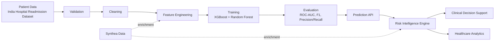

# HealthForecast AI - Machine Learning Design Document

**Document Version:** 1.0
**Companion Documents:** `HealthForecastAI_SRS.md`, `HealthForecastAI_System_Design.md`, `HealthForecastAI_Database_Design.md`
**Project:** HealthForecast AI: Hospital Readmission Prediction & Patient Risk Intelligence System

---

## 1. Introduction

### 1.1 Purpose

This document specifies the complete machine learning design for HealthForecast AI: dataset strategy, feature engineering, model selection and training, evaluation, the risk-scoring engine, the prediction API contract, and monitoring/retraining strategy. It is the authoritative reference for the AI/ML Engine layer defined in `HealthForecastAI_System_Design.md` §4 (Risk Prediction Module, Readmission Prediction Module) and implements the ML-related functional requirements in `HealthForecastAI_SRS.md` §7.4–7.5.

### 1.2 Scope

Covered: dataset selection and justification, data pipeline design, feature engineering, model selection/training/evaluation, risk score engine design, prediction API design, model monitoring, and ML security. Not covered: database schema (see Database Design document), frontend dashboard rendering, or non-ML backend services.

### 1.3 ML Objectives

| # | Objective | Description |
|---|---|---|
| M1 | Readmission prediction | Predict probability of readmission within 30-day and 90-day windows using historical admission data. |
| M2 | Risk scoring | Produce a calibrated, holistic patient risk score (0–1) mapped to Low/Medium/High tiers. |
| M3 | Explainability-lite | Surface feature-importance-driven contributing factors alongside every prediction, sufficient for clinician trust without a full XAI dashboard (explicitly out of scope for this phase). |
| M4 | Model governance | Version every trained model, track evaluation metrics, and support staged promotion/rollback. |
| M5 | Continuous evaluation | Compare predictions to actual outcomes to detect degradation and inform retraining. |

### 1.4 Expected Outcomes

- A deployed readmission-probability model and a deployed risk-scoring model, both meeting the SRS §14 success criteria (ROC-AUC ≥ 0.75, High-risk-tier F1 ≥ 0.70, inference latency ≤ 2s p95).
- A reproducible training pipeline that can be re-run against refreshed data and re-evaluated before promotion.
- A risk score engine and prediction API consumed directly by the Clinical Decision Support and Healthcare Analytics modules.

---

## 2. Business Problem Definition

### Hospital Readmission Prediction

Given a patient's demographics, diagnosis history, admission details, medications, and prior visit history, estimate the probability that the patient will be readmitted within a defined follow-up window (30-day and 90-day horizons), and classify the case into an actionable risk tier — directly implementing SRS FR-READM-01 through FR-READM-04.

### Patient Risk Intelligence

Beyond a single readmission number, synthesize multiple risk signals (comorbidities, admission frequency, length of stay, medication burden) into a holistic patient risk profile usable by clinicians during daily rounds — implementing SRS FR-RISK-01 through FR-RISK-04.

### Healthcare Analytics Support

Aggregate prediction outputs across patients, departments, and time periods to give Hospital Administrators and Healthcare Researchers population-level visibility, per SRS §7.7.

### Clinical Decision Support

Translate model outputs (risk score, contributing features) into ranked, human-readable care recommendations, follow-up plans, and discharge checklists, per SRS §7.6 — the ML layer's outputs are the direct input to the CDS module's rule-based recommendation engine described in the System Design.

---

## 3. Dataset Strategy

### 3.1 Primary Dataset: India Hospital Readmission Dataset (2015–2024)

**Source:** Kaggle — `digutlaranjithkumar/india-hospital-readmission-dataset-20152024`

**Dataset Overview:** A multi-year, multi-disease hospital admissions dataset covering Indian hospital encounters from 2015 to 2024, capturing patient demographics, admission/discharge details, diagnoses, and readmission outcomes across a broad range of conditions rather than a single disease category.

**Dataset Structure (representative, per SRS §11):**

| Field Category | Example Fields |
|---|---|
| Demographics | age, gender, region |
| Admission | admission_date, discharge_date, admission_type, department |
| Clinical | diagnosis / primary condition, diagnosis_code, length_of_stay |
| History | prior_admission_count |
| Treatment | medication_count/type at discharge |
| Label | readmission flag, readmission window |

**Expected Features:** Age, gender, region, primary diagnosis, admission type, department, length of stay, prior admission count, discharge medication count, and derived features built on top of these (see §7).

**Target Variables:**
- `readmitted` (binary): whether the patient was readmitted within the defined window.
- `readmission_probability` (continuous, model output): calibrated probability driving the risk tier.

**Strengths:**
- Multi-disease, hospital-wide coverage rather than a single-condition cohort — supports a general-purpose risk model applicable across departments, matching the platform's "any patient, any department" scope.
- Spans a full decade (2015–2024), enabling temporal validation (train on earlier years, validate on later years) to test robustness to distributional drift.
- Indian healthcare context — directly relevant to the platform's stated deployment context and stakeholder base (hospitals, clinics, insurers operating in this market).

**Limitations:**
- As with most public hospital-admission datasets, granular real-time vitals and lab trends are unlikely to be present at the fidelity a bedside monitoring system would offer — the platform is explicitly scoped as decision-support, not bedside monitoring, which aligns with this limitation.
- Label quality (accuracy of the readmission flag) depends on how readmissions were tracked in source hospital systems; class imbalance (readmitted being the minority class) is expected and is addressed in §6.10.
- Dataset must be schema-validated on ingestion since a Kaggle-sourced dataset does not carry the same governance guarantees as a hospital's own EHR export.

### 3.2 Secondary Dataset: Synthea

**Source:** `synthea.mitre.org` / GitHub `synthetichealth/synthea`

**Purpose:** Treatment Effectiveness Analysis, Clinical Decision Support enrichment, Population Health Analytics, and Dashboard Enrichment — **not** used as a label source for the readmission model.

**Usage Strategy:** Synthea generates synthetic-but-clinically-plausible longitudinal patient records (encounters, conditions, medications, procedures, care plans, observations) in a FHIR-like structure. HealthForecast AI uses Synthea output to:
1. Populate realistic treatment/medication/procedure detail for demo and development environments without using real patient data.
2. Enrich the Treatment Effectiveness module with recovery-trend and care-plan data that the primary dataset does not capture at that level of clinical granularity.
3. Provide journey/timeline data for population-health dashboard visualizations.

**Integration Approach:** Synthea's FHIR-style JSON output is mapped through a schema-alignment ETL step into the `patient_journey_events` table (PostgreSQL `JSONB`, per the Database Design document §5.16) rather than a separate document database. Each Synthea resource type (Encounter, Condition, MedicationRequest, Procedure, Observation, CarePlan) becomes one `event_type` row with the full resource preserved in `payload` for downstream flexible querying, and key fields (date, patient reference) promoted to indexed columns.

---

## 4. Dataset Selection Justification

### 4.1 Why the India Hospital Readmission Dataset Was Chosen

| Factor | Explanation |
|---|---|
| Multi-disease coverage | Captures readmissions across many conditions and departments, matching the platform's goal of a hospital-wide (not single-specialty) risk engine. |
| Hospital-wide applicability | Includes department- and admission-type-level detail, directly supporting the Hospital Administrator's department-level analytics requirement (FR-ANL-01–03). |
| Indian healthcare relevance | The platform's stated user base (hospitals, clinics, insurers, researchers) and stakeholder framing in the SRS point to Indian healthcare delivery patterns; a dataset native to that context reduces distributional mismatch between training data and eventual deployment population. |
| Better alignment with project goals | The platform's objective is general hospital readmission risk, not a single-disease deep-dive — a broad, multi-condition dataset is the correct fit, whereas a single-disease dataset would require a narrower product scope than the SRS defines. |

### 4.2 Comparison with Diabetes 130-US Dataset

The Diabetes 130-US Hospitals dataset (referenced in the source project brief's Week 1–2 milestone as an initial placeholder dataset) is a well-known, single-condition readmission dataset. It is retained only as an optional early-milestone bootstrap dataset (per the original 8-week plan) and is **not** the dataset the production model is trained and evaluated against — the India Hospital Readmission Dataset supersedes it as the primary source of truth for this design, consistent with the binding architectural decisions in `doc_prompt(2).md`.

| Dimension | India Hospital Readmission Dataset (2015–2024) | Diabetes 130-US Dataset |
|---|---|---|
| Condition scope | Multi-disease, hospital-wide | Single condition (diabetes) |
| Geographic/context relevance | Indian healthcare context | US healthcare context |
| Time span | 2015–2024 (10 years) | ~1999–2008 (~10 years, but far older/dated) |
| Departmental granularity | Includes department/admission-type fields | Encounter-level, diabetes-specific fields only |
| Fit to platform scope | High — matches "any patient, any department" SRS scope | Low — would constrain the platform to a single specialty |
| Role in this design | **Primary training and evaluation dataset** | Optional early-milestone bootstrap/smoke-test dataset only |

---

## 5. Machine Learning Architecture

### Mermaid Diagram



### ASCII Diagram

```
Patient Data (India Hospital Readmission Dataset)
        |
        v
   Validation
        |
        v
    Cleaning
        |
        v
Feature Engineering  <---- Synthea (enrichment only)
        |
        v
    Training (XGBoost, Random Forest)
        |
        v
    Evaluation (ROC-AUC, F1, Precision, Recall, Confusion Matrix)
        |
        v
   Prediction API
        |
        v
Risk Intelligence Engine ----> Clinical Decision Support
        |
        v
  Healthcare Analytics Dashboard
```

---

## 6. Data Pipeline Design

### 6.1 Data Ingestion

- Batch ingestion job loads the India Hospital Readmission Dataset CSV/Parquet export into a staging schema, validated before promotion into the operational `patients`/`admissions`/`readmission_records` tables (per Database Design §5.4–5.8).
- Synthea output is generated/ingested separately via the FHIR-to-`patient_journey_events` ETL step described in §3.2.

### 6.2 Validation

- Schema validation: required columns present, correct types, no unexpected columns silently dropped.
- Referential validation: every admission references a known patient; every readmission record references a valid index admission (enforced both at ETL time and by the database foreign keys in the Database Design document).
- Range validation: age within [0, 130]; discharge_date ≥ admission_date; length_of_stay ≥ 0.

### 6.3 Cleaning

- Duplicate admission records (same patient + same admission timestamp) are de-duplicated, keeping the most complete row.
- Malformed or contradictory rows (e.g., discharge before admission) are quarantined into a rejected-rows log for manual review rather than silently dropped.

### 6.4 Missing Value Handling

- Numeric clinical fields (age, length_of_stay, prior_admission_count): median imputation, with a companion missingness-indicator feature retained where the missing rate is non-trivial (>5%), since "missingness" itself can be predictive in clinical data.
- Categorical fields (gender, region, diagnosis, department): mode imputation or an explicit `"Unknown"` category, chosen per-field based on whether missingness is likely informative.
- Columns with >40% missing values are excluded from the initial feature set unless a clinically-justified imputation strategy is documented and reviewed.

### 6.5 Outlier Detection

- Physiologically implausible values (negative length-of-stay, absurd age values) are clipped/rejected at validation time (§6.2).
- Extreme-but-plausible numeric outliers (e.g., unusually long length-of-stay) are winsorized (capped at the 1st/99th percentile) rather than removed, to avoid discarding genuinely high-risk cases.

### 6.6 Encoding

- Low-cardinality categorical fields (gender, region, admission_type): one-hot encoding.
- High-cardinality categorical fields (diagnosis code, department): target/frequency encoding to avoid dimensionality explosion, fit only on the training split to prevent leakage.

### 6.7 Scaling

- Tree-based models (XGBoost, Random Forest) do not strictly require feature scaling, but continuous features are standardized (zero mean, unit variance) for pipeline consistency and to support any future linear/neural baseline without a separate preprocessing branch.

### 6.8 Feature Engineering

See §7 for the full feature catalogue. Engineering happens after cleaning/encoding/scaling and before the train/validation/test split is finalized for model-specific derived features (e.g., interaction terms), while dataset-level statistics (e.g., median for imputation, encoding maps) are fit on the training split only.

### 6.9 Feature Selection

- Initial feature set built from all engineered features (§7).
- Random Forest feature-importance ranking is used to prune low-signal features before final XGBoost training (consistent with the Model Selection rationale in §9), keeping the final feature set interpretable enough to support the CDS module's "contributing factors" output (M3).

### 6.10 Dataset Splitting

| Split | Ratio | Purpose |
|---|---|---|
| Train | 70% | Model fitting |
| Validation | 15% | Hyperparameter tuning, early stopping |
| Test (holdout) | 15% | Final, untouched evaluation reported in §11 |

- **Splitting strategy:** Primarily **temporal split** (train on earlier admission years, e.g., 2015–2021; validate on 2022; test on 2023–2024) to better simulate real-world deployment, where the model must generalize to *future* patients — this is stronger evidence of production readiness than a random split and directly supports the "Overfitting to historical dataset" risk mitigation noted in the SRS Risk Analysis (§12, AI/ML Risks).
- **Class imbalance:** Since readmitted patients are the minority class, class weighting (`scale_pos_weight` in XGBoost) and/or SMOTE-based resampling is applied on the **training split only** — never on validation/test — to avoid leaking synthetic signal into evaluation.

---

## 7. Feature Engineering Strategy

### Demographic Features
- Age (numeric, imputed/winsorized), age band (derived, for interpretability in CDS output).
- Gender (one-hot).
- Region (frequency-encoded) — captures potential systemic/regional care-access variation.

*Why they matter:* Baseline risk stratification factors well-established in readmission literature; age and comorbidity burden strongly correlate with readmission likelihood.

### Clinical Features
- Primary diagnosis / diagnosis code (target/frequency-encoded).
- Number of distinct diagnoses/comorbidities recorded for the patient to date (derived).

*Why they matter:* Diagnosis complexity and comorbidity count are among the strongest documented predictors of readmission risk.

### Admission Features
- Admission type (emergency/elective/transfer, one-hot).
- Department (frequency-encoded).
- Length of stay (numeric, winsorized).
- Day-of-week / season of admission (derived, cyclical encoding) — captures potential staffing/resource-availability effects.

*Why they matter:* Emergency admissions and unusually short/long stays are established readmission risk correlates; department captures case-mix differences.

### Treatment Features
- Discharge medication count (numeric).
- Distinct medication classes at discharge (derived, from Synthea-enriched records where available).
- Treatment outcome flag from the `treatments` table (improved/unchanged/worsened) where available.

*Why they matter:* Medication burden is a recognized proxy for regimen complexity and adherence risk; a "worsened" treatment outcome is a strong prospective readmission signal.

### Historical Features
- Prior admission count (numeric, directly sourced).
- Days since last discharge (derived, from admission history).
- Historical readmission flag (whether the patient has ever been readmitted before, derived from `readmission_records`).

*Why they matter:* Prior utilization is consistently one of the single strongest predictors of future readmission — "the best predictor of a future admission is a past admission" is a well-established heuristic in readmission-prediction literature, and this dataset's decade-long span makes this feature especially reliable.

---

## 8. Model Selection

| Model | Advantages | Disadvantages | Suitability |
|---|---|---|---|
| Logistic Regression | Simple, fast, highly interpretable coefficients | Limited capacity for non-linear feature interactions common in clinical data | Useful as a baseline only |
| Random Forest | Robust to overfitting, handles mixed feature types well, strong native feature-importance output | Can be slower at inference for very large forests; less precise probability calibration out-of-the-box than boosted trees | High — selected as a complementary model |
| XGBoost | Excellent accuracy on tabular data, native missing-value handling, built-in regularization, fast inference | More hyperparameters to tune; less immediately interpretable than a single tree | High — selected as the primary model |
| LightGBM | Very fast training on large tabular data, efficient with high-cardinality categoricals | Additional dependency; marginal benefit over XGBoost at this dataset's scale | Not selected — XGBoost sufficiently covers the need at this data volume |
| CatBoost | Strong native categorical handling | Additional dependency; team/tooling standardized on XGBoost + scikit-learn per System Design tech stack | Not selected for this phase |
| Neural Networks | Can capture complex non-linear interactions given enough data | Requires substantially more data to outperform gradient-boosted trees on tabular clinical data of this size; materially less interpretable; heavier infra footprint | Not selected — noted as a Future Enhancement (§16) |

---

## 9. Final Model Selection

### Random Forest and XGBoost — Selected

**Why Random Forest:** Serves as both a robust standalone baseline and, critically, as the **feature-importance and explainability source** feeding the CDS module's "contributing factors" output (M3) and the feature-selection step in §6.9. Its bagged-tree structure is naturally resistant to overfitting on the moderate feature-count tabular data this platform uses.

**Why XGBoost:** Selected as the **primary production classifier** for both risk scoring and readmission-probability prediction, due to its native handling of missing values (reducing pipeline fragility), built-in L1/L2 regularization (mitigating the "overfitting to historical dataset" risk flagged in the SRS Risk Analysis), and consistently strong published performance on structured/tabular healthcare readmission-prediction tasks.

**Comparison for this use case:**

| Criterion | Random Forest | XGBoost | Combined Approach |
|---|---|---|---|
| Raw predictive accuracy on tabular clinical data | Good | Excellent | Ensemble typically outperforms either alone |
| Training speed | Fast | Moderate (with early stopping) | Acceptable within the 8-week / iterative retraining cadence |
| Native missing-value handling | Requires imputation | Native | XGBoost reduces pipeline fragility |
| Feature importance / explainability | Strong, intuitive | Available (gain-based) but denser to interpret | RF importance used to validate/prune XGBoost's feature set |
| Overfitting resistance | High (bagging) | Moderate (mitigated via regularization + early stopping) | RF cross-checks XGBoost's learned importances |

**Production strategy:** XGBoost is deployed as the primary inference model for both `risk` and `readmission` prediction types (per Database Design `predictions.model_version`); Random Forest is retained as (a) a continuously-evaluated baseline for drift comparison and (b) the feature-importance validator consumed during each retraining cycle. Where beneficial, a weighted ensemble of both models' probability outputs may be used for the final served score, per §12.3 of the risk-score methodology.

---

## 10. Training Strategy

### Training Pipeline

1. Pull the current training split from the validated, feature-engineered dataset (§6).
2. Fit encoding maps, imputation statistics, and scalers on the training split only; persist them as part of the model artifact bundle so inference-time preprocessing is guaranteed identical to training-time preprocessing.
3. Train Random Forest first (feature-importance pass); prune low-signal features.
4. Train XGBoost on the pruned feature set with early stopping against the validation split.
5. Evaluate both models against the held-out test split (§11).
6. Register the resulting artifacts in `model_metadata` (Database Design §5.15) with `status = 'staged'`.

### Hyperparameter Tuning

- Randomized search (or Bayesian search, e.g., Optuna) over XGBoost's `max_depth`, `learning_rate`, `n_estimators`, `subsample`, `colsample_bytree`, `scale_pos_weight`, and `min_child_weight`, optimized against validation-split ROC-AUC.
- Random Forest tuning limited to `n_estimators`, `max_depth`, `min_samples_leaf`, and `max_features` — it is intentionally kept simpler since its primary production role is feature-importance validation rather than being the served model.

### Cross Validation

- Stratified k-fold (k=5) cross-validation on the training split is used during hyperparameter search to reduce variance in the selected hyperparameters, in addition to the temporal train/validation/test split used for the final reported evaluation (§6.10) — cross-validation informs tuning; the temporal holdout is what is actually reported as the model's expected real-world performance.

### Model Versioning

- Every training run produces a uniquely versioned artifact (`model_name` + semantic/timestamp `version`, per Database Design §5.15), stored in object storage with the training configuration, feature list, and evaluation metrics captured alongside it.

### Experiment Tracking

- Each training run's hyperparameters, cross-validation scores, and final holdout metrics are logged to an experiment-tracking store (e.g., MLflow) so that promotion decisions (§14) can be made by comparing candidate runs against the current production model's recorded metrics.

---

## 11. Evaluation Framework

| Metric | Formula | Interpretation |
|---|---|---|
| Accuracy | (TP + TN) / (TP + TN + FP + FN) | Overall correctness; less informative alone under class imbalance, reported for completeness. |
| Precision | TP / (TP + FP) | Of patients flagged as readmission-risk, the proportion who were actually readmitted — high precision avoids alarm fatigue. |
| Recall | TP / (TP + FN) | Of patients who were actually readmitted, the proportion the model correctly flagged — high recall is clinically prioritized, since missing a true high-risk patient is costlier than a false alarm. |
| F1 Score | 2 × (Precision × Recall) / (Precision + Recall) | Harmonic mean balancing precision and recall; the primary metric for High-risk-tier performance per SRS success criteria (target ≥ 0.70). |
| ROC-AUC | Area under the True Positive Rate vs. False Positive Rate curve across thresholds | Threshold-independent measure of overall discriminative ability; the primary reported metric for the readmission model (target ≥ 0.75 per SRS §14). |
| Confusion Matrix | Cross-tabulation of predicted vs. actual class | Diagnostic tool for understanding *where* the model errs (e.g., systematically under-flagging a particular risk tier). |

**Reporting convention:** All metrics are computed on the temporal holdout test split (§6.10), never on training or validation data, and are recorded in `model_metadata` before a model can be promoted to `status = 'production'` (§14).

---

## 12. Risk Score Engine Design

### 12.1 Risk Categories

| Tier | Score Range | Clinical Interpretation |
|---|---|---|
| Low | 0.00 – 0.39 | Standard discharge planning; no additional intervention flagged. |
| Medium | 0.40 – 0.69 | Enhanced follow-up cadence recommended; monitor for emerging risk drivers. |
| High | 0.70 – 1.00 | Priority clinical review before discharge; CDS mitigation and discharge-checklist workflows triggered. |

### 12.2 Threshold Logic

- Thresholds are stored as tunable configuration (not hardcoded in application logic) so they can be recalibrated per model version based on the training-time score distribution and clinical-review feedback, without requiring a code deployment.
- Threshold changes apply only to **new** predictions going forward; existing `predictions.risk_category` rows are immutable historical records of the tier that was true at prediction time (per Database Design §3.1).

### 12.3 Risk Score Formula

- **Base score:** The calibrated probability output directly from the primary XGBoost classifier (Platt scaling or isotonic calibration applied post-training if the raw XGBoost output is not well-calibrated, verified via a reliability/calibration curve during evaluation).
- **Ensemble option:** Where both XGBoost and Random Forest outputs are combined, the final score is a weighted average:

```
risk_score = (w_xgb * xgb_probability) + (w_rf * rf_probability)
```

  with weights (`w_xgb`, `w_rf`) tuned on the validation split to maximize ROC-AUC, defaulting to a higher weight on XGBoost given its typically stronger standalone performance on this data type.

### 12.4 Clinical Interpretation

Each risk score is accompanied by a short, ranked list of contributing features (from Random Forest feature-importance and XGBoost gain-based importance for the specific prediction), translated into clinician-readable language by the CDS module (e.g., "3 prior admissions in the last 12 months", "extended length of stay") — this satisfies the M3 explainability-lite objective without requiring a full SHAP/LIME dashboard, which is explicitly deferred to Future Enhancements (§16).

---

## 13. Prediction API Design

### Input Schema

**`POST /api/predictions/risk`**
```json
{
  "patient_id": "uuid"
}
```

**`POST /api/predictions/readmission`**
```json
{
  "patient_id": "uuid",
  "admission_id": "uuid"
}
```

### Output Schema

**Risk prediction response:**
```json
{
  "prediction_id": "uuid",
  "patient_id": "uuid",
  "risk_score": 0.82,
  "risk_category": "High",
  "contributing_factors": [
    "3 prior admissions in the last 12 months",
    "Length of stay above department median",
    "5 concurrent discharge medications"
  ],
  "model_version": "risk_xgboost_v1.3.0",
  "prediction_date": "2026-08-29T10:15:00Z"
}
```

**Readmission prediction response:**
```json
{
  "prediction_id": "uuid",
  "patient_id": "uuid",
  "admission_id": "uuid",
  "readmission_probability": 0.64,
  "risk_category": "Medium",
  "confidence_score": 0.78,
  "readmission_window": "30_day",
  "model_version": "readmission_xgboost_v1.3.0",
  "prediction_date": "2026-08-29T10:15:00Z"
}
```

### Error Handling

| Condition | HTTP Status | Response Body |
|---|---|---|
| Patient has insufficient feature data for reliable inference | `422 Unprocessable Entity` | `{ "error": "insufficient_patient_data", "missing_fields": [...] }` |
| Model inference service failure | `500 Internal Server Error` | `{ "error": "model_inference_failed" }` |
| Requesting user lacks permission for this patient (out of Doctor scope) | `403 Forbidden` | `{ "error": "out_of_scope_access" }` |
| Patient or admission not found | `404 Not Found` | `{ "error": "resource_not_found" }` |

### Prediction Workflow

1. API Gateway authenticates the request and enforces RBAC/scope (per System Design §10).
2. Prediction Service fetches the patient's current feature set from `patients`/`admissions`/derived feature tables.
3. Features are passed through the identical preprocessing pipeline persisted with the model artifact (§10, Training Pipeline step 2).
4. The current-production model (per `model_metadata.status = 'production'`) performs inference.
5. Result is persisted to `predictions` (and `risk_scores` for risk-type predictions), per Database Design §5.9–5.10.
6. Response is returned to the caller; the CDS module is triggered asynchronously to generate `care_recommendations` for High/Medium tier results.
7. The full request/response cycle is captured in `audit_logs` (FR-AUD-03).

---

## 14. Model Monitoring

### Drift Detection
- **Data drift:** Compare the feature distributions of newly-scored patients against the training-time distribution (e.g., population stability index per feature) on a scheduled basis; flag features whose distribution has shifted materially.
- **Concept drift:** Track rolling ROC-AUC/F1 on newly-resolved `prediction_outcomes` (§Database Design §5.11) against the model's originally-reported holdout metrics; a sustained drop below the SRS success-criteria thresholds (ROC-AUC < 0.75, High-tier F1 < 0.70) triggers a retraining review.

### Performance Monitoring
- Inference latency (p50/p95/p99) tracked per prediction request, alerting if p95 approaches the 2-second SLA ceiling (System Design §13, Monitoring & Observability).
- Prediction volume and risk-tier distribution tracked over time to catch unexpected shifts (e.g., a sudden spike in "High" tier predictions that may indicate a pipeline bug rather than a genuine population change).

### Retraining Strategy
- Scheduled retraining cadence (e.g., quarterly) using the latest available data, re-run through the full pipeline in §6 and re-evaluated per §11 before any promotion decision.
- Trigger-based retraining outside the schedule if drift detection (above) crosses a defined threshold.
- Every retraining run is a new `model_metadata` row with `status = 'staged'` — it never overwrites the current production model artifact.

### Version Control
- Model artifacts, their training configuration, and their evaluation metrics are immutably versioned in `model_metadata` (Database Design §5.15); promotion from `staged` to `production` is a System-Administrator-approved action (per SRS Use Case "Deploy Updated Prediction Model") that is fully audit-logged, including a rollback path to the previously-`production` version if the newly-promoted model underperforms in production monitoring.

---

## 15. ML Security Considerations

### Data Privacy
- Model training uses only de-identified/pseudonymized feature vectors — direct identifiers (`full_name`, `date_of_birth`) are never included as model features, consistent with the Database Design's PII encryption and the Researcher-facing anonymized view.
- Synthea data, being synthetic, carries no real-patient privacy risk and is used freely for enrichment/demo purposes per its intended design.

### Secure Model Storage
- Trained model artifacts are stored in access-controlled object storage (not in the application database as blobs, per Database Design §2.3), with access restricted to the ML inference service's service account and the CI/CD training pipeline.

### Secure Predictions
- All prediction requests pass through the same JWT + RBAC gateway as every other API call (System Design §10) — there is no unauthenticated or role-unrestricted path to the inference endpoints.
- Prediction responses returned to Researchers (where applicable via aggregated analytics endpoints) never include per-patient identifiers, only aggregated risk-tier distributions.

### Access Controls
- Only the System Administrator role can register, promote, or roll back models (`model_metadata` write access), per the RBAC matrix in SRS §9 ("Model Management: System Administrator only").
- Doctors and Hospital Administrators can trigger inference and view results but cannot alter model configuration or thresholds.

---

## 16. Future ML Enhancements

*(All items below are explicitly out of scope for the current implementation, per the binding architectural decisions in `doc_prompt(2).md`, and are documented here only as forward-looking direction.)*

- **Explainable AI:** Full SHAP/LIME-based per-prediction explanation dashboards, superseding the lightweight feature-importance summary in §12.4.
- **Ensemble Models:** More sophisticated stacked/blended ensembles beyond the simple weighted XGBoost + Random Forest combination in §12.3.
- **Temporal Models:** Sequence-aware models (e.g., recurrent or transformer-based architectures over a patient's full admission history) to capture trajectory patterns beyond static feature snapshots.
- **Deep Learning Extensions:** Neural network approaches, viable once sufficient longitudinal, multi-hospital data volume justifies the added complexity and reduced interpretability relative to gradient-boosted trees.

---

*End of HealthForecastAI_ML_Design.md*
