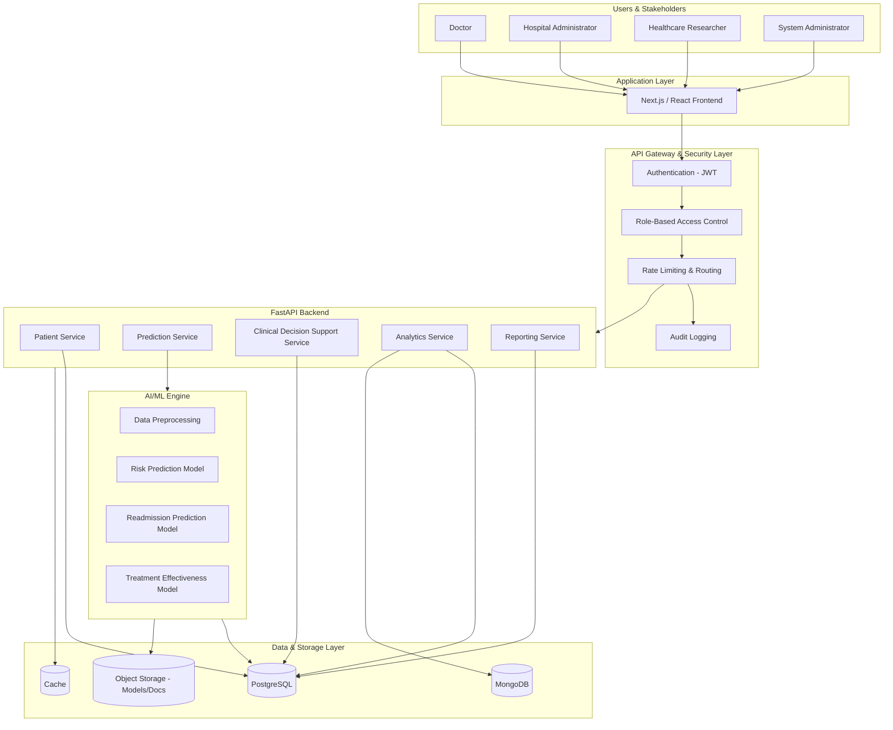
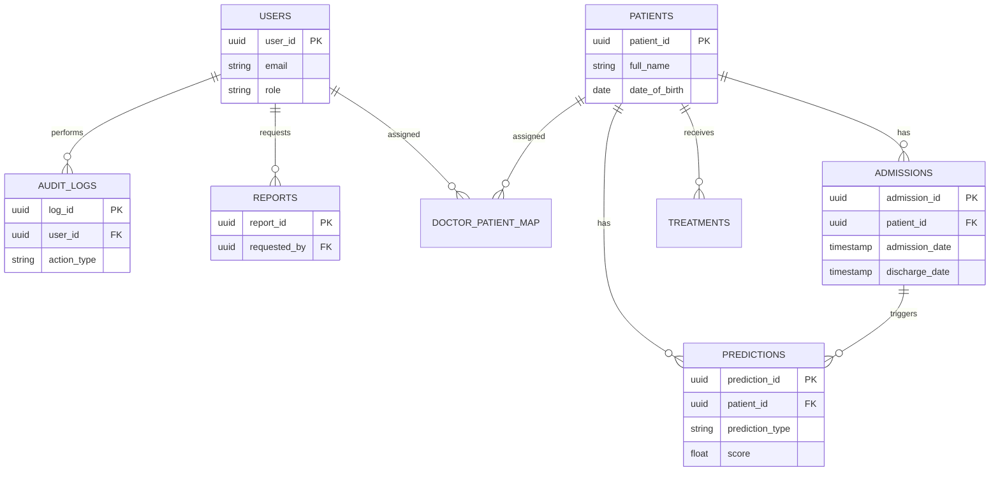
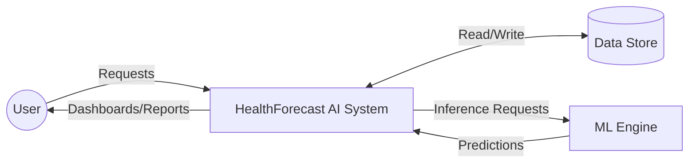
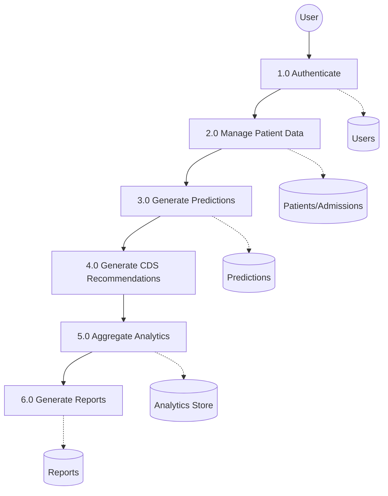
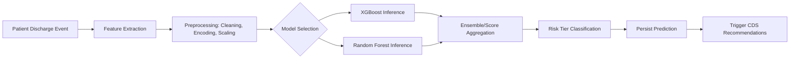
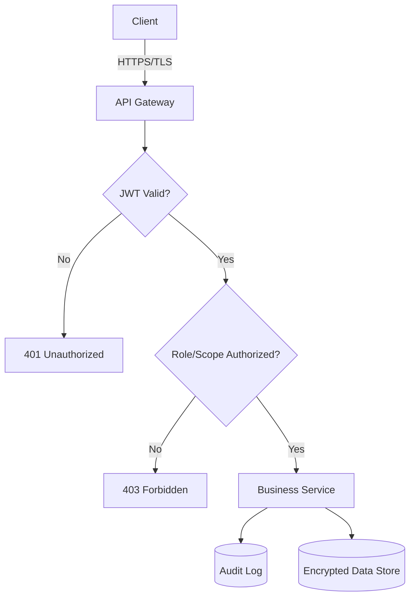
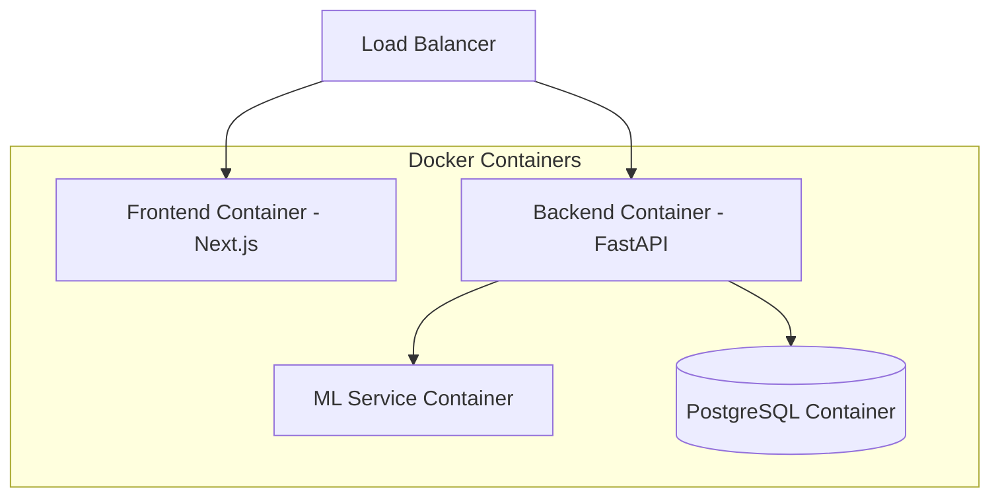

# HealthForecast AI - System Design Document

**Document Version:** 1.0
**Companion Document:** `HealthForecastAI_SRS.md`
**Project:** HealthForecast AI: Hospital Readmission Prediction & Patient Risk Intelligence System

---

## 1. Architecture Overview

HealthForecast AI follows a **layered, service-oriented architecture** consisting of a Next.js/React frontend, a FastAPI backend exposing REST APIs, a PostgreSQL operational database, and a dedicated ML inference engine built on XGBoost and Random Forest. The architecture is containerized with Docker for consistent deployment across development, staging, and production environments, and is designed to scale horizontally as patient data volume grows.

The system is organized into six architectural layers:
1. **Application Layer** — Next.js/React frontend delivering role-specific dashboards
2. **API Gateway & Security Layer** — Authentication, RBAC, request routing, rate limiting, audit logging
3. **AI Analytics & Prediction Engine** — Data preprocessing, risk prediction, readmission prediction, treatment effectiveness analysis, clinical decision support, analytics aggregation
4. **Data & Storage Layer** — PostgreSQL (operational), MongoDB (flexible/document data), object storage (documents/models), cache
5. **Infrastructure Layer** — Docker, orchestration, CI/CD, monitoring
6. **External Systems & Integrations** — EHR/HIS, lab systems, pharmacy systems, notification services (future/optional integrations)

This design mirrors the reference architecture diagram provided in the source project brief, adapted specifically to the India Hospital Readmission Dataset + Synthea dataset strategy.

---

## 2. High-Level Architecture

### Mermaid Diagram



### ASCII Architecture Diagram

```
+-------------------------------------------------------------------------------+
|                          USERS & STAKEHOLDERS                                 |
|   Doctor        Hospital Admin        Healthcare Researcher   System Admin    |
+-------------------------------------------------------------------------------+
                                    |
                                    v
+-------------------------------------------------------------------------------+
|                     APPLICATION LAYER (Next.js / React)                       |
|   Dashboard | Patient Search | Risk View | Alerts | Analytics | Reports       |
+-------------------------------------------------------------------------------+
                                    |
                                    v
+-------------------------------------------------------------------------------+
|                    API GATEWAY & SECURITY LAYER                               |
|   JWT Auth | RBAC | Permission Mgmt | Request Routing | Audit Logging         |
+-------------------------------------------------------------------------------+
                                    |
                                    v
+-------------------------------------------------------------------------------+
|                      FASTAPI BACKEND SERVICES                                 |
|  Patient Svc | Prediction Svc | CDS Svc | Analytics Svc | Reporting Svc       |
+-------------------------------------------------------------------------------+
                       |                          |
                       v                          v
+----------------------------------+   +---------------------------------------+
|      AI/ML PREDICTION ENGINE     |   |         DATA & STORAGE LAYER          |
|  1. Preprocessing                |   |  PostgreSQL (operational)             |
|  2. Risk Prediction (RF/XGB)     |-->|  MongoDB (flexible/analytics docs)    |
|  3. Readmission Prediction       |   |  Object Storage (models, reports)     |
|  4. Treatment Effectiveness      |   |  Cache (session/query cache)          |
+----------------------------------+   +---------------------------------------+
                                    |
                                    v
+-------------------------------------------------------------------------------+
|                        INFRASTRUCTURE LAYER                                   |
|   Docker | Docker Compose | CI/CD (GitHub Actions) | Monitoring/Logging       |
+-------------------------------------------------------------------------------+
```

**Component explanation:**
- **Application Layer:** Renders role-specific UI; communicates exclusively via authenticated REST calls to the API Gateway.
- **API Gateway & Security Layer:** Single entry point enforcing authentication, RBAC, and audit logging before any request reaches business services.
- **Backend Services:** Domain-partitioned FastAPI services/routers (Patient, Prediction, CDS, Analytics, Reporting) each owning a clear responsibility boundary.
- **AI/ML Engine:** Stateless inference services that load versioned models from object storage and return structured predictions.
- **Data & Storage Layer:** PostgreSQL is the system of record; MongoDB supports flexible/semi-structured analytics documents (e.g., Synthea-derived journey data); object storage holds trained model artifacts and generated reports; cache reduces repeated read load for dashboards.
- **Infrastructure Layer:** Docker containers per service, orchestrated via Docker Compose (and Kubernetes-ready for future scale), with GitHub Actions driving CI/CD.

---

## 3. Technology Stack Analysis

### Frontend

| Technology | Purpose | Benefits | Why Selected | Alternatives Considered |
|---|---|---|---|---|
| Next.js | Application framework, routing, SSR/SSG | Fast initial load, SEO-friendly, hybrid rendering | Strong ecosystem fit with React + TypeScript for dashboard-heavy apps | Vite + React Router |
| React | Component-based UI | Reusable, composable dashboard widgets | Team familiarity, wide library support (charting, tables) | Vue.js |
| Tailwind CSS | Utility-first styling | Rapid, consistent UI development | Speeds up building many role-specific dashboard variants | Bootstrap, Chakra UI |
| TypeScript | Static typing | Reduces runtime errors in data-heavy dashboards | Critical for handling complex prediction/report payloads safely | Plain JavaScript |

### Backend

| Technology | Purpose | Benefits | Why Selected | Alternatives Considered |
|---|---|---|---|---|
| FastAPI | REST API framework | High performance, native async, automatic OpenAPI docs | Excellent fit for Python-based ML inference integration | Flask, Django REST Framework |
| Python | Core backend/ML language | Rich ML ecosystem (scikit-learn, XGBoost) | Enables shared language across API and ML pipeline | Node.js (weaker ML ecosystem) |

### Database

| Technology | Purpose | Benefits | Why Selected | Alternatives Considered |
|---|---|---|---|---|
| PostgreSQL | Primary relational store | ACID compliance, strong relational integrity for clinical data | Patient/admission/prediction data is inherently relational | MySQL |
| MongoDB (supplementary) | Flexible document store | Handles semi-structured Synthea/analytics documents well | Synthea's FHIR-like structure maps more naturally to documents | Storing everything in Postgres JSONB |

### Machine Learning

| Technology | Purpose | Benefits | Why Selected | Alternatives Considered |
|---|---|---|---|---|
| XGBoost | Gradient-boosted classification | High accuracy on tabular clinical data, handles missing values well | Strong track record on readmission-prediction-style tabular problems | LightGBM, CatBoost |
| Random Forest | Ensemble classification/baseline | Robust, interpretable feature importance, less prone to overfitting on small data | Good complementary baseline/ensemble partner to XGBoost | Logistic Regression alone |

### Infrastructure

| Technology | Purpose | Benefits | Why Selected | Alternatives Considered |
|---|---|---|---|---|
| Docker | Containerization | Consistent environments across dev/stage/prod | Required by project brief; simplifies multi-service deployment | Bare-metal/VM deployment |
| GitHub | Source control | Version history, collaboration, PR review | Team-standard SCM | GitLab, Bitbucket |
| GitHub Actions | CI/CD | Automated build/test/deploy pipelines | Tight integration with GitHub-hosted repo | Jenkins, CircleCI |

---

## 4. Module-Wise Architecture

### Authentication Module

#### Purpose
Provide secure identity verification and session management for all platform users.

#### Responsibilities
Issue and validate JWTs; manage password hashing; handle login/logout/refresh/reset flows.

#### Components
`AuthController`, `TokenService`, `PasswordHasher`, `AuthMiddleware`.

#### Inputs
Login credentials, refresh tokens, password reset requests.

#### Outputs
Access tokens, refresh tokens, authentication status.

#### Internal Workflow
Credential validation → password hash comparison → JWT issuance → token embedded in subsequent requests → middleware validation per request.

#### External Interactions
Email/notification service for password reset links (optional integration).

#### APIs Used
`POST /api/auth/login`, `POST /api/auth/refresh`, `POST /api/auth/logout`, `POST /api/auth/reset-password`.

#### Database Dependencies
`users` table (credentials, role reference).

---

### User Management Module

#### Purpose
Administer platform user accounts and role assignments.

#### Responsibilities
Create/update/deactivate users; assign roles; manage Doctor-patient scope mappings.

#### Components
`UserController`, `RoleService`, `ScopeAssignmentService`.

#### Inputs
User profile data, role selections, scope assignments.

#### Outputs
User records, role-bound permission sets.

#### Internal Workflow
Admin submits user data → validation → persistence → role/scope linkage → permission cache invalidation.

#### External Interactions
None (internal-only module).

#### APIs Used
`POST /api/users`, `GET /api/users`, `PUT /api/users/{id}`, `POST /api/users/{id}/scope`.

#### Database Dependencies
`users`, `roles`, `doctor_patient_map`.

---

### Patient Management Module

#### Purpose
Maintain the authoritative record of patient demographics, medical history, and admission/treatment episodes.

#### Responsibilities
CRUD operations on patient records; admission/discharge tracking; medication/treatment logging.

#### Components
`PatientController`, `AdmissionService`, `TreatmentLogService`.

#### Inputs
Patient demographic data, admission/discharge events, medication/treatment entries.

#### Outputs
Patient records, admission timelines, treatment logs.

#### Internal Workflow
Data ingested/entered → schema validation → persistence → linkage to admission episodes → available to downstream Risk/Readmission/CDS modules.

#### External Interactions
Optional EHR/HIS integration for record synchronization (future scope).

#### APIs Used
`POST /api/patients`, `GET /api/patients/{id}`, `GET /api/patients/{id}/admissions`, `POST /api/patients/{id}/treatments`.

#### Database Dependencies
`patients`, `admissions`, `treatments`, `medications`.

---

### Risk Prediction Module

#### Purpose
Compute holistic patient risk scores and categorize patients into actionable risk tiers.

#### Responsibilities
Feature extraction, model inference, risk tier categorization, high-risk flagging.

#### Components
`FeatureBuilder`, `RiskModelService`, `RiskTierClassifier`.

#### Inputs
Patient demographic/clinical features from Patient Management module.

#### Outputs
Risk score (0–1), risk tier (Low/Medium/High), contributing feature summary.

#### Internal Workflow
Patient features fetched → preprocessing (missing value handling, encoding, scaling) → model inference (Random Forest / XGBoost) → threshold-based tier classification → persisted prediction record.

#### External Interactions
None directly; consumed by Clinical Decision Support and Analytics modules.

#### APIs Used
`POST /api/predictions/risk`, `GET /api/predictions/risk/{patientId}`.

#### Database Dependencies
`predictions`, `patients`.

---

### Readmission Prediction Module

#### Purpose
Forecast the probability that a patient will be readmitted within a defined window.

#### Responsibilities
Model inference for readmission probability, confidence scoring, outcome feedback logging.

#### Components
`ReadmissionModelService`, `ConfidenceEstimator`, `OutcomeFeedbackService`.

#### Inputs
Admission/discharge history, diagnosis and medication features, prior admission frequency.

#### Outputs
Readmission probability (%), confidence score, trend data.

#### Internal Workflow
Discharge event triggers feature assembly → model inference → probability + confidence returned → stored for trend analysis → later compared against actual outcome for model feedback.

#### External Interactions
None directly.

#### APIs Used
`POST /api/predictions/readmission`, `GET /api/predictions/readmission/{patientId}`, `POST /api/predictions/feedback`.

#### Database Dependencies
`predictions`, `admissions`, `prediction_outcomes`.

---

### Clinical Decision Support Module

#### Purpose
Translate risk and readmission outputs into actionable clinical guidance.

#### Responsibilities
Generate care recommendations, follow-up plans, risk mitigation suggestions, discharge checklists.

#### Components
`RecommendationEngine`, `FollowUpPlanner`, `DischargeChecklistBuilder`.

#### Inputs
Risk score, readmission probability, contributing feature drivers.

#### Outputs
Ranked recommendations, follow-up schedule, mitigation actions, discharge checklist.

#### Internal Workflow
Prediction outputs retrieved → rule-based mapping of risk drivers to recommendation library → ranked output rendered to Doctor dashboard.

#### External Interactions
None directly (future: notification service for follow-up reminders).

#### APIs Used
`GET /api/cds/recommendations/{patientId}`, `GET /api/cds/discharge-checklist/{patientId}`.

#### Database Dependencies
`care_recommendations`, `predictions`.

---

### Healthcare Analytics Module

#### Purpose
Provide aggregated, trend-based, and comparative healthcare analytics.

#### Responsibilities
Hospital-wide readmission analytics, patient outcome analysis, trend visualization, anonymized research views.

#### Components
`AnalyticsAggregator`, `TrendService`, `AnonymizationService`.

#### Inputs
Aggregated prediction, admission, and outcome data.

#### Outputs
Dashboard-ready aggregate metrics, trend chart data, anonymized exports.

#### Internal Workflow
Scheduled/on-demand aggregation queries → statistical summarization → role-based filtering (full vs. aggregated-only vs. anonymized) → served to dashboard or export pipeline.

#### External Interactions
None directly.

#### APIs Used
`GET /api/analytics/readmissions`, `GET /api/analytics/outcomes`, `GET /api/analytics/research-export`.

#### Database Dependencies
`predictions`, `admissions`, `patients` (anonymized view), MongoDB analytics collections.

---

### Reporting Module

#### Purpose
Generate exportable reports for clinical, operational, and research audiences.

#### Responsibilities
Render and export PDF/Excel reports; manage report templates.

#### Components
`ReportBuilder`, `PDFExporter`, `ExcelExporter`.

#### Inputs
Report parameters (date range, filters, role scope).

#### Outputs
Downloadable PDF/XLSX report files.

#### Internal Workflow
Report request received → data queried via Analytics/Patient services → template rendered → file generated and stored → download link returned.

#### External Interactions
Object storage for generated report files; optional email/notification delivery.

#### APIs Used
`GET /api/reports/export`, `GET /api/reports/{id}/download`.

#### Database Dependencies
`reports`, referencing `predictions`/`admissions` data.

---

### Audit Logging Module

#### Purpose
Provide an immutable trail of security-relevant and clinically-relevant actions.

#### Responsibilities
Log authentication events, patient record access, prediction requests, administrative actions.

#### Components
`AuditLogger`, `AuditQueryService`.

#### Inputs
Event metadata (user, action, resource, timestamp) captured via middleware hooks.

#### Outputs
Immutable audit log entries; filtered audit exports for administrators.

#### Internal Workflow
Middleware intercepts request/response lifecycle → relevant events written asynchronously to append-only audit store → queryable by System Administrator.

#### External Interactions
None directly.

#### APIs Used
`GET /api/audit-logs` (System Administrator only).

#### Database Dependencies
`audit_logs` (append-only table).

---

## 5. Database Design

### Users

| Column | Data Type | Constraints | Description |
|---|---|---|---|
| user_id | UUID | PRIMARY KEY | Unique user identifier |
| full_name | VARCHAR(150) | NOT NULL | User's full name |
| email | VARCHAR(255) | UNIQUE, NOT NULL | Login email |
| password_hash | VARCHAR(255) | NOT NULL | Hashed password |
| role | VARCHAR(50) | NOT NULL, CHECK (role IN ('doctor','hospital_admin','researcher','system_admin')) | Assigned RBAC role |
| is_active | BOOLEAN | DEFAULT TRUE | Account active status |
| created_at | TIMESTAMP | DEFAULT NOW() | Record creation time |

### Patients

| Column | Data Type | Constraints | Description |
|---|---|---|---|
| patient_id | UUID | PRIMARY KEY | Unique patient identifier |
| full_name | VARCHAR(150) | NOT NULL | Patient name (restricted field) |
| date_of_birth | DATE | NOT NULL | Patient date of birth |
| gender | VARCHAR(20) | | Patient gender |
| region | VARCHAR(100) | | Geographic region |
| primary_condition | VARCHAR(255) | | Primary diagnosis/condition |
| created_at | TIMESTAMP | DEFAULT NOW() | Record creation time |

### Admissions

| Column | Data Type | Constraints | Description |
|---|---|---|---|
| admission_id | UUID | PRIMARY KEY | Unique admission identifier |
| patient_id | UUID | FOREIGN KEY → Patients.patient_id | Linked patient |
| admission_date | TIMESTAMP | NOT NULL | Admission timestamp |
| discharge_date | TIMESTAMP | NULLABLE | Discharge timestamp |
| diagnosis_code | VARCHAR(50) | | Diagnosis classification |
| length_of_stay_days | INTEGER | CHECK (length_of_stay_days >= 0) | Derived stay duration |
| readmitted_flag | BOOLEAN | DEFAULT FALSE | Ground-truth readmission label |

### Predictions

| Column | Data Type | Constraints | Description |
|---|---|---|---|
| prediction_id | UUID | PRIMARY KEY | Unique prediction identifier |
| patient_id | UUID | FOREIGN KEY → Patients.patient_id | Linked patient |
| prediction_type | VARCHAR(30) | CHECK (prediction_type IN ('risk','readmission')) | Prediction category |
| score | FLOAT | NOT NULL | Probability/risk score (0–1) |
| risk_tier | VARCHAR(20) | | Low/Medium/High |
| model_version | VARCHAR(50) | NOT NULL | Version of model used |
| created_at | TIMESTAMP | DEFAULT NOW() | Prediction timestamp |

### Reports

| Column | Data Type | Constraints | Description |
|---|---|---|---|
| report_id | UUID | PRIMARY KEY | Unique report identifier |
| requested_by | UUID | FOREIGN KEY → Users.user_id | Requesting user |
| report_type | VARCHAR(50) | NOT NULL | Report category |
| file_path | VARCHAR(500) | | Storage path of generated file |
| generated_at | TIMESTAMP | DEFAULT NOW() | Generation timestamp |

### AuditLogs

| Column | Data Type | Constraints | Description |
|---|---|---|---|
| log_id | UUID | PRIMARY KEY | Unique log entry identifier |
| user_id | UUID | FOREIGN KEY → Users.user_id | Actor performing the action |
| action_type | VARCHAR(100) | NOT NULL | Action category (login, access, prediction, admin) |
| resource_id | UUID | NULLABLE | Related resource (e.g., patient_id) |
| timestamp | TIMESTAMP | DEFAULT NOW() | Event time |
| metadata | JSONB | | Additional contextual detail |

---

## 6. Entity Relationship Diagram

### Mermaid ER Diagram



### ASCII ER Diagram

```
USERS (1) ----< AUDIT_LOGS (many)
USERS (1) ----< REPORTS (many)
USERS (1) ----< DOCTOR_PATIENT_MAP (many) >---- (1) PATIENTS
PATIENTS (1) ----< ADMISSIONS (many)
PATIENTS (1) ----< PREDICTIONS (many)
ADMISSIONS (1) ----< PREDICTIONS (many, via admission context)
PATIENTS (1) ----< TREATMENTS (many)
```

---

## 7. API Design

### Authentication APIs

#### `POST /api/auth/login`
- **Description:** Authenticate a user and issue JWT tokens.
- **Request Body:** `{ "email": "string", "password": "string" }`
- **Response Body:** `{ "access_token": "string", "refresh_token": "string", "role": "string" }`
- **Authorization Rules:** Public endpoint (no token required).
- **Error Responses:** `401 Unauthorized` (invalid credentials), `423 Locked` (account locked).

### User APIs

#### `POST /api/users`
- **Description:** Create a new user account.
- **Request Body:** `{ "full_name": "string", "email": "string", "role": "string" }`
- **Response Body:** `{ "user_id": "uuid", "email": "string", "role": "string" }`
- **Authorization Rules:** System Administrator only.
- **Error Responses:** `400 Bad Request` (validation failure), `409 Conflict` (duplicate email).

### Patient APIs

#### `GET /api/patients/{id}`
- **Description:** Retrieve a patient record.
- **Request Body:** N/A
- **Response Body:** `{ "patient_id": "uuid", "full_name": "string", "primary_condition": "string", ... }`
- **Authorization Rules:** Doctor (assigned only), Hospital Administrator (view only), Researcher (anonymized only), System Administrator (full).
- **Error Responses:** `403 Forbidden` (out-of-scope access), `404 Not Found`.

### Prediction APIs

#### `POST /api/predictions/risk`
- **Description:** Trigger risk prediction for a patient.
- **Request Body:** `{ "patient_id": "uuid" }`
- **Response Body:** `{ "prediction_id": "uuid", "score": 0.0, "risk_tier": "High" }`
- **Authorization Rules:** Doctor, Hospital Administrator, System Administrator.
- **Error Responses:** `422 Unprocessable Entity` (insufficient patient data), `500 Internal Server Error` (model failure).

#### `POST /api/predictions/readmission`
- **Description:** Trigger readmission probability prediction.
- **Request Body:** `{ "patient_id": "uuid", "admission_id": "uuid" }`
- **Response Body:** `{ "prediction_id": "uuid", "probability": 0.0, "confidence": 0.0 }`
- **Authorization Rules:** Doctor, Hospital Administrator, System Administrator.
- **Error Responses:** `422 Unprocessable Entity`, `500 Internal Server Error`.

### Analytics APIs

#### `GET /api/analytics/readmissions`
- **Description:** Retrieve aggregated readmission analytics.
- **Request Body:** N/A (query params: date range, department)
- **Response Body:** `{ "period": "string", "readmission_rate": 0.0, "trend": [...] }`
- **Authorization Rules:** Doctor (limited), Hospital Administrator (full), Researcher (aggregated only), System Administrator (full).
- **Error Responses:** `400 Bad Request` (invalid filters).

### Reporting APIs

#### `GET /api/reports/export`
- **Description:** Generate and export a report.
- **Request Body:** N/A (query params: report_type, format, filters)
- **Response Body:** `{ "report_id": "uuid", "download_url": "string" }`
- **Authorization Rules:** Doctor, Hospital Administrator, Researcher, System Administrator (each scoped to their permitted data).
- **Error Responses:** `400 Bad Request`, `403 Forbidden`.

---

## 8. Data Flow Diagrams

### Context-Level DFD



### Level-1 DFD



### Prediction Workflow DFD



### ASCII Prediction Workflow

```
[Discharge Event] -> [Feature Extraction] -> [Preprocessing]
        -> [XGBoost] -+
                       |-> [Score Aggregation] -> [Risk Tier] -> [Persist] -> [CDS Trigger]
        -> [Random Forest] -+
```

---

## 9. AI/ML Architecture

### Data Pipeline

```
Raw Data (India Hospital Readmission Dataset + Synthea)
   -> Validation (schema checks, referential integrity)
   -> Cleaning (missing value handling, duplicate removal)
   -> Feature Engineering (encoding, derived features, aggregation)
   -> Training (XGBoost, Random Forest)
   -> Evaluation (holdout + cross-validation, metric thresholds)
   -> Deployment (versioned model artifact promoted to inference service)
```

### Feature Engineering Strategy

- **Missing value handling:** Median/mode imputation for numeric/categorical clinical fields; missingness indicator flags retained as features where informative.
- **Outlier treatment:** Clip/flag physiologically implausible values (e.g., negative length-of-stay); winsorize extreme numeric outliers.
- **Encoding:** One-hot encoding for low-cardinality categorical fields (gender, region); target/frequency encoding for high-cardinality diagnosis codes.
- **Scaling:** Standardization applied to continuous features feeding models sensitive to scale; tree-based models (XGBoost/Random Forest) used primarily so scaling requirements are relaxed but standardized for pipeline consistency.
- **Feature selection:** Feature importance ranking from Random Forest used to prune low-signal features before final XGBoost training.

### Models

#### XGBoost
- **Purpose:** Primary high-accuracy classifier for readmission and risk prediction on tabular clinical data.
- **Advantages:** Handles missing values natively, strong performance on structured/tabular healthcare data, built-in regularization to reduce overfitting.
- **Training approach:** Gradient-boosted trees trained with early stopping on validation loss; hyperparameters tuned via grid/randomized search; class-weighting applied for imbalance.

#### Random Forest
- **Purpose:** Complementary ensemble baseline and feature-importance/explainability source.
- **Advantages:** Robust to overfitting on smaller feature sets, provides intuitive feature importance for clinical explainability, less sensitive to hyperparameter tuning.
- **Training approach:** Bagged decision trees trained on bootstrapped samples; used both as a standalone baseline and as a feature-importance validator for the XGBoost pipeline.

### Evaluation Metrics
- Accuracy
- Precision
- Recall
- F1 Score
- ROC-AUC

### Risk Score Generation

**Risk scoring methodology:** The trained model outputs a calibrated probability (0–1) representing likelihood of adverse outcome (readmission or health deterioration). Where both XGBoost and Random Forest are used, their probability outputs may be combined via a weighted or stacked ensemble to improve robustness.

**Classification logic:** The continuous probability is mapped into a discrete risk tier using threshold bands, with thresholds tuned against clinical review during evaluation.

**Low / Medium / High Risk thresholds (baseline, tunable):**

| Risk Tier | Score Range |
|---|---|
| Low | 0.00 – 0.39 |
| Medium | 0.40 – 0.69 |
| High | 0.70 – 1.00 |

---

## 10. Security Architecture

### JWT Authentication
Stateless authentication using signed JWTs containing user ID and role claims; short-lived access tokens paired with longer-lived refresh tokens.

### Role-Based Access Control
Centralized RBAC middleware evaluates role and scope (e.g., Doctor-patient assignment) on every request before reaching business logic.

### Password Hashing
Passwords stored using a strong adaptive hashing algorithm (bcrypt/argon2) with per-user salt; plaintext passwords never persisted or logged.

### Audit Logging
Every authentication event, patient data access, prediction request, and administrative action is written to an append-only audit store.

### Encryption
TLS 1.2+ enforced in transit; PII/PHI fields encrypted at rest using database-level or application-level encryption.

### Secure API Practices
Input validation on all endpoints, rate limiting at the gateway layer, principle-of-least-privilege applied to service accounts, secrets managed via environment/secret-manager (not hardcoded).

### Architecture Diagram



---

## 11. Deployment Architecture



### Development Environment
Local Docker Compose stack running frontend, backend, ML service, and PostgreSQL containers with hot-reload enabled; seeded with a sampled subset of the India Hospital Readmission Dataset for local testing.

### Staging Environment
Cloud-hosted (AWS/Azure) mirrored environment used for integration testing, model validation, and mentor/reviewer demonstrations prior to production promotion.

### Production Environment
Cloud-hosted deployment with container orchestration, load balancing across frontend/backend replicas, managed PostgreSQL instance, and monitored ML inference service.

---

## 12. Scalability Strategy

- **Horizontal scaling:** Stateless FastAPI and ML inference containers replicated behind a load balancer as request volume grows.
- **Vertical scaling:** Database instance sized up (CPU/memory) for read/write-heavy periods before horizontal read-replica scaling is introduced.
- **Database optimization:** Indexing on frequently queried columns (`patient_id`, `admission_date`, `prediction_type`), read replicas for analytics-heavy queries.
- **Model serving optimization:** Batch inference support for bulk risk scoring; model caching to avoid repeated cold-loads; async inference queue for non-blocking bulk operations.

---

## 13. Monitoring & Observability

- **Logging:** Centralized structured logging across frontend, backend, and ML services.
- **Metrics:** API latency, prediction inference time, error rates, model performance drift metrics tracked over time.
- **Health Checks:** Liveness/readiness endpoints per container (`/health`) monitored by orchestration layer.
- **Alerting:** Threshold-based alerts for elevated error rates, latency spikes, or model performance degradation below evaluation thresholds.

---

## 14. Future Enhancements

- **Explainable AI:** Integrate SHAP/LIME-based explanations directly into clinician-facing risk views.
- **Real-Time Prediction:** Move from on-demand/batch inference to streaming, near-real-time risk updates as new vitals/data arrive.
- **EHR Integration:** Direct integration with hospital EHR/HIS systems for automated data ingestion.
- **Multi-Hospital Deployment:** Extend architecture to support multi-tenant, multi-hospital data isolation and comparative benchmarking.
- **Federated Learning:** Enable model training across multiple hospitals without centralizing raw patient data.
- **Advanced Clinical Decision Support:** Expand CDS module with more granular, condition-specific care pathways and guideline integration.

---

*End of HealthForecastAI_System_Design.md*
